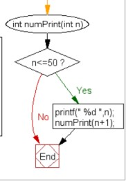
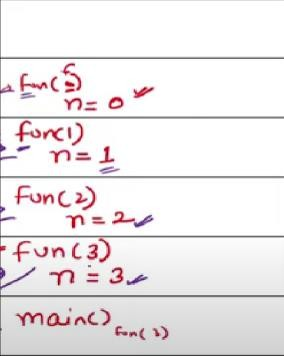
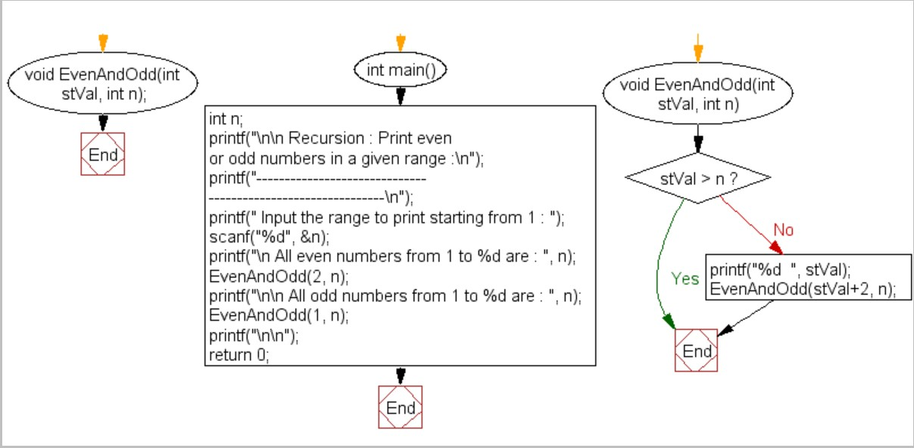
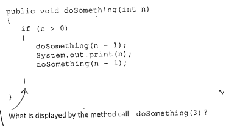
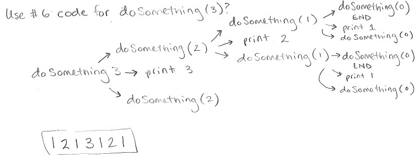

# ০১ — Tracing & Output Order (রিকার্শনের আউটপুট ট্রেস করা)

> **মূল কথা:** রিকার্সিভ কলের **আগে** `printf` থাকলে আউটপুট নামার সময় (going down) প্রিন্ট হয়,
> আর রিকার্সিভ কলের **পরে** `printf` থাকলে আউটপুট ফেরার সময় (coming back / LIFO) প্রিন্ট হয়।
> এই একটা জিনিস বুঝলেই এই অধ্যায়ের প্রায় সব প্রশ্ন পারা যায়।

---

## প্রশ্ন ১ — call-এর আগে print

What is the output of the following code?

```c
main() {
    int i, n;
    n = f(6);
    printf("%d", n);
}

f(int x) {
    if (x == 2)
        return 2;
    else
        printf("+");
    f(x - 1);
}
```

a) ++++2  b) ++++++2  c) +++++  d) 2

**✅ সঠিক উত্তর: a) ++++2**

When x = 6 → '+' printed; x = 5 → '+'; x = 4 → '+'; x = 3 → '+'; x = 2 → returns 2 which is printed.
So the output is `++++2`.

---

## প্রশ্ন ২ — call-এর আগে print (countdown)

What will be the output of the following code?

```c
void my_recursive_function(int n) {
    if (n == 0)
        return;
    printf("%d ", n);
    my_recursive_function(n - 1);
}

int main() {
    my_recursive_function(10);
    return 0;
}
```

a) 10  b) 1  c) 10 9 8 ... 1 0  d) 10 9 8 7 ... 1

**✅ সঠিক উত্তর: d) 10 9 8 7 ... 1**

printf comes **before** the recursive call, so numbers print on the way down: 10, then 9, then 8 ... When n becomes 0, the base case returns without printing. Output: `10 9 8 7 6 5 4 3 2 1`.

---

## প্রশ্ন ৩ — base case চেনা

What is the base case for the following code?

```c
void my_recursive_function(int n) {
    if (n == 0)
        return;
    printf("%d ", n);
    my_recursive_function(n - 1);
}

int main() {
    my_recursive_function(10);
    return 0;
}
```

a) `return`  b) `printf("%d ", n)`  c) `if(n == 0)`  d) `my_recursive_function(n-1)`

**✅ সঠিক উত্তর: c) if(n == 0)**

The base case is the condition where the recursive function is **not** called anymore. Here that condition is `if(n == 0)`.

---

## প্রশ্ন ৪ — call-এর পরে print (ascending)

What is the output of the following code?

```c
int numPrint(int);

int main() {
    int n = 1;
    printf(" The natural numbers are :");
    numPrint(n);
    return 0;
}

int numPrint(int n) {
    if (n <= 5) {
        printf(" %d ", n);
        numPrint(n + 1);
    }
}
```

a) 2,4,5,1,3  b) 1,2,3,4,5  c) 3,1,2,5,4  d) 2,1,3,4,5

**✅ সঠিক উত্তর: b) 1,2,3,4,5**

printf is before the recursive call and n increases 1→5, so it prints `1 2 3 4 5`.



---

## প্রশ্ন ৫ — call-এর পরে print → LIFO

What is the output of the following code?

```c
void fun(int n) {
    if (n > 0)
        fun(n - 1);
    printf("%d", n);
}

main() {
    fun(3);
    return 0;
}
```

a) 1123  b) 0133  c) 0123  d) None of the above

**✅ সঠিক উত্তর: c) 0123**

Here printf comes **after** the recursive call, so values print while returning (LIFO order):
- fun(3) → fun(2) → fun(1) → fun(0) sits in the stack
- fun(0): 0>0 false → prints 0, then returning back prints 1, 2, 3.

Output: `0123`



---

## প্রশ্ন ৬ — Java: call-এর আগে print

What will be the output?

```java
public void draw() {
    recurs(10);
}

void recurs(int count) {
    if (count == 0)
        return;
    else {
        System.out.print(count + " ");
        int recount = count - 2;
        recurs(recount);
        return;
    }
}
```

a) 8 6 4 2  b) 10 8 6 4 2  c) 10 8 6 4 2 0  d) 8 6 4 2 0

**✅ সঠিক উত্তর: b) 10 8 6 4 2**

10 is printed, then count-2 = 8 goes in, prints 8 ... continuing: `10 8 6 4 2`. When count reaches 0, nothing is printed.

---

## প্রশ্ন ৭ — even/odd range print

What will be the output of the following code if the input range is 1 to 15?

```c
void EvenAndOdd(int stVal, int n);

int main() {
    int n;
    scanf("%d", &n);
    printf("\n All even numbers from 1 to %d are : ", n);
    EvenAndOdd(2, n);   // for even numbers
    printf("\n\n All odd numbers from 1 to %d are : ", n);
    EvenAndOdd(1, n);   // for odd numbers
    return 0;
}

void EvenAndOdd(int stVal, int n) {
    if (stVal > n)
        return;
    printf("%d ", stVal);
    EvenAndOdd(stVal + 2, n);   // recursive call
}
```

a) Print all even numbers from 1 to 15
b) Print all odd numbers from 1 to 15
c) Both (a) and (b)
d) None of the above

**✅ সঠিক উত্তর: c) Both (a) and (b)**

The same function is called twice — once starting from 2 (evens: 2 4 6 ... 14) and once from 1 (odds: 1 3 5 ... 15), each time stepping +2.



---

## প্রশ্ন ৮ — upward recursion (n+1)

```c
#include <stdio.h>
int fun(int n) {
    if (n == 4)
        return n;
    else
        return 2 * fun(n + 1);
}

int main() {
    printf("%d ", fun(2));
    return 0;
}
```

**✅ উত্তর: 16**

Fun(2) = 2 × Fun(3), Fun(3) = 2 × Fun(4), Fun(4) = 4
So Fun(2) = 2 × 2 × 4 = **16**.

> 📌 মূল নোটে এই প্রশ্নটা ৩ বার এসেছে (একবার pseudocode আকারে: `if(n EQUALS 4) return n else return 2 * fun(n+1)`, n=2 → 16)। সব একই প্রশ্ন।

---

## প্রশ্ন ৯ — call-এর আগে ও পরে দুই দিকেই print

```c
#include <stdio.h>
void print(int n) {
    if (n > 4000)
        return;
    printf("%d ", n);
    print(2 * n);
    printf("%d ", n);
}

int main() {
    print(1000);
    return 0;
}
```

**✅ উত্তর: 1000 2000 4000 4000 2000 1000**

Going down: 1000, 2000, 4000 printed (8000 > 4000 so recursion stops).
Coming back: the second printf prints 4000, 2000, 1000 in reverse order.

---

## প্রশ্ন ১০ — দুই পাশে দুইটা recursive call

```c
#include <stdio.h>
void fun(int x) {
    if (x > 0) {
        fun(--x);
        printf("%d\t", x);
        fun(--x);
    }
}

int main() {
    int a = 4;
    fun(a);
    return 0;
}
```

**✅ উত্তর: 0 1 2 0 3 0 1**

Call tree:

```
fun(4)
 ├─ fun(3)
 │   ├─ fun(2)
 │   │   ├─ fun(1)
 │   │   │   ├─ fun(0)  → does nothing
 │   │   │   ├─ print 0
 │   │   │   └─ fun(-1) → does nothing
 │   │   ├─ print 1
 │   │   └─ fun(0)      → does nothing
 │   ├─ print 2
 │   └─ fun(1) → prints 0
 ├─ print 3
 └─ fun(2) → prints 0 1
```

---

## প্রশ্ন ১১ — Java: আগে-পরে দুই পাশে call

What is displayed by the method call `doSomething(3)`?

```java
public void doSomething(int n) {
    if (n > 0) {
        doSomething(n - 1);
        System.out.print(n);
        doSomething(n - 1);
    }
}
```

**✅ উত্তর: 1 2 1 3 1 2 1**

doSomething(3) = doSomething(2) + print(3) + doSomething(2)
doSomething(2) = doSomething(1) + print(2) + doSomething(1) = "1 2 1"
So: "1 2 1" + "3" + "1 2 1" = **1 2 1 3 1 2 1**

মূল প্রশ্নের ছবি: 
ব্যাখ্যা: 

---

## প্রশ্ন ১২ — stack reverse (concept)

Does the following function correctly represent the recursive approach to reverse a stack?

```c
int reverse(int n) {
    if (s.size() > 0) {
        int x = s.top();
        s.pop();
        reverse();
        Bottominsert(x);
    }
}
```

a) Yes  b) No

**✅ সঠিক উত্তর: a) Yes**

We keep holding the elements in the call stack until we reach the bottom of the stack. Then we insert elements at the bottom. This reverses the stack.

