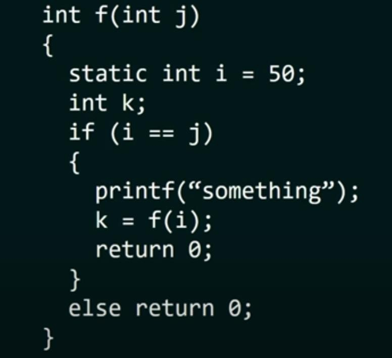

# ০২ — Infinite Recursion & Common Traps (অসীম রিকার্শন ও ফাঁদ)

> **মূল কথা:** base case না থাকলে, base case-এ কখনো না পৌঁছালে (যেমন `b--` post-decrement),
> বা negative input handle না করলে — রিকার্শন অসীমভাবে চলে এবং **stack overflow** হয়ে
> প্রোগ্রাম runtime error দিয়ে বন্ধ হয়। পরীক্ষায় এগুলোই সবচেয়ে কমন ফাঁদ।

---

## প্রশ্ন ১ — post-decrement ফাঁদ (b--)

How many times 'a' will be printed for the following code?

```c
main() {
    int a;
    a = f1(10);
    printf("%d", a);
}

f1(int b) {
    if (b == 0)
        return 0;
    else {
        printf("a");
        f1(b--);
    }
}
```

a) 9  b) 10  c) 0  d) Infinite number of times

**✅ সঠিক উত্তর: d) Infinite number of times**

`f1(b--)` is **post**-decrement — the old value of b (10) is passed every time, so b never reaches 0. Though there is an exit condition, it is never met → infinite recursion.

> 📌 মনে রাখো: `f1(b--)` → আগের মানই পাস হয়। `f1(--b)` বা `f1(b-1)` দিলে ঠিকমতো কমতো।

---

## প্রশ্ন ২ — main() এর ভিতরে main()

What will be the output of the following code?

```c
main() {
    printf("Recursion checking");
    main();
    return 0;
}
```

a) 'Recursion checking' is printed once
b) 0 is returned
c) 'Recursion checking' infinite number of times
d) Output screen will be empty

**✅ সঠিক উত্তর: c) 'Recursion checking' infinite number of times**

main() is called inside main() — that's recursion with **no exit condition**, so it runs infinitely (until the stack overflows). To prevent this, an exit condition should be set inside the function.

---

## প্রশ্ন ৩ — base case ছাড়া রিকার্শন

What will happen when the below code snippet is executed?

```c
void my_recursive_function() {
    my_recursive_function();
}

int main() {
    my_recursive_function();
    return 0;
}
```

a) The code will be executed successfully and no output will be generated
b) The code will be executed successfully and random output will be generated
c) The code will show a compile time error
d) The code will run for some time and stop when the stack overflows

**✅ সঠিক উত্তর: d) The code will run for some time and stop when the stack overflows**

Every function call is stored in stack memory. There is no terminating condition (base case), so calls pile up until the stack overflows and the program stops abruptly.

---

## প্রশ্ন ৪ — negative input: Fibonacci

What is the output of the following code?

```c
int fibo(int n) {
    if (n == 1)
        return 0;
    else if (n == 2)
        return 1;
    return fibo(n - 1) + fibo(n - 2);
}

main() {
    n = -1;
    int ans = fibo(n);
    printf("%d", ans);
    return 0;
}
```

a) 0  b) 1  c) Compile time error  d) Run time error

**✅ সঠিক উত্তর: d) Run time error**

Negative numbers are not handled: n = -1 never reaches the base cases (1 or 2), so fibo() is called infinitely → stack overflow → run time error.

---

## প্রশ্ন ৫ — negative input: sum

What is the output of the following code?

```c
int recursive_sum(int n) {
    if (n == 0)
        return 0;
    return n + recursive_sum(n - 1);
}

int main() {
    int n = -4;
    int ans = recursive_sum(n);
    printf("%d", ans);
    return 0;
}
```

a) 0  b) -10  c) 10  d) Run time error

**✅ সঠিক উত্তর: d) Run time error**

-4 → -5 → -6 → ... never reaches 0. The function is called again and again till the stack overflows.

---

## প্রশ্ন ৬ — Java: base case কখনো পৌঁছায় না (odd → even mismatch)

What will be the output?

```java
public void draw() {
    recurs(11);
}

void recurs(int count) {
    if (count == 0)
        return;
    else {
        System.out.print(count + " ");
        int recount = count - 2;
        recurs(recount);
        return;
    }
}
```

a) 11 9 7 5 3 1  b) 9 7 5 3 1  c) 11 9 7 5 3 1 -1  d) Infinite Loop

**✅ সঠিক উত্তর: d) Infinite Loop**

11 is odd and decreases by 2: 11, 9, 7, 5, 3, 1, **-1**, -3 ... it never equals 0, so the end condition is never reached → infinite loop.

> 📌 আগের অধ্যায়ের প্রশ্নে recurs(10) দিলে ঠিকঠাক `10 8 6 4 2` প্রিন্ট হয় — জোড়/বিজোড়ের পার্থক্যটাই এখানে ফাঁদ।

---

## প্রশ্ন ৭ — uninitialized variable (রিকার্শন না, তবু ফাঁদ)

What is the output of the following code?

```c
int get_sum(int n) {
    int sm, i;
    for (i = 1; i <= n; i++)
        sm += i;
    return sm;
}

int main() {
    int n = 10;
    int ans = get_sum(n);
    printf("%d", ans);
    return 0;
}
```

a) 55  b) 45  c) 35  d) Depends on compiler

**✅ সঠিক উত্তর: d) Depends on compiler**

`sm` is **not initialized** to 0, so it starts with a garbage value. Some compilers auto-initialize to 0 (then the answer would be 55), but this is not guaranteed. Hence: depends on the compiler.

---

## প্রশ্ন ৮ — static variable দিয়ে infinite loop

Consider the following function:

```c
int f(int j) {
    static int i = 50;
    int k;
    if (i == j) {
        printf("something");
        k = f(i);
        return 0;
    }
    else
        return 0;
}
```

a) The function returns 0 for all the values of j
b) The function prints the string "something" for all the values of j
c) The function returns 0 when j = 50
d) The function will run into an infinite loop when j = 50

**✅ সঠিক উত্তর: d) The function will run into an infinite loop when j = 50**

- j ≠ 50 হলে সরাসরি return 0 — তাই (b) ভুল।
- j = 50 হলে "something" প্রিন্ট হয়ে `f(i)` মানে `f(50)` আবার কল হয় — i static, মান বদলায় না — তাই আবার i == j মিলে যায় → infinite loop। (a) ও (c) ভুল।

মূল প্রশ্নের ছবি: 

