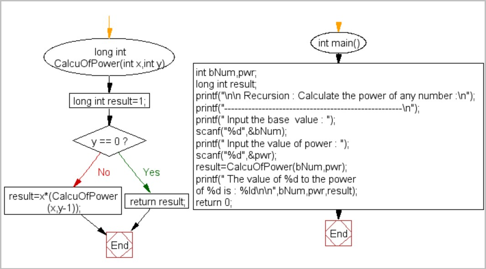
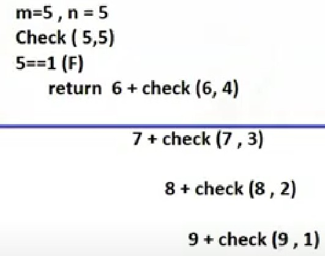
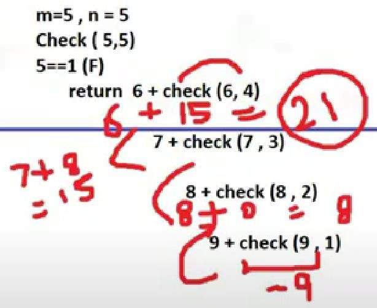
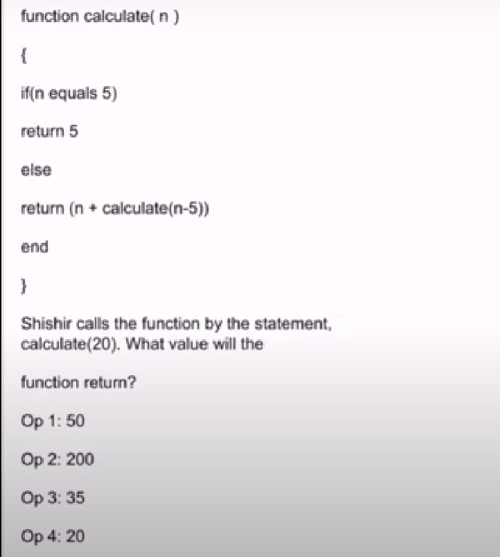
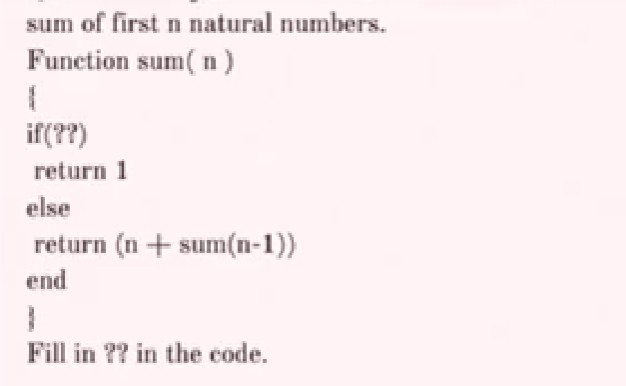
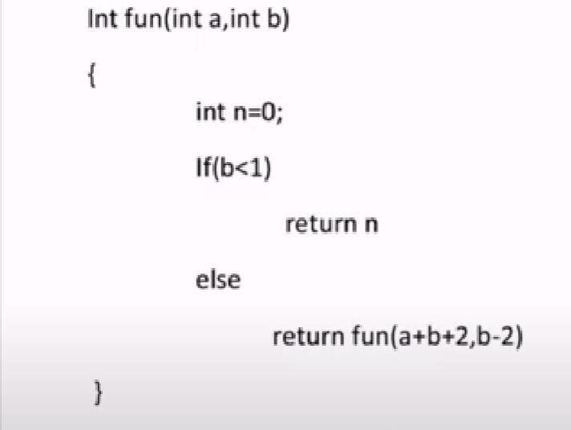
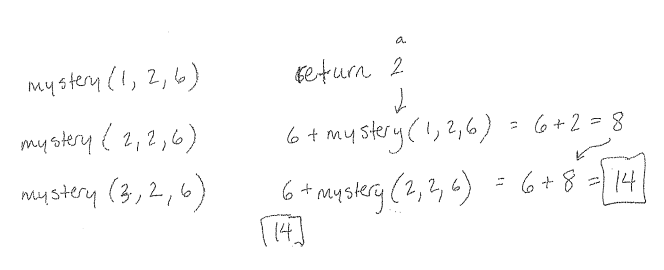

# ০৩ — Sum, Series & Factorial (যোগফল, ধারা ও ফ্যাক্টোরিয়াল)

> **মূল কথা:** `return n + f(n-1)` প্যাটার্ন মানে যোগফল (series sum),
> `return n * f(n-1)` মানে গুণফল (factorial)। base case-এ কী return হয় সেটা খেয়াল করো —
> সেখান থেকেই পেছন দিকে হিসাব করে মান বসাও।

---

## প্রশ্ন ১ — repeated addition (a × b)

What is the output of the following code?

```c
int doSomething(int a, int b) {
    if (b == 1)
        return a;
    else
        return a + doSomething(a, b - 1);
}

doSomething(2, 3);
```

a) 4  b) 2  c) 3  d) 6

**✅ সঠিক উত্তর: d) 6**

- Call 1: 2 + doSomething(2,2)
- Call 2: 2 + 2 + doSomething(2,1)
- Call 3: b==1 → return 2

Total: 2+2+2 = **6** (আসলে এটা a×b = 2×3)

---

## প্রশ্ন ২ — factorial

What is the output of the following code?

```c
int something(int number) {
    if (number <= 0)
        return 1;
    else
        return number * something(number - 1);
}

something(4);
```

a) 12  b) 24  c) 1  d) 0

**✅ সঠিক উত্তর: b) 24**

return 4 × (3 × (2 × (1 × something(0)))) = 4 × 3 × 2 × 1 = **24** (এটাই 4!)

---

## প্রশ্ন ৩ — n পর্যন্ত যোগফল: sum(8)

What is the output of the following code for sum(8)?

```c
int sum(int n) {
    if (n == 0)
        return n;
    else
        return n + sum(n - 1);
}
```

a) 40  b) 36  c) 8  d) 15

**✅ সঠিক উত্তর: b) 36**

8 + 7 + 6 + 5 + 4 + 3 + 2 + 1 = **36** (সূত্র: n(n+1)/2 = 8×9/2)

---

## প্রশ্ন ৪ — ২ করে কমে: f(n-2)

What will be the output of the following code?

```c
main() {
    int n = 10;
    int f(int n);
    printf("%d", f(n));
}

int f(int n) {
    if (n > 0)
        return (n + f(n - 2));
}
```

a) 10  b) 80  c) 30  d) error

**✅ সঠিক উত্তর: c) 30**

10 + 8 + 6 + 4 + 2 = **30** (n > 0 থাকা পর্যন্ত ২ করে কমে)

---

## প্রশ্ন ৫ — recursive_sum(5)

What is the output of the following code?

```c
int recursive_sum(int n) {
    if (n == 0)
        return 0;
    return n + recursive_sum(n - 1);
}

int main() {
    int n = 5;
    int ans = recursive_sum(n);
    printf("%d", ans);
    return 0;
}
```

a) 10  b) 15  c) 21  d) 14

**✅ সঠিক উত্তর: b) 15**

First 5 natural numbers-এর যোগফল: 5+4+3+2+1 = **15**

---

## প্রশ্ন ৬ — recursive_sum(0) (edge case)

What will be the output of the following code snippet?

```c
int recursive_sum(int n) {
    if (n == 0)
        return 0;
    return n + recursive_sum(n - 1);
}

int main() {
    int n = 0;
    int ans = recursive_sum(n);
    printf("%d", ans);
    return 0;
}
```

a) -1  b) 0  c) 1  d) Runtime Error

**✅ সঠিক উত্তর: b) 0**

n = 0 সরাসরি base case-এ পড়ে → return 0। কোনো রিকার্সিভ কলই হয় না।

---

## প্রশ্ন ৭ — Java: sum(3)

What value is returned by the method call sum(3)?

```java
public int sum(int n) {
    if (n == 1)
        return 1;
    else
        return n + sum(n - 1);
}
```

**✅ উত্তর: 6**

sum(3) = 3 + sum(2) = 3 + 2 + sum(1) = 3 + 2 + 1 = **6**

---

## প্রশ্ন ৮ — Fibonacci: ফাঁকা জায়গা পূরণ

Consider the following recursive implementation and state which of the lines should be inserted to complete the given code.

```c
int fibo(int n) {
    if (n == 1)
        return 0;
    else if (n == 2)
        return 1;
    return ______ ;
}

main() {
    int n = 5;
    int ans = fibo(n);
    printf("%d", ans);
    return 0;
}
```

a) fibo(n-1)  b) fibo(n-1) + fibo(n-2)  c) fibo(n) + fibo(n-1)  d) fibo(n-2) + fibo(n-1)

**✅ সঠিক উত্তর: b) fibo(n-1) + fibo(n-2)**

Fibonacci series-এর নিয়ম অনুযায়ী প্রতিটি পদ = আগের দুই পদের যোগফল।

---

## প্রশ্ন ৯ — pointer দিয়ে Fibonacci

```c
#include <stdio.h>
int fun(int n, int *fp) {
    int t, f;
    if (n <= 2) {
        *fp = 1;
        return 1;
    }
    t = fun(n - 1, fp);
    f = t + *fp;
    *fp = t;
    return f;
}

int main() {
    int x = 15;
    printf("%d\n", fun(5, &x));
    return 0;
}
```

**✅ উত্তর: 5**

The program calculates the n-th Fibonacci number. `t = fun(n-1, fp)` gives the (n-1)th Fibonacci number and `*fp` stores the (n-2)th. The initial value of *fp (15) doesn't matter.

```
(1) fun(5, fp)
       ├─ (2) fun(4, fp)         (10) t=5, f=8, *fp=5
       │        ├─ (3) fun(3, fp)     (9) t=3, f=5, *fp=3
       │        │       ├─ (4) fun(2, fp)  (8) t=2, f=3, *fp=2
       │        │       │       └─ (5) fun(1, fp) (7) t=1, f=2, *fp=1
       │        │       │              └─ (6) *fp = 1
```
Fibonacci: 1 1 2 3 5 → fun(5) = **5**

---

## প্রশ্ন ১০ — power: xʸ

What will be the output of the following code for the given value of bnum=4 and pwr=3?

```c
long int CalcuOfPower(int x, int y) {
    long int result = 1;
    if (y == 0)
        return result;
    result = x * (CalcuOfPower(x, y - 1));   // recursive call
}

int main() {
    int bNum, pwr;
    long int result;
    scanf("%d", &bNum);           // 4
    scanf("%d", &pwr);            // 3
    result = CalcuOfPower(bNum, pwr);
    printf("The value of %d to the power of %d is : %ld\n", bNum, pwr, result);
    return 0;
}
```

a) 43  b) 64  c) 12  d) None of these

**✅ সঠিক উত্তর: b) 64**

4³ = 4 × 4 × 4 = **64**



---

## প্রশ্ন ১১ — fun(x, y) আসলে কী করে?

What does the following function do?

```c
int fun(int x, int y) {
    if (y == 0)
        return 0;
    return (x + fun(x, y - 1));
}
```

**✅ উত্তর: x*y**

The function adds x to itself y times, which is x × y.

---

## প্রশ্ন ১২ — fun2() আসলে কী করে?

What does fun2() do in general?

```c
int fun(int x, int y) {
    if (y == 0)
        return 0;
    return (x + fun(x, y - 1));
}

int fun2(int a, int b) {
    if (b == 0)
        return 1;
    return fun(a, fun2(a, b - 1));
}
```

**✅ উত্তর: x^y (x to the power y)**

fun() multiplies (x*y), and fun2() applies it b times: a × a × ... × a = **aᵇ**

---

## প্রশ্ন ১৩ — accumulate করে যোগ: fun(4, 3)

Consider the following recursive function fun(x, y). What is the value of fun(4, 3)?

```c
int fun(int x, int y) {
    if (x == 0)
        return y;
    return fun(x - 1, x + y);
}
```

**✅ উত্তর: 13**

fun() returns (1 + 2 + ... + x) + y = x(x+1)/2 + y = 4×5/2 + 3 = 10 + 3 = **13**

---

## প্রশ্ন ১৪ — Python: fun(4, 8)

Predict the output:

```python
def fun(i, j):
    if i == 0:
        return j
    else:
        return fun(i - 1, j + 1)

print(fun(4, 8))
```

a) 10  b) 11  c) 12  d) 15

**✅ সঠিক উত্তর: c) 12**

i কমে, j বাড়ে: (4,8) → (3,9) → (2,10) → (1,11) → (0,12) → return **12**

---

## প্রশ্ন ১৫ — Python: my_function(6, 10)

Predict the output:

```python
def my_function(p, q):
    if p == 0:
        return q
    else:
        return my_function(p - 1, q + 5)

print(my_function(6, 10))
```

a) 10  b) 11  c) 12  d) 35

**✅ সঠিক উত্তর: d) 35**

প্রতি কলে p কমে 1, q বাড়ে 5। মূল নোটের ব্যাখ্যা অনুযায়ী: (6,10) → (5,15) → (4,20) → (3,25) → (2,30) → (1,35) → p==0 তে q = 35 return হয়।

> ⚠️ খেয়াল করো: নিয়মমতো ট্রেস করলে p=1 থেকে p=0 তে গেলে q আরো ৫ বেড়ে **40** হওয়ার কথা (10 + 6×5), কিন্তু অপশনে 40 নেই — মূল নোটের উদ্দিষ্ট উত্তর 35। নিজে চালিয়ে যাচাই করে নিও।

---

## প্রশ্ন ১৬ — Python: check(5, 5)

What will the following function check() return when the values of m and n both are equal to 5?

```python
def check(m, n):
    if n == 1:
        return -m
    else:
        return (m + 1) + check(m + 1, n - 1)
```

a) 21  b) 12  c) 30  d) 16

**✅ সঠিক উত্তর: a) 21**

- check(5,5) = 6 + check(6,4)
- = 6 + 7 + check(7,3)
- = 6 + 7 + 8 + check(8,2)
- = 6 + 7 + 8 + 9 + check(9,1)
- check(9,1): n==1 → return -9

মোট: 6 + 7 + 8 + 9 + (-9) = **21**




> 📌 মূল নোটে একই প্রশ্ন C-স্টাইলে আবার এসেছে (`return ++m + check(m, --n)` , check(5,5) → 21)।

---

## প্রশ্ন ১৭ — pseudocode: Function(8, 9)

What will be the output of the following pseudocode when a=8 and b=9?

```text
Function(input a, input b)
    If (a < b)
        Return Function(b, a)
    Else If (b != 0)
        Return a + Function(a, b - 1)
    Else
        Return 0
```

a) 56  b) 88  c) 72  d) 65

**✅ সঠিক উত্তর: c) 72**

প্রথমে 8 < 9 → arguments swap হয়ে Function(9,8)।
তারপর b = 8 থেকে 0 পর্যন্ত প্রতিবার 9 যোগ হয়: 9×8 + 0 = **72**

---

## প্রশ্ন ১৮ — pseudocode: calculate(20)

What will be the output of the following function?

```text
function calculate(n)
{
    if (n equals 5)
        return 5
    else
        return (n + calculate(n - 5))
    end
}
```

Shishir calls the function by the statement `calculate(20)`. What value will the function return?

a) Op 1: 50  b) Op 2: 200  c) Op 3: 35  d) Op 4: 20

**✅ সঠিক উত্তর: a) Op 1: 50**

20 + calculate(15) → 15 + calculate(10) → 10 + calculate(5) → 5
মোট: 20 + 15 + 10 + 5 = **50**

মূল প্রশ্নের ছবি: 

---

## প্রশ্ন ১৯ — pseudocode: ফাঁকা জায়গায় base case

Sum of first n natural numbers:

```text
Function sum(n)
{
    if (??)
        return 1
    else
        return (n + sum(n - 1))
    end
}
```

Fill in ?? in the code.

a) n equals 1  b) n equals 2  c) n >= 1  d) n > 1

**✅ সঠিক উত্তর: a) n equals 1**

base case-এ return 1 হচ্ছে — অর্থাৎ n = 1 এ থামতে হবে (প্রথম natural number-এর যোগফল 1)।

মূল প্রশ্নের ছবি: 

---

## প্রশ্ন ২০ — pseudocode: fun(2, 4)

What will be the output of the following pseudocode when a=2 and b=4?

```text
Int fun(int a, int b)
{
    int n = 0;
    If (b < 1)
        return n
    else
        return fun(a + b + 2, b - 2)
}
```

a) 0  b) 22  c) 58  d) 9

**✅ সঠিক উত্তর: a) 0**

- fun(2,4): b=4 ≥ 1 → fun(8, 2)
- fun(8,2): b=2 ≥ 1 → fun(12, 0)
- fun(12,0): b < 1 → return n = 0

যত ঘুরুক, শেষে **n = 0**-ই return হয়।

মূল প্রশ্নের ছবি: 

---

## প্রশ্ন ২১ — Java: mystery(3, 2, 6) (arithmetic series)

What value is returned by the method mystery(3, 2, 6)?

```java
public int mystery(int n, int a, int d) {
    if (n == 1)
        return a;
    else
        return d + mystery(n - 1, a, d);
}
```

**✅ উত্তর: 14**

mystery(3,2,6) = 6 + mystery(2,2,6) = 6 + 6 + mystery(1,2,6) = 6 + 6 + 2 = **14**
(এটা arithmetic series-এর n-তম পদ: a + (n-1)d = 2 + 2×6)



