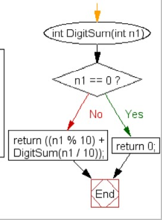
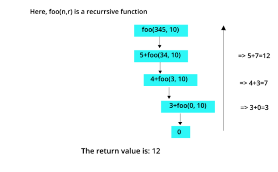
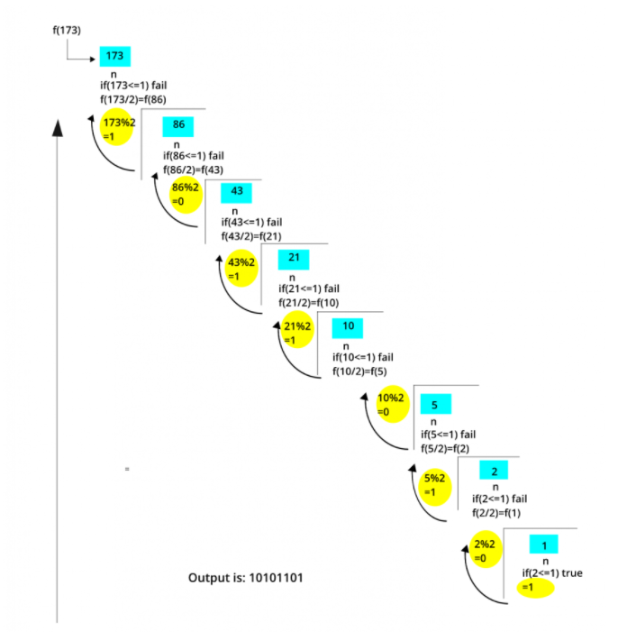
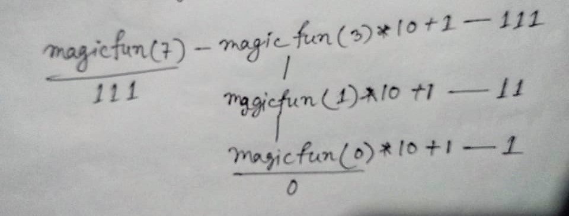
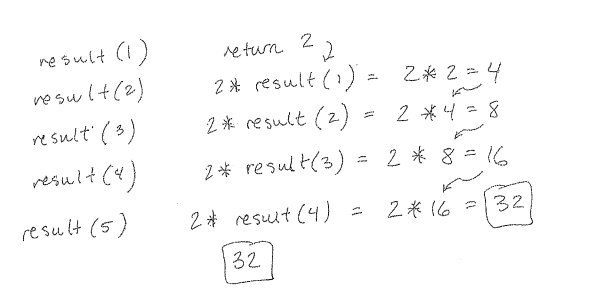
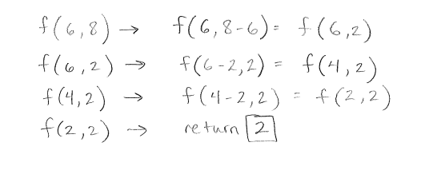
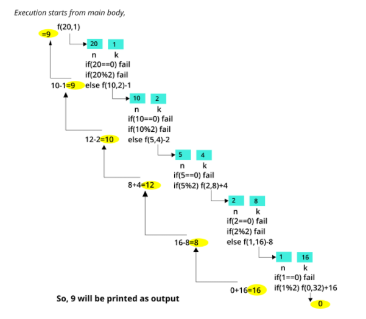

# ০৪ — Digits, Binary & Number Tricks (অঙ্ক, বাইনারি ও সংখ্যার কারসাজি)

> **মূল কথা:** `n % 10` = শেষ অঙ্ক, `n / 10` = শেষ অঙ্ক বাদ; `n % 2` = বাইনারি বিট, `n / 2` = ডান দিক থেকে বিট বাদ।
> print **call-এর আগে** হলে বিটগুলো উল্টা (reverse) ক্রমে আসে, **call-এর পরে** হলে সঠিক ক্রমে আসে।

---

## প্রশ্ন ১ — digit sum: rec(55)

Select the correct output of the following code.

```c
int rec(int num) {
    return (num) ? num % 10 + rec(num / 10) : 0;
}

main() {
    printf("%d", rec(55));
}
```

a) 10  b) 25  c) 5  d) 15

**✅ সঠিক উত্তর: a) 10**

55%10 = 5 এবং rec(55/10) = rec(5) = 5 → 5 + 5 = **10** (অঙ্কের যোগফল)

---

## প্রশ্ন ২ — digit sum: DigitSum(25)

What is the output of the following code if n1=25?

```c
int DigitSum(int n1) {
    if (n1 == 0)
        return 0;
    return ((n1 % 10) + DigitSum(n1 / 10));
}
```

a) 7  b) 2  c) 1  d) 4

**✅ সঠিক উত্তর: a) 7**

2 + 5 = **7**



---

## প্রশ্ন ৩ — যেকোনো base-এ digit sum: foo(345, 10)

What is the return value of the function foo when it is called as foo(345, 10)?

```c
unsigned int foo(unsigned int n, unsigned int r) {
    if (n > 0)
        return ((n % r) + foo(n / r, r));
    else
        return 0;
}
```

**✅ উত্তর: 12**

r = 10 হলে এটা digit sum: 3 + 4 + 5 = **12**



---

## প্রশ্ন ৪ — binary reverse: print(12)

What will be the output if we put print(12)?

```c
void print(int n) {
    if (n == 0)
        return;
    printf("%d", n % 2);
    print(n / 2);
}
```

a) 0011  b) 1100  c) 0101  d) 1001

**✅ সঠিক উত্তর: a) 0011**

print **call-এর আগে**, তাই বিট উল্টা ক্রমে:
- 12%2=0 → প্রিন্ট 0, n=6
- 6%2=0 → প্রিন্ট 0, n=3
- 3%2=1 → প্রিন্ট 1, n=1
- 1%2=1 → প্রিন্ট 1, n=0 → থামে

Output: **0011** (12-এর বাইনারি 1100-এর উল্টা)

---

## প্রশ্ন ৫ — binary reverse: fun(25)

What does the following function print for n = 25?

```c
void fun(int n) {
    if (n == 0)
        return;
    printf("%d", n % 2);
    fun(n / 2);
}
```

**✅ উত্তর: 10011**

The function prints the binary representation **in reverse order**. 25 = binary 11001 → reversed **10011**

---

## প্রশ্ন ৬ — সঠিক ক্রমে binary: f(173)

What does f(173) print?

```c
void f(int n) {
    if (n <= 1) {
        printf("%d", n);
    }
    else {
        f(n / 2);
        printf("%d", n % 2);
    }
}
```

**✅ উত্তর: 10101101**

এখানে print **call-এর পরে**, তাই সঠিক ক্রমে বাইনারি: 173 = **10101101₂**



---

## প্রশ্ন ৭ — binary বানায় দশমিকের চেহারায়: magicfun(7)

What will the function magicfun() return when the value of n is 7?

```c
int magicfun(int n) {
    if (n == 0)
        return 0;
    else
        return magicfun(n / 2) * 10 + (n % 2);
}
```

a) 100  b) 111  c) 1110  d) None of the above

**✅ সঠিক উত্তর: b) 111**

- magicfun(7) = magicfun(3)×10 + 1
- magicfun(3) = magicfun(1)×10 + 1
- magicfun(1) = magicfun(0)×10 + 1 = 0 + 1 = 1

তাহলে: 1 → 11 → **111** (7-এর বাইনারি রূপ দশমিক সংখ্যার চেহারায়)



> 📌 মূল নোটে এই প্রশ্নটা দুইবার এসেছে (প্রশ্ন ২৯ ও ৬৪) — একই উত্তর।

---

## প্রশ্ন ৮ — একই প্যাটার্ন: my-function(10)

What will the function my-function() return when the value of n is 10?

```c
int my_function(int n) {
    if (n == 0)
        return 0;
    else
        return my_function(n / 2) * 10 + (n % 2);
}
```

a) 1010  b) 1111  c) 1110  d) None of the above

**✅ সঠিক উত্তর: a) 1010**

10-এর বাইনারি = **1010**
ধাপ: f(10)=f(5)×10+0; f(5)=f(2)×10+1; f(2)=f(1)×10+0; f(1)=1 → 1 → 10 → 101 → **1010**

---

## প্রশ্ন ৯ — power of 2 চেক

What will be the output of the following code?

```c
void my_recursive_function(int n) {
    if (n == 0) { printf("False"); return; }
    if (n == 1) { printf("True");  return; }
    if (n % 2 == 0)
        my_recursive_function(n / 2);
    else { printf("False"); return; }
}

int main() {
    my_recursive_function(100);
    return 0;
}
```

a) True  b) False

**✅ সঠিক উত্তর: b) False**

ফাংশনটা চেক করে n **power of 2** কিনা। 100 → 50 → 25 (odd, ≠1) → False।

> 📌 মূল নোটে এই প্রশ্নটা দুইবার এসেছে (প্রশ্ন ১৭ ও ৩৬) — একই উত্তর।

---

## প্রশ্ন ১০ — power of 3 চেক

What does this function do?

```c
int fun(unsigned int n) {
    if (n == 0 || n == 1)
        return n;
    if (n % 3 != 0)
        return 0;
    return fun(n / 3);
}
```

**✅ উত্তর: It returns 1 when n is a power of 3, otherwise returns 0.**

উদাহরণ n=27: 27%3=0 → fun(9); 9%3=0 → fun(3); 3%3=0 → fun(1) → return **1**।
মাঝপথে কোনো ভাগশেষ থাকলেই return 0।

---

## প্রশ্ন ১১ — 2ⁿ: result(5)

What value is returned by the method call result(5)?

```java
public int result(int n) {
    if (n == 1)
        return 2;
    else
        return 2 * result(n - 1);
}
```

**✅ উত্তর: 32**

2 × 2 × 2 × 2 × 2 = 2⁵ = **32**



---

## প্রশ্ন ১২ — GCD-এর মতো: f(6, 8)

What value is returned by the method call f(6, 8)?

```java
public int f(int k, int n) {
    if (n == k)
        return k;
    else if (n > k)
        return f(k, n - k);
    else
        return f(k - n, n);
}
```

**✅ উত্তর: 2**

এটা আসলে GCD (subtraction method): f(6,8) → f(6,2) → f(4,2) → f(2,2) → **2**



---

## প্রশ্ন ১৩ — prime factor print: compute(24, 2)

What will be the output by the function call compute(24, 2)?

```python
def compute(x, y):
    if x > 1:
        if x % y == 0:
            print(y, end=' ')
            compute(int(x / y), y)
        else:
            compute(x, y + 1)
```

a) 2 2 2 3  b) 2 2 2 2  c) 2 3 3 3  d) None of the above

**✅ সঠিক উত্তর: a) 2 2 2 3**

এটা prime factorization: 24 = 2 × 2 × 2 × 3
- (24,2): 24%2=0 → প্রিন্ট 2 → (12,2) → প্রিন্ট 2 → (6,2) → প্রিন্ট 2 → (3,2)
- (3,2): 3%2≠0 → (3,3) → প্রিন্ট 3 → (1,3): 1>1 false → শেষ

> 📌 মূল নোটে একই প্রশ্ন Java সংস্করণেও এসেছে (`somefun(24,2)`, ছবি: images/image13.jpeg) — উত্তর একই: 2 2 2 3।

---

## প্রশ্ন ১৪ — +k / -k খেলা: f(20, 1)

```c
#include <stdio.h>
int f(int n, int k) {
    if (n == 0)
        return 0;
    else if (n % 2)
        return f(n / 2, 2 * k) + k;
    else
        return f(n / 2, 2 * k) - k;
}

int main() {
    printf("%d", f(20, 1));
    return 0;
}
```

**✅ উত্তর: 9**

- f(20,1): even → f(10,2) − 1
- f(10,2): even → f(5,4) − 2
- f(5,4): odd → f(2,8) + 4
- f(2,8): even → f(1,16) − 8
- f(1,16): odd → f(0,32) + 16 = 16

মোট: 16 − 8 + 4 − 2 − 1 = **9**



---

## প্রশ্ন ১৫ — অদ্ভুত ভাঙা রিকার্শন: f(11)

```c
#include <stdio.h>
int f(int n) {
    if (n <= 1)
        return 1;
    if (n % 2 == 0)
        return f(n / 2);
    return f(n / 2) + f(n / 2 + 1);
}

int main() {
    printf("%d", f(11));
    return 0;
}
```

**✅ উত্তর: 5**

F(11) → F(5) + F(6) → [F(2) + F(3)] + F(3) → F(1) + 2×[F(1) + F(2)] → 1 + 2×(1 + 1) = **5**

