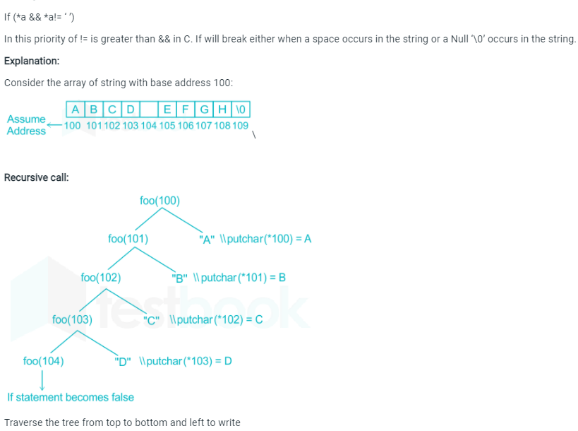
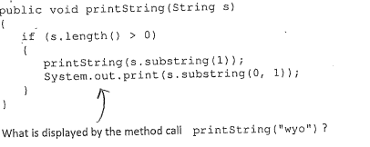
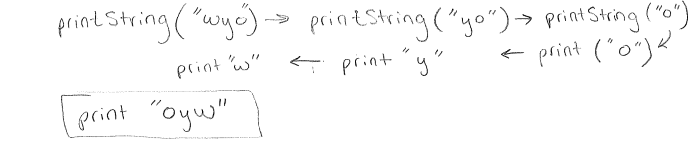
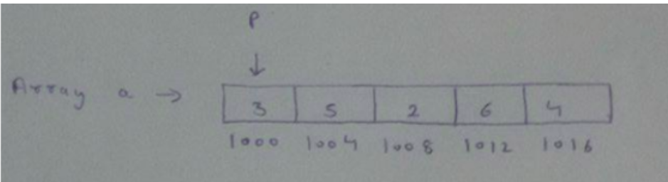
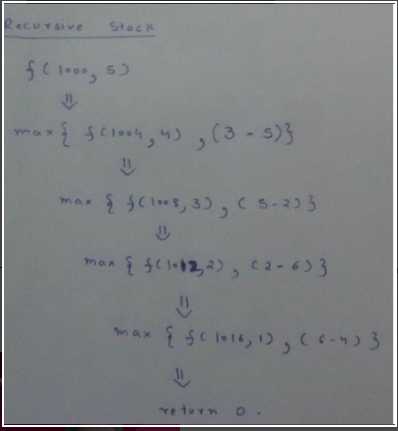

# ০৫ — Strings & Arrays (স্ট্রিং ও অ্যারে নিয়ে রিকার্শন)

> **মূল কথা:** স্ট্রিং reverse করার ক্লাসিক কৌশল — **আগে রিকার্সিভ কল, পরে প্রিন্ট**।
> ক্যারেক্টারগুলো call stack-এ জমা থাকে, ফেরার পথে উল্টা ক্রমে বের হয়।

---

## প্রশ্ন ১ — getchar দিয়ে reverse

What will be the output of the following C code if the input given to the code shown below is "sanfoundry"?

```c
main() {
    void f(void);
    printf("enter the word\n");
    f();
}

void f(void) {
    char c;
    if ((c = getchar()) != NL) {
        f();
        printf("%c", c);
    }
    return;
}
```

a) sanfoundry  b) infinite loop  c) yrdnuofnas  d) fnasyrdnuo

**✅ সঠিক উত্তর: c) yrdnuofnas**

আগে f() কল, পরে printf — তাই ঢোকার সময় সব অক্ষর stack-এ জমা হয়, ফেরার সময় উল্টা ক্রমে প্রিন্ট হয়। "sanfoundry" উল্টে **"yrdnuofnas"**।

---

## প্রশ্ন ২ — pointer দিয়ে word reverse

The output of the following function on input "ABCD EFGH" is:

```c
void foo(char *a) {
    if (*a && *a != ' ') {
        foo(a + 1);
        putchar(*a);
    }
}
```

**✅ উত্তর: DCBA**

space (' ') পেলেই রিকার্শন থেমে যায়, তাই শুধু প্রথম শব্দ "ABCD" উল্টে **DCBA** প্রিন্ট হয়। "EFGH" পর্যন্ত পৌঁছায়ই না।



---

## প্রশ্ন ৩ — Java: substring দিয়ে reverse

What is displayed by the method call `printString("wyo")`?

```java
public void printString(String s) {
    if (s.length() > 0) {
        printString(s.substring(1));
        System.out.print(s.substring(0, 1));
    }
}
```

**✅ উত্তর: oyw**

আগে রিকার্সিভ কল, পরে প্রথম অক্ষর প্রিন্ট → ফেরার পথে উল্টা ক্রম: **oyw**

মূল প্রশ্নের ছবি: 
ব্যাখ্যা: 

---

## প্রশ্ন ৪ — দুইবার কল: abc("xyz")

```c
void abc(char *s) {
    if (s[0] == '\0')
        return;
    abc(s + 1);
    abc(s + 1);
    printf("%c", s[0]);
}

int main() {
    abc("xyz");
    return 0;
}
```

**✅ উত্তর: zzyzzyx**

প্রতি লেভেলে দুইবার কল হয়, তাই:
- s[0] ('x') → 1 বার প্রিন্ট
- s[1] ('y') → 2 বার
- s[2] ('z') → 4 বার (2ⁱ বার)

ট্রেস: abc("xyz") = abc("yz") + abc("yz") + 'x', আর abc("yz") = "zzy" → **"zzy"+"zzy"+"x" = zzyzzyx**

---

## প্রশ্ন ৫ — vowel গোনা

What will be the output of the following code?

```c
int count = 0;

void my_recursive_function(char *s, int i) {
    if (s[i] == '\0')
        return;
    if (s[i]=='a' || s[i]=='e' || s[i]=='i' || s[i]=='o' || s[i]=='u')
        count++;
    my_recursive_function(s, i + 1);
}

int main() {
    my_recursive_function("thisisrecursion", 0);
    printf("%d", count);
    return 0;
}
```

a) 6  b) 9  c) 5  d) 10

**✅ সঠিক উত্তর: a) 6**

"th**i**s**i**sr**e**c**u**rs**io**n" — vowels: i, i, e, u, i, o = **6**টা

---

## প্রশ্ন ৬ — অ্যারেতে linear search

What will be the output of the following code?

```c
void my_recursive_function(int *arr, int val, int idx, int len) {
    if (idx == len) {
        printf("-1");
        return;
    }
    if (arr[idx] == val) {
        printf("%d", idx);
        return;
    }
    my_recursive_function(arr, val, idx + 1, len);
}

int main() {
    int array[10] = {7, 6, 4, 3, 2, 1, 9, 5, 0, 8};
    int value = 2;
    int len = 10;
    my_recursive_function(array, value, 0, len);
    return 0;
}
```

a) 3  b) 4  c) 5  d) 6

**✅ সঠিক উত্তর: b) 4**

value = 2 অ্যারের index 4-এ আছে (0-based indexing): {7₀, 6₁, 4₂, 3₃, **2₄**, ...} → প্রিন্ট **4**

---

## প্রশ্ন ৭ — অ্যারের maximum

```c
#include <stdio.h>
int fun(int a[], int n) {
    int x;
    if (n == 1)
        return a[0];
    else
        x = fun(a, n - 1);
    if (x > a[n - 1])
        return x;
    else
        return a[n - 1];
}

int main() {
    int arr[] = {12, 10, 30, 50, 100};
    printf(" %d ", fun(arr, 5));
    return 0;
}
```

**✅ উত্তর: 100**

fun() returns the **maximum value** in the input array a[] of size n. এখানে max = **100**।

---

## প্রশ্ন ৮ — pairwise difference-এর max

```c
int f(int *p, int n) {
    if (n <= 1)
        return 0;
    else
        return max(f(p + 1, n - 1), p[0] - p[1]);
}

int main() {
    int a[] = {3, 5, 2, 6, 4};
    printf("%d", f(a, 5));
}
```

**✅ উত্তর: 3**

প্রতিটি পাশাপাশি জোড়ার difference: 3−5=−2, 5−2=3, 2−6=−4, 6−4=2 → max = **3**




