# ০৬ — Multiple Calls, Static Variables & Hard Problems (কঠিন প্রশ্ন)

> **মূল কথা:** এই অধ্যায়ে তিন ধরনের কঠিন প্রশ্ন —
> ১) **একাধিক রিকার্সিভ কল** (call tree এঁকে হিসাব করো),
> ২) **static variable** (সব কলে একটাই ভাগাভাগি করা মান — reset হয় না),
> ৩) **কতবার ফাংশন কল হলো** গোনা (base case-এর কলটাও গুনতে ভুলো না)।

---

## প্রশ্ন ১ — কতবার কল হবে: get(6)

If get(6) function is called in main, then how many times the get() function will be invoked before returning to the main?

```c
void get(int n) {
    if (n < 1)
        return;
    get(n - 1);
    get(n - 3);
    printf("%d", n);
}
```

a) 15  b) 25  c) 35  d) 45

**✅ সঠিক উত্তর: b) 25**

প্রতিটি কল থেকে দুইটা কল হয়: get(n-1) এবং get(n-3)। পুরো call tree আঁকলে মোট **25**টা কল পাওয়া যায়।

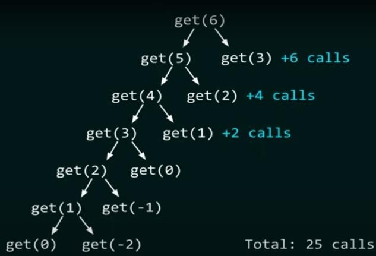
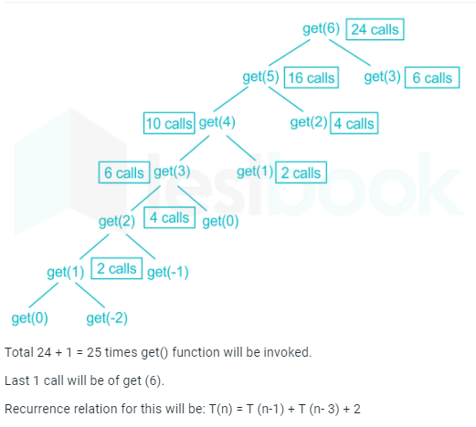

> 📌 মূল নোটে এই প্রশ্নটা দুইবার এসেছে (প্রশ্ন ২৬ ও ৫৭) — একই উত্তর।

---

## প্রশ্ন ২ — কতবার কল হবে: recursive_sum(5)

How many times is the function recursive_sum called when the code is executed?

```c
int recursive_sum(int n) {
    if (n == 0)
        return 0;
    return n + recursive_sum(n - 1);
}

int main() {
    int n = 5;
    int ans = recursive_sum(n);
    printf("%d", ans);
    return 0;
}
```

a) 4  b) 5  c) 6  d) 7

**✅ সঠিক উত্তর: c) 6**

কলগুলো: f(5), f(4), f(3), f(2), f(1), f(0) — শেষেরটা base case। মোট **6** বার।

> 📌 ফাঁদ: n=5 বলে 5 ভেবো না — base case-এর কল f(0)-ও গুনতে হয়।

---

## প্রশ্ন ৩ — কতবার কল হবে: my_recursive_function(10)

How many times is the recursive function called when the code is executed?

```c
void my_recursive_function(int n) {
    if (n == 0)
        return;
    printf("%d ", n);
    my_recursive_function(n - 1);
}

int main() {
    my_recursive_function(10);
    return 0;
}
```

a) 9  b) 10  c) 11  d) 12

**✅ সঠিক উত্তর: c) 11**

f(10) থেকে f(0) পর্যন্ত — মোট **11**টা কল (10টা প্রিন্ট করে + 1টা base case)।

---

## প্রশ্ন ৪ — counter দিয়ে কল গোনা: calc(4, 81)

```c
#include <stdio.h>
int counter = 0;

int calc(int a, int b) {
    int c;
    counter++;
    if (b == 3)
        return (a * a * a);
    else {
        c = calc(a, b / 3);
        return (c * c * c);
    }
}

int main() {
    calc(4, 81);
    printf("%d", counter);
}
```

**✅ উত্তর: 4**

b-এর মান: 81 → 27 → 9 → 3 — চারটা কল। counter = **4**

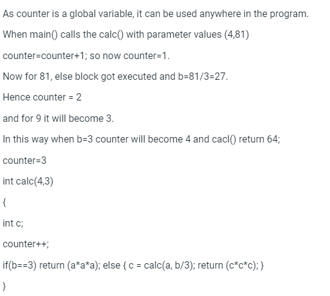

---

## প্রশ্ন ৫ — print কতবার: Count(1024, 1024)

```c
Count(x, y) {
    if (y != 1) {
        if (x != 1) {
            print("*");
            Count(x / 2, y);
        }
        else {
            y = y - 1;
            Count(1024, y);
        }
    }
}
```

The number of times that the print statement is executed by the call Count(1024, 1024) is _____.

**✅ উত্তর: 10230**

প্রতি y-এর জন্য x: 1024 → 512 → ... → 2 → 1 পর্যন্ত **10**টা `*` প্রিন্ট হয়।
y চলে 1024 থেকে 2 পর্যন্ত = **1023**টা মান।
মোট: 10 × 1023 = **10230**

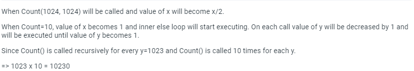

---

## প্রশ্ন ৬ — mutual recursion: fun1 ও fun2

Consider the following two functions. The output printed when fun1(5) is called is:

```c
void fun1(int n) {
    if (n == 0) return;
    printf("%d", n);
    fun2(n - 2);
    printf("%d", n);
}

void fun2(int n) {
    if (n == 0) return;
    printf("%d", n);
    fun1(++n);
    printf("%d", n);
}
```

**✅ উত্তর: 53423122233445**

দুইটা ফাংশন একে অপরকে ডাকে (mutual recursion)। ধাপে ধাপে ট্রেস করলে:
fun1(5)→5, fun2(3)→3, fun1(4)→4, fun2(2)→2, fun1(3)→3, fun2(1)→1, fun1(2)→2, fun2(0) return... ফেরার পথে বাকি সংখ্যাগুলো।

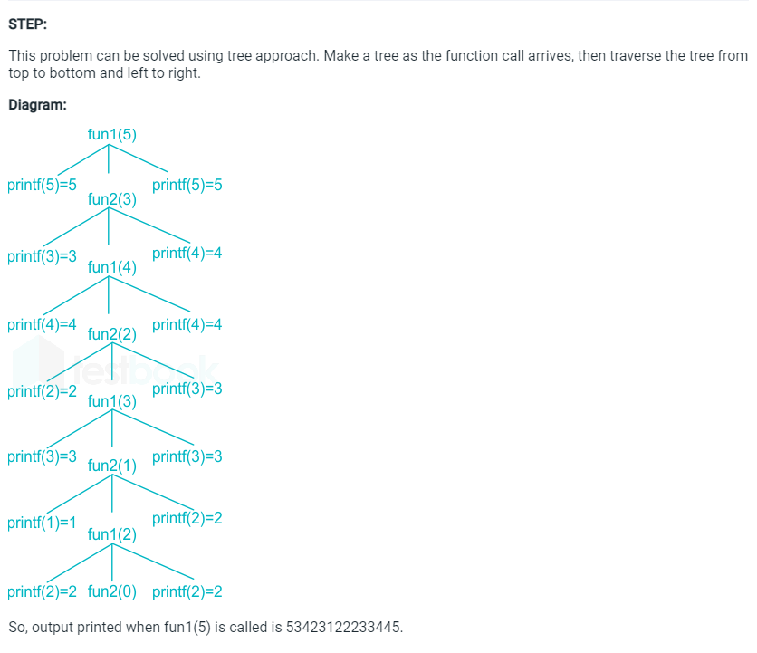

---

## প্রশ্ন ৭ — Java: equation(8)

Predict the output:

```java
public static void main(String[] args) {
    System.out.println(equation(8));
}

public static int equation(int a) {
    if (a <= 5) {
        return 12;
    }
    return equation(a - 2) * equation(a - 1);
}
```

a) 104  b) 1728  c) 144  d) 248832

**✅ সঠিক উত্তর: d) 248832**

Stopping case: a ≤ 5 → return 12
- equation(6) = 12 × 12 = 144
- equation(7) = 12 × 144 = 1728
- equation(8) = 144 × 1728 = **248832**

---

## প্রশ্ন ৮ — Java: foo(5, 9)

What will be the output for the function call foo(5, 9)?

```java
public static int foo(int a, int b) {
    if (b <= 1 || b <= a) {
        return 1;
    }
    return (b - a) * foo(a, b - 1);
}
```

a) 36  b) 18  c) 32  d) 24

**✅ সঠিক উত্তর: d) 24**

- foo(5,9) = 4 × foo(5,8)
- foo(5,8) = 3 × foo(5,7)
- foo(5,7) = 2 × foo(5,6)
- foo(5,6) = 1 × foo(5,5), আর foo(5,5) = 1 (b ≤ a)

মোট: 4 × 3 × 2 × 1 × 1 = **24**

---

## প্রশ্ন ৯ — Java: foo(8) দুই শাখা

What will be the output for the function call foo(8)?

```java
public static int foo(int a) {
    if (a <= 3) {
        return 1;
    }
    return a * foo(a - 3) * foo(a - 4);
}
```

a) 240  b) 160  c) 140  d) 144

**✅ সঠিক উত্তর: b) 160**

- foo(8) = 8 × foo(5) × foo(4)
- foo(5) = 5 × foo(2) × foo(1) = 5 × 1 × 1 = 5
- foo(4) = 4 × foo(1) × foo(0) = 4 × 1 × 1 = 4

মোট: 8 × 5 × 4 = **160**

---

## প্রশ্ন ১০ — Catalan-এর মতো: fun(5)

```c
int fun(int n) {
    int x = 1, k;
    if (n == 1)
        return x;
    for (k = 1; k < n; ++k)
        x = x + fun(k) * fun(n - k);
    return x;
}
```

The return value of fun(5) is _____.

**✅ উত্তর: 51**

- fun(1)=1, fun(2)=1+1×1=2, fun(3)=1+1×2+2×1=5, fun(4)=1+1×5+2×2+5×1=15
- fun(5)=1 + 1×15 + 2×5 + 5×2 + 15×1 = **51**

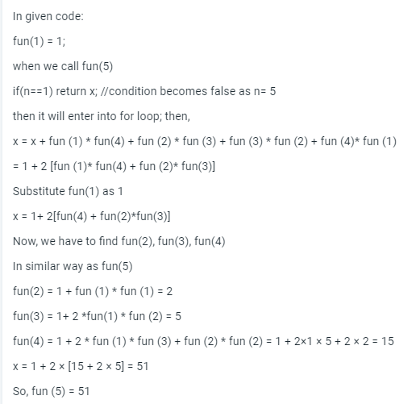

---

## প্রশ্ন ১১ — reference parameter: f(p, p)

What is the return value of f(p, p), if the value of p is initialized to 5 before the call?

```cpp
int f(int &x, int c) {
    c = c - 1;
    if (c == 0) return 1;
    x = x + 1;
    return f(x, c) * x;
}
```

**✅ উত্তর: 6561**

x reference হওয়ায় সব লেভেলে একই ভেরিয়েবল! শেষে x = 9 হয়ে যায়, আর গুণফল হয় 9 × 9 × 9 × 9 = **6561**

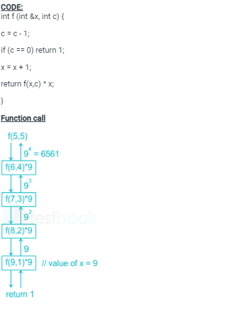

> 📌 এটা C++ এর reference (`int &x`) — মান সব stack frame-এ শেয়ার হয়।

---

## প্রশ্ন ১২ — static variable: f(5)

Consider the following C function. What is the value of f(5)?

```c
int f(int n) {
    static int r = 0;
    if (n <= 0) return 1;
    if (n > 3) {
        r = n;
        return f(n - 2) + 2;
    }
    return f(n - 1) + r;
}
```

**✅ উত্তর: 18**

- f(5): n>3 → r=5, return f(3)+2
- f(3): return f(2)+r = f(2)+5
- f(2): return f(1)+5; f(1): return f(0)+5; f(0): return 1

f(1)=1+5=6, f(2)=6+5=11, f(3)=11+5=16, f(5)=16+2=**18**

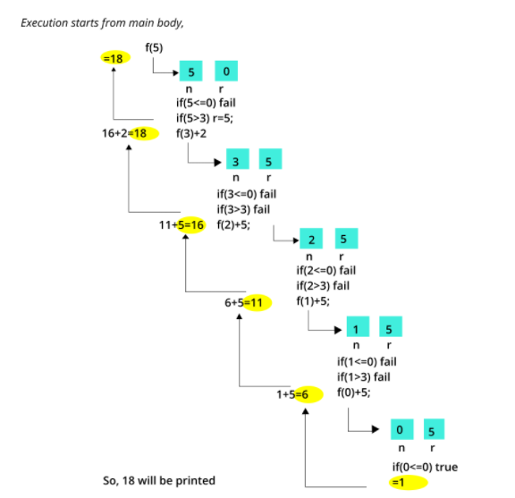

---

## প্রশ্ন ১৩ — McCarthy 91 function

```text
def fun(n)
    if n > 100
        return n - 10
    else
        return fun(fun(n + 11))
```

fun(99) = ?

**✅ উত্তর: 91**

- fun(99) = fun(fun(110))  (99 ≤ 100)
- = fun(100)  (110 > 100 → 110−10)
- = fun(fun(111))  (100 ≤ 100)
- = fun(101)  (111 > 100)
- = **91**  (101 > 100 → 101−10)

n ≤ 101 সব integer-এর জন্য উত্তর 91। এটাই বিখ্যাত **McCarthy 91 function**।

---

## প্রশ্ন ১৪ — post-increment ফাঁদ: fun(200)

```c
int fun(int i) {
    if (i % 2) return (i++);
    else return fun(fun(i - 1));
}

int main() {
    printf(" %d ", fun(200));
    return 0;
}
```

**✅ উত্তর: 199**

n odd হলে n return করে, even হলে fun(fun(n−1))।
`return i++;` post-increment — বাড়ার আগের মানই return হয়।
fun(200) → fun(fun(199)) → fun(199) → **199**

---

## প্রশ্ন ১৫ — nested call: fun(fun(fun(++count)))

```c
#include <stdio.h>
int fun(int count) {
    printf("%d\n", count);
    if (count < 3) {
        fun(fun(fun(++count)));
    }
    return count;
}

int main() {
    fun(1);
    return 0;
}
```

**Answer:**
```
1
2
3
3
3
3
3
```

fun(1) prints 1 → calls fun(fun(fun(2))). fun(2) prints 2 → calls fun(fun(fun(3))). So the sequence becomes fun(fun(fun(fun(fun(3))))). Each fun(3) prints "3" and returns 3 (condition false, no more increment). Nested কলগুলো একে একে খুলতে খুলতে "3" মোট **৫ বার** প্রিন্ট হয়।

---

## প্রশ্ন ১৬ — দুই static ভেরিয়েবল: fun2(5)

```c
int fun1(int n) {
    static int i = 0;
    if (n > 0) {
        i++;
        fun1(n - 1);
    }
    return (i);
}

int fun2(int n) {
    static int i = 0;
    if (n > 0) {
        i = i + fun1(n);
        fun2(n - 1);
    }
    return (i);
}
```

fun2(5) = ?

**✅ উত্তর: 55**

fun1-এর static i জমতে থাকে: fun1(5)=5, তারপর fun1(4)=5+4=9, fun1(3)=12, fun1(2)=14, fun1(1)=15।
fun2-এর i = 5 + 9 + 12 + 14 + 15 = **55**

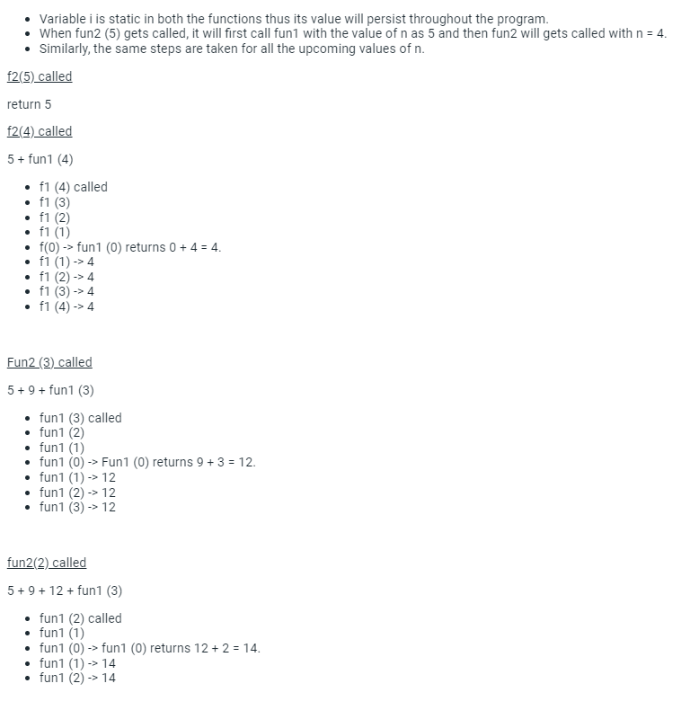
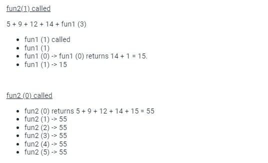

---

## প্রশ্ন ১৭ — static d: count(3)

What will be the output of the following C program?

```c
void count(int n) {
    static int d = 1;
    printf("%d ", n);
    printf("%d ", d);
    d++;
    if (n > 1)
        count(n - 1);
    printf("%d ", d);
}

void main() {
    count(3);
}
```

**✅ উত্তর: 3 1 2 2 1 3 4 4 4**

- count(3): print 3, 1 → d=2 → count(2)
- count(2): print 2, 2 → d=3 → count(1)
- count(1): print 1, 3 → d=4 → (n>1 false) → print 4
- ফেরার পথে count(2) ও count(3)-ও d-এর **বর্তমান** মান 4 প্রিন্ট করে (static!)

Output: **3 1 2 2 1 3 4 4 4**

মূল প্রশ্নের ছবি: 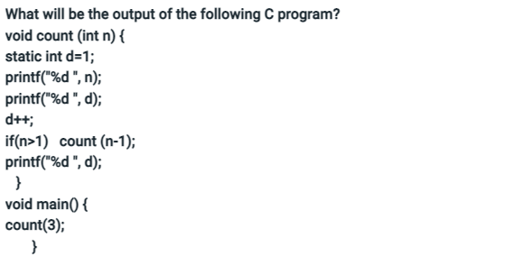
ব্যাখ্যা: 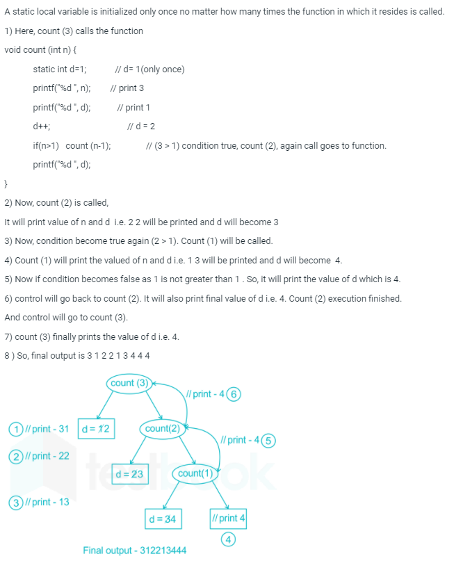

---

## প্রশ্ন ১৮ — Java: mystery(3) দুই শাখা

What value is returned by the method call mystery(3)?

```java
public int mystery(int n) {
    if (n < 0) return 2;
    else return mystery(n - 1) + mystery(n - 3);
}
```

**✅ উত্তর: 14**

- mystery(-1) = mystery(-2) = mystery(-3) = 2
- mystery(0) = mystery(-1) + mystery(-3) = 2 + 2 = 4
- mystery(1) = mystery(0) + mystery(-2) = 4 + 2 = 6
- mystery(2) = mystery(1) + mystery(-1) = 6 + 2 = 8
- mystery(3) = mystery(2) + mystery(0) = 8 + 4 = 12

> ⚠️ সরাসরি ট্রেস করলে 12 আসে, কিন্তু মূল নোটে উত্তর **14** লেখা — ছবির ব্যাখ্যার ধাপগুলো মিলিয়ে দেখো, মূল নোটে হিসাবে ভুল থাকতে পারে:

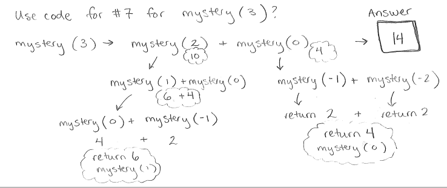

