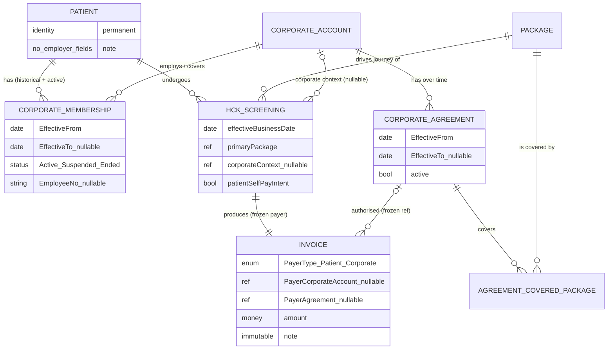

বুঝেছি — এটা purely domain/business validation phase। কোনো code, migration, entity, table, doc change করব না, G2a LOCK করব না। শুধু বিশ্লেষণ।

নিচে পুরো বিশ্লেষণ দিলাম।

---

# ভূমিকা — পাঁচটা আলাদা প্রশ্ন যা প্রায়ই একসাথে মিশে যায়

Corporate health-check ডোমেইনে নিচের পাঁচটা প্রশ্ন **সম্পূর্ণ আলাদা**, এবং বেশিরভাগ ভুল ডিজাইন হয় এগুলো এক করে ফেলার কারণে:

1. **এই ব্যক্তি কে?** → Patient (permanent clinical identity)
2. **এই ব্যক্তির কোনো কোম্পানির সাথে সম্পর্ক আছে কি, কবে থেকে কবে পর্যন্ত?** → CorporateMembership
3. **এই নির্দিষ্ট screening-টা কি কোনো corporate context-এ হচ্ছে?** → Screening-এর Corporate Context (booking-time decision)
4. **এই নির্দিষ্ট transaction-এর টাকা কে দেবে?** → Payer determination (confirm-time decision, agreement + coverage + effective date + রোগীর পছন্দের উপর নির্ভরশীল)
5. **শেষ পর্যন্ত কাকে কত bill করা হলো?** → Invoice (immutable financial record)

"Membership আছে" মানেই "কোম্পানি টাকা দেবে" — এই লাফটাই মূল বিপদ। Membership হলো #2, payer হলো #4; এদের মাঝে #3 আর eligibility validation দাঁড়িয়ে আছে।

তোমার dead-code sweep-এর ফলাফলও এখানে সঙ্গতিপূর্ণ: `HckCorporateBatch` / `HckCorporateEmployee` হলো একটা **campaign/roster-upload** ধারণা — এটা membership নয়, এবং একে membership-এর বিকল্প হিসেবে ব্যবহার করলে #2 আর #3 আবার মিশে যাবে।

---

# অংশ ১ — ছয়টি Hypothesis-এর সরাসরি যাচাই

## A. একজন Patient-এর একাধিক CorporateMembership

**Verdict: CONFIRMED** (domain capability হিসেবে অবশ্যই support করতে হবে; V1-এ শুধু active subset ব্যবহার করলেও model-এ 1:N লাগবেই)

বাস্তবতা:

|কেস|বাস্তবে ঘটে?|মন্তব্য|
|---|---|---|
|চাকরি পরিবর্তন (A → B)|খুব সাধারণ|পুরোনো membership মুছে ফেললে audit/reconciliation ভেঙে যায়|
|পূর্বতন employer|সাধারণ|historical row হিসেবে থাকতেই হবে|
|একই সময়ে দুই চাকরি / board membership / group-company|ঘটে, বিরল নয়|**overlapping active periods** representable হতে হবে|
|Consultant / part-time / retainer|ঘটে|"employment" শব্দটা সংকীর্ণ — নিচে F-এর নোট দেখো|
|Dependent/spouse coverage, retiree benefit|কিছু agreement-এ ঘটে|তখন "membership" = employment নয়, "eligibility relationship"|

**সংশোধন/সতর্কতা:** hypothesis A ঠিক, কিন্তু "simultaneous active membership কখনো allowed নয়" — এই ধারণা **রাখা যাবে না**। Model-কে overlapping active membership _store_ করতে দিতে হবে। V1 UI চাইলে booking-এর সময় শুধু একটা বেছে নিতে বাধ্য করতে পারে (নিচে D ও §3), কিন্তু সেটা storage constraint নয়, workflow constraint।

---

## B. Historical CorporateMembership সংরক্ষণ

**Verdict: CONFIRMED — এবং এটা "future enhancement" নয়, correct model-এর জন্য REQUIRED**

কেন history আজই দরকার (পরে নয়):

- **Eligibility as-of date:** screening-এর effective date-এ patient কোন কোম্পানির অধীনে ছিল — সেটা জানতে হলে period লাগবে। আজকের `IsActive` দিয়ে ৩ মাস আগের booking যাচাই করা যায় না।
- **Corporate reconciliation:** কোম্পানিকে মাস শেষে invoice পাঠানো হয়; কোম্পানি ৪৫ দিন পরে জিজ্ঞেস করে "এই লোকটা তো ওই তারিখে আমাদের কর্মী ছিল না" — তখন historical membership ছাড়া উত্তর নেই।
- **Dispute/audit:** "screening যখন হয়েছিল তখন কি এই ব্যক্তি covered ছিল?" — এটা immutable historical fact, পরে membership বদলালেও উত্তর একই থাকতে হবে।
- **Re-hire:** একই কোম্পানিতে দুইবার (Case 3) — দুটো আলাদা period, মাঝে একটা gap। এক row-তে date overwrite করলে gap-এর মধ্যে হওয়া কোনো booking ভুলভাবে "covered" দেখাবে।

Booking time-এ system-কে যা জানতে হবে:

1. এই patient-এর যে membership-গুলো **effective business date-এ active** ছিল তার তালিকা।
2. তার প্রতিটার corporate account ও (থাকলে) EmployeeNo।

চিরকাল available থাকতে হবে:

- প্রতিটা membership period (from/to), status transition-এর ইতিহাস, কোন account।
- একবার কোনো screening/invoice যে membership+agreement-এর ভিত্তিতে corporate-billed হয়েছে — সেই সম্পর্ক invoice-এ **frozen** (membership পরে বদলালেও invoice বদলাবে না)।

**নিয়ম:** CorporateMembership rows কখনো hard-delete বা date-overwrite হবে না; পরিবর্তন = নতুন period বা explicit status transition, audit সহ।

---

## C. Membership period / validity (`MembershipFrom`, `MembershipTo`, `IsActive`, `EmployeeNo`)

**Verdict: MODIFIED**

|ক্ষেত্র|এটা কী?|রায়|
|---|---|---|
|`MembershipFrom`|**genuine business concept**|REQUIRED, "future optional" নয় — eligibility-on-date এটা ছাড়া অসম্ভব|
|`MembershipTo`|**genuine business concept** (nullable = open-ended/current)|REQUIRED|
|`IsActive`|**বেশিরভাগ ক্ষেত্রে derived** (today ∈ [From,To)), কিন্তু একটা স্বাধীন business state-ও আছে|নিচে দেখো|
|`EmployeeNo`|**genuine business concept**, কিন্তু optional/nullable|corporate-এর নিজস্ব reconciliation identifier; সব কোম্পানি দেয় না; Patient-এ নয়, Membership-এ|
|membership status|**genuine, date থেকে আলাদা**|Suspended / Terminated-for-cause তারিখের অঙ্ক নয় — explicit event|
|eligibility period|derived (status + date period-এর যৌথ ফল)|আলাদা store করার দরকার নেই|

**কেন original hypothesis অপর্যাপ্ত:**

`IsActive`-কে একটা স্বাধীন, mutable boolean হিসেবে source-of-truth রাখলে সেটা date-এর সাথে **contradict** করতে পারে (period বলছে active, কেউ ভুলে `IsActive=false` করে দিল, বা উল্টো)। তখন "eligible কি না" প্রশ্নের দুটো পরস্পরবিরোধী উত্তর — payer determination-এ এটা বিপজ্জনক।

**সংশোধিত business rule:**

> Membership-এর দুটো স্বাধীন মাত্রা আছে: (a) **period** — `EffectiveFrom` (required), `EffectiveTo` (nullable); (b) **lifecycle status** — একটা explicit concept: `Active` / `Suspended` / `Ended` (তারিখ নয়, ঘটনা)।
> 
> "effective date D-তে eligible?" = `status` D-তে কার্যকরভাবে Active **এবং** D ∈ [EffectiveFrom, EffectiveTo)।
> 
> কোনো denormalized `IsActive` boolean-কে source of truth করা হবে না — দরকার হলে সেটা শুধু derived read-model / UI hint।

`EmployeeNo` — genuine business concept, Membership-owned, nullable।

---

## D. এক HCK booking-এ ঠিক এক Corporate context/payer

**Verdict: CONFIRMED — V1 simplification হিসেবে সঠিক ও নিরাপদ** (তবে "inferred" নয়, "explicit" হতে হবে)

তোমার আটটা কেস বিশ্লেষণ:

|#|পরিস্থিতি|V1 আচরণ|
|---|---|---|
|1|Self-paid|corporate context = none → PayerType = Patient (existing path, unchanged)|
|2|Corporate-sponsored|context = সেই এক account → agreement+coverage যাচাই → Corporate payer|
|3|এক patient, এক corporate|তুচ্ছ কেস — context স্পষ্ট|
|4|এক patient, একাধিক corporate|**system নিজে বাছবে না** — operator/referral explicit বেছে দেবে (§3)|
|5|একাধিক corporate একই package cover করে|একই — explicit selection; ambiguity মানুষ resolve করবে, deterministically record হবে|
|6|Membership আছে কিন্তু package covered নয়|eligibility fail → self-pay (বা booking আটকাবে — owner question)|
|7|Agreement expired/suspended|effective date-এ invalid → self-pay fallback|
|8|Eligible, কিন্তু রোগী self-pay চায়|রোগীর পছন্দ জেতে → PayerType = Patient|

**কেন এক-corporate-per-booking V1-এ ঠিক আছে:**

- Health-check-এ split billing / dual sponsor বাস্তবে আছে কিন্তু **বিরল**।
- Invoice হলো permanent record এবং পরে extend করা যায় — এখন এক payer রাখলে ভবিষ্যতে multi-payer যোগ করা corrupting নয়, additive।
- এক payer context = deterministic, unambiguous — যেটা INV-G2.7-এর দাবি।

**তবে "এক booking = এক Package" — এটা CHALLENGE করছি।**

**Verdict এই sub-assumption-এ: MODIFIED (V1 UI-limit হিসেবে ঠিক, locked domain invariant হিসেবে অনিরাপদ)**

কেন:

- বাস্তবে একটা screening event প্রায়ই = **base package + add-ons**: বয়স/লিঙ্গভিত্তিক extra test, ডাক্তার/রোগীর চাওয়া অতিরিক্ত test।
- **Split payer সমস্যাটা এখান থেকেই আসে:** corporate base package cover করে, রোগী extra test নিজে যোগ করে ও তার দাম দেয়। যদি structural ভাবে "এক screening = এক ServiceGroup, ব্যস" লক করি, তাহলে পরে add-on/co-pay যোগ করা মানে schema ভাঙা।
- **সুপারিশ:** conceptually একটা screening-এর **একটা primary package** থাকে যা journey/stations চালায়; কিন্তু data model যেন একই screening-এ **অতিরিক্ত billable item** নিষিদ্ধ না করে। V1 UI চাইলে শুধু একটা package-এ সীমাবদ্ধ থাকুক — কিন্তু "screening-এ ঠিক একটাই billable line" যেন **locked invariant না হয়**।

---

## E. Membership স্বয়ংক্রিয়ভাবে payer নির্ধারণ করে না

**Verdict: CONFIRMED (দৃঢ়ভাবে) — এটাই পুরো মডেলের মেরুদণ্ড**

"Patient, Corporate A-এর member" → **কখনোই আপনাআপনি** মানে "Corporate A এই screening-এর টাকা দেবে" নয়।

কেন নয়:

- Membership = **সম্ভাব্য eligibility**, payment authorization নয়।
- Corporate কেবল **নির্দিষ্ট package**, **নির্দিষ্ট agreement window-তে** cover করে — membership থাকা সত্ত্বেও এই screening covered না-ও হতে পারে (Scenario 3)।
- রোগীর **self-pay বেছে নেওয়ার অধিকার** আছে (Scenario 2) — corporate visit ট্র্যাক করতে চায় না এমন সংবেদনশীল test।
- Agreement **expired/suspended** থাকতে পারে (Scenario 5) — membership row তখনো "active" দেখাতে পারে, কিন্তু কোম্পানির দায় নেই।
- একাধিক corporate (Scenario 4) — auto-inference মানেই ভুল বা নির্বিচার বাছাই।

**Corporate context, eligibility, coverage, payer, financial responsibility — কোথায় প্রতিষ্ঠিত হয়:**

|ধাপ|কোথায়|কখন|পরিবর্তনযোগ্য?|
|---|---|---|---|
|**Corporate context** (কোন account, বা none)|HckScreening-এর উপর একটা nullable pointer + (থাকলে) referral artifact|**Booking time**, explicit human/referral decision|confirm-এর আগে হ্যাঁ|
|**Eligibility validation**|confirm atomic core-এর ভেতর একটা function (আলাদা entity নয় V1-এ)|**Confirm time**, effective business date-এ evaluated|না — মুহূর্তের সিদ্ধান্ত|
|**Package coverage**|agreement ↔ covered-package সম্পর্ক দেখে|Confirm time|না|
|**Payer determination**|confirm core, E-এর নিয়ম প্রয়োগ|Confirm time (INV-G2.7)|না|
|**Financial responsibility**|**Invoice**-এ frozen (payer type + account + agreement id)|Confirm time|**কখনো না** — immutable|

---

## F. এক Patient identity

**Verdict: CONFIRMED**

- Patient = **স্থায়ী ব্যক্তি/clinical identity**। Employer বদলানো, একাধিক corporate সম্পর্ক, historical membership — কোনোটাই নতুন Patient record তৈরি করবে না।
- Employment/membership তথ্য **Patient entity-তে ঢুকবে না** — সেটা CorporateMembership-এর।
- একমাত্র বৈধ ব্যতিক্রম healthcare-domain-এ: duplicate patient record merge (MRN dedup) — কিন্তু সেটা data-quality process, employer modelling-এর কারণ নয়।

এতে চ্যালেঞ্জ করার মতো কোনো domain কারণ নেই।

---

# অংশ ২ — ডোমেইন ধারণাগুলো স্পষ্টভাবে আলাদা

|ধারণা|কী ধারণ করে|কী ধারণ করে **না**|
|---|---|---|
|**Patient**|স্থায়ী ব্যক্তি পরিচয়, demographics, MRN, clinical history-র anchor|employer, EmployeeNo, membership, payer|
|**CorporateMembership**|Patient ↔ CorporateAccount সম্পর্ক; period (from/to); lifecycle status; EmployeeNo?; সম্পর্কের ধরন (employee/dependent/retiree — future)|কে টাকা দেবে; কোন package covered; screening data|
|**CorporateAccount** (বিদ্যমান `HckCorporateAccount`)|সংস্থা/কোম্পানি: নাম, যোগাযোগ, ঠিকানা|individual patient; কোন screening; payer সিদ্ধান্ত|
|**Corporate Agreement** (concept — REQUIRED, shape নয়)|account-এর সাথে একটা validity window (effective from/to, active?), renewal-এ একাধিক|billing terms/credit limit (V1-এ নয়)|
|**Agreement ↔ Covered Package** (concept)|কোন agreement কোন package cover করে (V1: binary)|দাম, শতাংশ, co-pay (V1-এ নয়)|
|**HCK Screening/Booking**|একটা নির্দিষ্ট health-check event: primary package, effective date, journey, status; + একটা **nullable Corporate Context pointer**|membership ইতিহাস; agreement master; permanent financial record|
|**Corporate Context (screening-এর)**|_এই_ event কোন account-এর অধীনে (বা none); + referral artifact থাকলে|eligibility-র চূড়ান্ত রায় (সেটা confirm-এ হয়)|
|**Payer / Financial Responsibility**|_এই_ transaction-এর দায়ী পক্ষ: PayerType (Patient/Corporate), account?, authorising agreement?|patient identity; membership; clinical data|
|**Invoice**|চূড়ান্ত bill-এর **immutable** record: কাকে, কত, কোন agreement-এর ভিত্তিতে|live membership state (শুধু frozen copy)|

**গুরুত্বপূর্ণ:** campaign/batch entity (`HckCorporateBatch`/`HckCorporateEmployee`) এদের কারো বিকল্প নয় — ওটা roster-upload workflow, membership নয়। তোমার নিজের নির্দেশনার সাথে এটা মিলে যায়।

---

# অংশ ২ (চলমান) — দশটি বাস্তব দৃশ্যকল্প

প্রতিটার জন্য: (১) বাস্তবে মানে · (২) system-এর যা জানা দরকার · (৩) owner concept · (৪) booking-এ কী ঘটবে।

### A. Corporate A → ছেড়ে B-তে যোগ

1. পুরোনো নিয়োগ শেষ, নতুন শুরু। 2. দুটো membership: A `[t0, t1)` Ended, B `[t1, ∞)` Active। 3. CorporateMembership (দুটো row)। 4. Booking effective date যদি `< t1` → A context প্রস্তাব; `≥ t1` → B। System **শুধু effective-date-এ active** membership-গুলো দেখায়।

### B. একই সময়ে A ও B

1. দুই চাকরি/পরিচালকপদ। 2. দুটো overlapping Active membership। 3. CorporateMembership (overlapping periods allowed)। 4. Booking-এ operator/referral **explicitly** কোনটা বেছে দেবে — system বাছবে না (§3)।

### C. আগে A-তে ছিল, এখন কর্মী নয়

1. নিয়োগ শেষ, নতুন নেই। 2. A membership `[t0, t1)` Ended; কোনো active membership নেই। 3. CorporateMembership (historical)। 4. Booking-এ কোনো corporate context প্রস্তাব হয় না → self-pay। পুরোনো screening/invoice-এর corporate সম্পর্ক অক্ষত থাকে।

### D. একই Corporate-এর সাথে একাধিক period

1. Resign করে আবার যোগ। 2. একই account-এর দুটো আলাদা period, মাঝে gap। 3. CorporateMembership (একই account, ভিন্ন period rows — কখনো merge/overwrite নয়)। 4. Booking effective date কোন period-এ পড়ে সেটা দেখে eligibility; gap-এর মধ্যে হলে not covered।

### E. Referral ছাড়া HCK

1. রোগী নিজে থেকে এসেছে। 2. corporate context = none। 3. Screening (context null)। 4. Self-pay path, existing, unchanged। (রোগীর membership থাকলেও — E hypothesis)।

### F. Corporate A-এর program-এর মাধ্যমে

1. কোম্পানির health-check drive/authorization। 2. context = A; referral artifact (letter/authorization no.) থাকলে capture। 3. Screening-এর Corporate Context + (owner-question) referral record। 4. Confirm-এ: A-এর agreement effective date-এ valid? package covered? রোগী self-pay চায় না? → Corporate payer।

### G. একাধিক membership, একাধিক corporate package cover করে

1. দুই sponsor-ই সম্ভাব্য। 2. patient-এর active membership তালিকা + প্রতিটার agreement coverage। 3. Screening Corporate Context (একটা বাছাই আবশ্যক)। 4. **Deterministic rule (§3):** referral context থাকলে সেটাই; না থাকলে operator বাধ্যতামূলকভাবে বেছে দেয়; system কখনো নিজে বাছে না; বাছাই ও তার কারণ record হয়।

### H. Membership আছে, package covered নয়

1. কোম্পানি এই screening-এর দায় নেয় না। 2. agreement-এ এই package নেই। 3. coverage সম্পর্ক (agreement ↔ package)। 4. Eligibility fail → self-pay (অথবা booking block — **owner question**: fail করলে থামবে না ফলব্যাক করবে?)।

### I. Membership আছে, agreement expired/suspended

1. চুক্তিগত সম্পর্ক এই তারিখে কার্যকর নয়। 2. agreement-এর effective window + status effective date-এ। 3. Corporate Agreement (period + status)। 4. Effective date-এ invalid → Corporate payer নয় → self-pay fallback। Membership row "active" থাকলেও এতে কিছু আসে যায় না।

### J. Eligible, কিন্তু self-pay বেছেছে

1. রোগী corporate benefit ব্যবহার করতে চায় না (গোপনীয়তা/ব্যক্তিগত)। 2. রোগীর explicit choice। 3. Screening-এর payer-intent flag (booking input)। 4. Confirm-এ eligibility pass করলেও রোগীর choice জেতে → PayerType = Patient। **এটাই প্রমাণ করে payer ≠ membership-এর যান্ত্রিক ফল।**

---

# অংশ ৩ — একাধিক Membership, দুই Corporate-ই Package X cover করে

Patient P1001 → Corporate A membership + Corporate B membership → Package X বেছেছে, A ও B দুজনেই X cover করে।

চারটি approach:

|#|Approach|রায়|
|---|---|---|
|1|System স্বয়ংক্রিয়ভাবে একটা বেছে নেয় (যেমন "সাম্প্রতিকতম membership")|**REJECTED** — নির্বিচার, ভুল কোম্পানিকে bill করার ঝুঁকি, রোগী/কোম্পানি বিতর্ক|
|2|Explicit corporate selection আবশ্যক|**RECOMMENDED (V1)**|
|3|Booking/referral context ব্যবহার|**RECOMMENDED (যখন উপলব্ধ)** — #2-এর সাথে মিলিয়ে|
|4|অন্য deterministic rule|শুধু tie-break হিসেবে, নিচে|

**নিরাপদ ও ব্যবহারিক সুপারিশ (V1):**

> **Corporate context booking-এ explicit ভাবে সেট হবে, কখনো inferred নয়:**
> 
> 1. যদি referral/authorization artifact থাকে যা একটা নির্দিষ্ট account নির্দেশ করে → সেটাই context (deterministic)।
> 2. না থাকলে → booking operator-কে patient-এর **effective-date-এ active** membership তালিকা থেকে **একটা বেছে দিতে বাধ্য** করা হয়।
> 3. রোগী চাইলে "self-pay" বেছে সব corporate context বাদ দিতে পারে।
> 4. System **কখনো** দুই সম্ভাবনার মধ্যে নিজে বাছে না। বাছাই না হলে confirm এগোয় না।
> 
> নির্বাচিত context + (confirm-এ) resolved payer + agreement id — Invoice-এ frozen।

**REAL-WORLD PRACTICE vs HCK V1 SIMPLIFICATION:**

- বাস্তবে: একটা booking-এ dual coverage coordination (primary/secondary payer, যেমন insurance COB) সম্ভব।
- V1: ঠিক একটা payer context; দ্বিতীয় সম্ভাব্য sponsor সম্পূর্ণ উপেক্ষিত; ambiguity মানুষ resolve করে। Invoice permanent record বলে পরে COB-স্টাইল যোগ করা additive।

---

# অংশ ৪ — Membership history আসলেই লাগে কি না

|ক্ষেত্র|genuine business concept|derived state|implementation convenience|অপ্রয়োজনীয় duplication|
|---|---|---|---|---|
|`MembershipFrom` / `EffectiveFrom`|✅||||
|`MembershipTo` / `EffectiveTo` (nullable)|✅||||
|`EmployeeNo`|✅ (corporate-এর reconciliation key)|||(Patient-এ রাখলে duplication হতো)|
|lifecycle status (Active/Suspended/Ended)|✅ (তারিখ থেকে স্বাধীন ঘটনা)||||
|`IsActive` (bool)||✅ (status + period থেকে)|⚠️ source-of-truth করলে বিপজ্জনক||
|"eligibility period" আলাদা করে||✅||✅ (status+period-এর যৌথ ফল)|

**validity period কি employment-switching-এর জন্য আবশ্যক?** — হ্যাঁ, দ্ব্যর্থহীনভাবে। A→B switch, একই কোম্পানিতে re-join, gap-এর মধ্যে booking — এসব **শুধু** from/to period দিয়েই historically সঠিক থাকে। Period ছাড়া model বাস্তবের সাথে সাংঘর্ষিক।

---

# অংশ ৫ — Screening Journey-তে Membership কোথায় অংশ নেয়, কোথায় থামে

```
Patient identification
   → Corporate context (if applicable)          ← Membership এখানে candidate তালিকা দেয়
   → Package selection                            ← Package journey নির্ধারণ করে
   → Eligibility validation                       ← Membership + Agreement + Coverage এখানে
   → Payer determination                          ← এখানে Membership-এর ভূমিকা শেষ
   ─────────────────────────────────────────────  ← এই রেখার পরে Membership সম্পূর্ণ অনুপস্থিত
   → Screening registration (composition snapshot)
   → Invoice { frozen payer context }
   → HCK journey / stations
   → Results / report
```

**নিশ্চিতকরণ — CorporateMembership কখনোই station/journey model-এর অংশ হবে না।** ✅

কারণ:

- Journey হলো **clinical/physical** — কোন station, কোন test, কোন ক্রম। এটা নির্ধারণ করে **package composition**, corporate সম্পর্ক নয়।
- Corporate A vs Corporate B vs self-pay — একই package হলে **হুবহু একই journey**। Payer শুধু bill-এ প্রভাব ফেলে, station-এ নয়।
- Membership-কে journey-তে টানলে: (a) repeat-patient cross-contamination আরও খারাপ হয়, (b) membership বদলালে ঐতিহাসিক journey পুনর্ব্যাখ্যা হয়ে যায়, (c) G1-এর immutable composition snapshot নীতি ভাঙে।

**Package selection কি journey/stations নির্ধারণ করে?** — হ্যাঁ, এবং **একমাত্র সেটাই** (+ registration-এ নেওয়া immutable composition snapshot — G1 ArchitectureVersion)। রোগীর corporate সম্পর্ক business/eligibility context দেয়, physical journey নয়।

`HckCorporateEmployee.ScreeningId` — এই dead FK-টা ঠিক এই ভুল সংযোগেরই অবশিষ্ট; membership model-এ এটা ফিরিয়ে আনা যাবে না।

---

# অংশ ৬ — Data Ownership (তোমার টেবিল + সংশোধন)

|তথ্য|Conceptual Owner|মন্তব্য / সংশোধন|
|---|---|---|
|ব্যক্তি পরিচয়|**Patient**|✅|
|Healthcare identity / MRN|**Patient**|✅|
|Employee relationship|**CorporateMembership**|✅ Patient-এ নয়|
|Membership history / periods|**CorporateMembership** (append-only, overwrite নয়)|✅|
|Employee number|**CorporateMembership** (nullable)|✅; confirm-এ Invoice-এ snapshot হতে পারে|
|Corporate সংস্থা|**CorporateAccount** (`HckCorporateAccount`)|✅|
|Agreement / validity window|**CorporateAgreement** (নতুন concept, REQUIRED)|account-এর `ContractStart/End` এটা নয়|
|কোন package covered|**Agreement ↔ CoveredPackage** সম্পর্ক|✅|
|এই HCK event-এর নির্বাচিত corporate|**HckScreening-এর Corporate Context** (nullable pointer) + confirm-এ **Invoice-এ frozen copy**|দুই জায়গা: live pointer + immutable copy|
|নির্বাচিত package|**HckScreening** (primary package)|+ সম্ভাব্য add-on items (§D challenge)|
|Eligibility decision|**Confirm transaction** — আলাদা mutable entity নয় (V1); ফলাফল Invoice-এ frozen|তোমার টেবিলে "eligibility context" — V1-এ এটা function, entity নয়|
|চূড়ান্ত payer|**Invoice** (PayerType + account? + agreement?)|confirm-এ নির্ধারিত, immutable|
|bill করা amount|**Invoice**|✅|
|Screening stations / journey|**HCK package/screening composition** (registration snapshot)|Membership এখানে নেই — নিশ্চিত|
|Results|**HCK screening/result domain**|✅|
|রোগীর self-pay intent|**HckScreening** (booking input flag)|নতুন — J scenario-র জন্য দরকার|
|Referral / authorization artifact|**HckScreening** (owner question — এটা কি আদৌ আছে?)||

---

# অংশ ৭ — Conceptual সম্পর্ক

```
                    Patient  (permanent healthcare identity — এক ব্যক্তি, এক record, চিরকাল)
                       │
                       │ 1 : N        (একাধিক, historical + overlapping active সহ)
                       ▼
              CorporateMembership   { EffectiveFrom, EffectiveTo?, status, EmployeeNo? }
                       │
                       │ N : 1
                       ▼
               CorporateAccount   (সংস্থা)
                       │
                       │ 1 : N        (renewal-এ একাধিক, সময়ের সাথে)
                       ▼
              CorporateAgreement   { EffectiveFrom, EffectiveTo?, active? }
                       │
                       │ 1 : N
                       ▼
        AgreementCoveredPackage ───▶ Package (ServiceGroup)   [V1: binary coverage]
```

Screening → payer কীভাবে যুক্ত হয় (membership-এর সরাসরি সংযোগ **নেই**):

```
HckScreening { effectiveDate, primaryPackage, corporateContext?, selfPayIntent? }
      │
      │  ── confirm atomic core (INV-G2.7): payer determination ──
      │      1. corporateContext == none  OR  selfPayIntent  → PayerType = Patient
      │      2. নাহলে: context.account-এর Agreement যা effectiveDate-এ valid?
      │      3. সেই agreement Package cover করে?
      │      4. তিনটাই হ্যাঁ → PayerType = Corporate; নাহলে → Patient (fallback/আটকানো — owner Q)
      ▼
Invoice { PayerType, PayerCorporateAccountId?, PayerAgreementId?, PayorName }   ← FROZEN, immutable
```

**তিনটি concrete উদাহরণ:**

**(ক) এক Corporate** — P1001 → Corporate A membership `[2024-01, ∞)` Active → 2026-09 booking, referral A থেকে। context = A → A-এর agreement 2026-09-এ valid ও package X cover করে → **PayerType = Corporate, account = A, agreement = A-2025**। Invoice-এ frozen।

**(খ) দুই historical Corporate** — P1001 → A `[2023-01, 2025-06)` Ended, B `[2025-07, ∞)` Active।

- 2025-03 booking → effective date A-period-এ → context candidate = A।
- 2026-09 booking → effective date B-period-এ → candidate = B; A দেখানো হয় না (তখন active নয়)।
- 2025-03-এর screening/invoice পরেও A-billed হিসেবেই থাকে, B যোগ হওয়ায় বদলায় না।

**(গ) দুই simultaneous Corporate** — P1001 → A `[2024-01, ∞)` Active + B `[2025-01, ∞)` Active। 2026-09 booking।

- referral A নির্দেশ করলে → context = A।
- referral না থাকলে → operator বাধ্যতামূলকভাবে A বা B বা self-pay বাছে; **system নিজে বাছে না; না বাছলে confirm আটকায়**।
- বাছাই + কারণ record; resolved payer Invoice-এ frozen।

**কেন booking শুধু "Patient-এর membership আছে" দেখে payer ঠিক করতে পারে না:** membership সম্ভাব্যতা, authorization নয়; কোন package, কোন window, রোগীর সম্মতি, এবং একাধিক হলে কোনটা — এসব membership row-তে লেখা নেই। এগুলো transaction-time সিদ্ধান্ত।

---

# অংশ ৮ — Assumption-গুলোর চ্যালেঞ্জ

|Assumption|রায়|কেন|
|---|---|---|
|এক Patient-এর একাধিক Corporate|**নিরাপদ — support করতেই হবে**|চাকরি বদল, dual employment বাস্তব; 1:N না হলে history ভাঙে|
|এক HCK booking = এক Corporate|**নিরাপদ V1 simplification** — তবে **explicit, inferred নয়**|split/dual sponsor বিরল; Invoice পরে extend করা যায়; ambiguity মানুষ resolve করবে|
|এক HCK booking = এক Package|**locked invariant হিসেবে অনিরাপদ**|base + add-on বাস্তব; split-payer সমস্যা এখান থেকেই; V1 UI-limit ঠিক আছে, structural lock নয়|
|Membership → স্বয়ংক্রিয় payer|**অনিরাপদ — REJECT**|membership = eligibility সম্ভাবনা; payer = agreement + coverage + effective date + রোগীর পছন্দ + context|
|Membership validity dates পরে যোগ করা যাবে|**অনিরাপদ — REJECT**|date ছাড়া "as-of eligibility" অসম্ভব; পরে যোগ করলে সব ঐতিহাসিক booking পুনর্মূল্যায়ন|
|Membership station/journey assignment-এ অংশ নেবে|**অনিরাপদ — REJECT**|journey = clinical, package-driven; membership টানলে contamination + immutability ভাঙে|

---

# অংশ ৯ — চূড়ান্ত রায় টেবিল

|Hypothesis|Verdict|Reason|
|---|---|---|
|**A — Multiple CorporateMembership**|**CONFIRMED**|চাকরি বদল, পূর্বতন employer, dual/consultant সম্পর্ক — সব বাস্তব। Domain model-এ Patient 1:N Membership আবশ্যক, overlapping active সহ। V1 workflow শুধু active subset ব্যবহার করলেও storage constraint দেওয়া যাবে না।|
|**B — Historical membership**|**CONFIRMED** (future নয়, এখনই REQUIRED)|Effective-date eligibility, corporate reconciliation, dispute/audit, re-hire — সব ঐতিহাসিক period ছাড়া ভুল হয়। Membership append-only; hard-delete/overwrite নিষিদ্ধ।|
|**C — Membership period**|**MODIFIED**|`EffectiveFrom/To` = genuine, REQUIRED (future-optional নয়)। `IsActive`-কে স্বাধীন stored boolean/source-of-truth করা অনিরাপদ — date-এর সাথে contradict করতে পারে। Lifecycle **status** (Active/Suspended/Ended) আলাদা concept হিসেবে দরকার; eligibility = status ∧ period, derived। `EmployeeNo` = genuine, nullable, Membership-owned।|
|**D — One Corporate per HCK booking**|**CONFIRMED** (payer context) / **MODIFIED** (one-package sub-assumption)|এক payer context V1-এ নিরাপদ ও deterministic — তবে explicit, কখনো inferred নয়। "এক booking = এক package" locked invariant হিসেবে অনিরাপদ (add-on/co-pay বাস্তব); V1 UI-limit হিসেবে গ্রহণযোগ্য।|
|**E — Membership ≠ automatic payer**|**CONFIRMED**|Membership = সম্ভাব্য eligibility। Payer = context + agreement (effective date-এ valid) + package coverage + রোগীর self-pay choice। Confirm core-এ নির্ধারিত, Invoice-এ frozen (INV-G2.7)। পাঁচটা scenario-ই এটা সমর্থন করে।|
|**F — One Patient identity**|**CONFIRMED**|Patient = স্থায়ী clinical identity; employer বদল/multiple/historical membership কখনো নতুন Patient তৈরি করবে না। Employment তথ্য Patient-এ নয়, Membership-এ।|

**MODIFIED গুলোর সংশোধিত business rule:**

**C — সংশোধিত নিয়ম:**

> CorporateMembership-এর দুটো স্বাধীন মাত্রা: (a) **period** — `EffectiveFrom` (required), `EffectiveTo` (nullable = current); (b) **lifecycle status** — explicit event-driven concept `Active / Suspended / Ended`, তারিখ থেকে স্বাধীন। কোনো effective date D-তে "eligible" = status D-তে কার্যকরভাবে Active **এবং** D ∈ [EffectiveFrom, EffectiveTo)। `IsActive` কোনো canonical stored field নয় — শুধু derived read-hint। `EmployeeNo` nullable, Membership-owned।

**D — সংশোধিত নিয়ম (one-package অংশ):**

> এক HCK screening-এর ঠিক একটা **primary package** থাকে যা journey/stations চালায়, এবং V1 UI এক package-এ সীমাবদ্ধ থাকতে পারে। কিন্তু domain model একই screening-এ অতিরিক্ত billable item (add-on) **structurally নিষিদ্ধ করবে না**। "screening-এ ঠিক একটাই billable line" — এটা locked invariant হবে না; পরে add-on/co-pay যোগ করা যেন additive পরিবর্তন হয়।

---

# অংশ ১০ — চূড়ান্ত আউটপুট

## ১. প্রস্তাবিত Real-World Conceptual Model (implementation-নিরপেক্ষ)

- **Patient** — একজন ব্যক্তির একটাই স্থায়ী healthcare identity। কোনো employer/membership/payer field নেই।
- **CorporateMembership** — Patient ↔ CorporateAccount-এর একটা সম্পর্ক-দৃষ্টান্ত, যার নিজস্ব **period** (from/to), **lifecycle status**, ঐচ্ছিক **EmployeeNo**, এবং সম্পর্কের ধরন (employee / dependent / retiree — ধারণাগতভাবে, V1-এ শুধু employee)। এক Patient-এর একাধিক (historical + overlapping active)।
- **CorporateAccount** — সংস্থা। এক account-এর সময়ের সাথে একাধিক **CorporateAgreement** (renewal), প্রতিটার নিজস্ব validity window ও active-state।
- **AgreementCoveredPackage** — কোন agreement কোন package cover করে (binary)।
- **HCK Screening** — একটা নির্দিষ্ট event: primary package (+ সম্ভাব্য add-on), effective date, journey, status, এবং একটা **nullable Corporate Context** (কোন account-এর অধীনে, বা none) + রোগীর self-pay intent।
- **Payer determination** — একটা transaction-time সিদ্ধান্ত (entity নয়): context + agreement-validity + coverage + রোগীর choice → PayerType।
- **Invoice** — চূড়ান্ত, immutable financial record: PayerType, account?, authorising agreement?, amount।

সম্পর্কের মেরুদণ্ড: **Membership eligibility-র সম্ভাবনা দেয়; Screening-এর Corporate Context কোন সম্পর্ক এই event-এ প্রযোজ্য তা ঠিক করে; Payer determination সেই context-কে agreement/coverage/choice-এর বিরুদ্ধে যাচাই করে টাকা কে দেবে ঠিক করে; Invoice সেটা চিরস্থায়ী করে।**

## ২. প্রস্তাবিত HCK V1 Model

**V1-এ support করা হবে:**

- Patient 1:N CorporateMembership, period + status সহ, historical rows সংরক্ষিত।
- CorporateAccount 1:N CorporateAgreement (validity window + active flag), Agreement N:M Package (binary coverage)।
- Screening-এ একটা nullable Corporate Context + self-pay intent।
- Confirm core-এ deterministic binary payer determination, effective business date-এ evaluated।
- Invoice-এ frozen payer (type + account + agreement)।

**V1-এ ইচ্ছাকৃতভাবে সরলীকৃত:**

- এক screening = এক payer context (split/dual sponsor নয়)।
- এক screening = এক primary package UI-তে (কিন্তু model add-on নিষিদ্ধ করে না)।
- Binary coverage (co-pay/শতাংশ/negotiated price নয়)।
- একাধিক সম্ভাব্য corporate → operator/referral explicit বাছে (system auto-select নয়)।
- Membership type = employee ধরে নেওয়া (dependent/retiree ধারণাগতভাবে স্বীকৃত, V1-এ ব্যবহৃত নয়)।
- Eligibility = confirm-এর ভেতরের function, আলাদা persisted "eligibility decision" entity নয়।

## ৩. এখন থেকেই যা represent করতে হবে

1. Patient-এর একাধিক membership (historical + overlapping)।
2. প্রতিটা membership-এর `EffectiveFrom` / `EffectiveTo?` / lifecycle status / `EmployeeNo?`।
3. CorporateAgreement-এর validity window + active-state।
4. Agreement ↔ covered package সম্পর্ক।
5. Screening-এর nullable Corporate Context (এই event কোন account-এর, বা none)।
6. রোগীর self-pay intent (eligible হয়েও self-pay বেছে নেওয়া)।
7. Invoice-এ frozen payer: type + account + authorising agreement id।
8. Effective business date — যার বিরুদ্ধে eligibility/payer যাচাই হয়।

## ৪. যা নিরাপদে scope-এর বাইরে রাখা যায়

- Split billing / co-pay / শতাংশভিত্তিক coverage / secondary payer (COB)।
- Agreement-এ billing terms, credit limit, negotiated price, price list।
- Persisted eligibility-decision entity / eligibility audit table।
- Dependent / spouse / retiree membership workflow (ধারণাটা রাখো, workflow পরে)।
- একাধিক package এক booking-এ (UI); add-on line items।
- Automatic corporate selection / referral-artifact parsing।
- Membership self-service portal, roster bulk-upload (এটাই dead Batch/Employee — পুনরুজ্জীবিত নয়)।
- Corporate receivable ledger / aging / statement generation (`EnumInvoiceStatus.CorporateReceivable` = optional)।

এগুলো পরে যোগ করা **additive** — কারণ Invoice immutable record, payer-determination একটা function, আর membership-এ history থাকছে।

## ৫. প্রস্তাবিত Conceptual ER ডায়াগ্রাম (শুধু ধারণাগত — কোনো table/entity design নয়)



সংযোগ-বাক্য: **Membership diagram-এর বাম দিকে (Patient ↔ Account eligibility); Screening ও Invoice ডান দিকে; দুইয়ের মাঝে সেতু হলো Screening-এর `corporateContext` pointer + confirm-এ চলা payer-determination function। Membership থেকে Screening/Invoice-এ কোনো সরাসরি রেখা নেই — ইচ্ছাকৃতভাবে।**

## ৬. Business Invariants যা শেষে LOCK করা উচিত (এখন নয়)

- **INV-G2a.A** — একজন ব্যক্তির আজীবন ঠিক একটা Patient identity; employer পরিবর্তন কখনো নতুন Patient তৈরি করে না।
- **INV-G2a.B** — Patient ↔ Corporate সম্পর্ক কেবল CorporateMembership-এর মাধ্যমে; Patient-এ কোনো employer/EmployeeNo/membership field নেই।
- **INV-G2a.C** — CorporateMembership rows কখনো hard-delete বা date-overwrite হয় না; পরিবর্তন = নতুন period বা explicit status transition, audit সহ।
- **INV-G2a.D** — eligibility ও payer সর্বদা screening-এর effective business date-এর বিরুদ্ধে evaluated, "now"-এর বিরুদ্ধে নয়।
- **INV-G2a.E** — membership-এর অস্তিত্ব কখনো payment দায়িত্ব বোঝায় না। Corporate payer হতে দরকার: screening-এ explicit corporate context **এবং** effective date-এ valid agreement **এবং** package covered **এবং** রোগী self-pay বাছেনি।
- **INV-G2a.F** — V1-এ প্রতি HCK screening-এ সর্বোচ্চ একটা corporate payer context; অনুপস্থিতি ⇒ self-pay।
- **INV-G2a.G** — payer determination confirm atomic core-এর ভেতরে চলে এবং Invoice-এ frozen হয় (type + account + agreement); Invoice-এর সেই copy পরে immutable (INV-G2.7 সম্প্রসারণ)।
- **INV-G2a.H** — CorporateMembership কখনো station/journey/result model-এ অংশ নেয় না; journey চালায় registration-এ নেওয়া package composition snapshot।
- **INV-G2a.I** — নির্বাচিত primary package journey চালায়; domain model একই screening-এ অতিরিক্ত billable add-on item structurally নিষিদ্ধ করবে না (V1 UI এক package-এ সীমাবদ্ধ থাকলেও)।
- **INV-G2a.J** — একাধিক সম্ভাব্য corporate context থাকলে system কখনো নিজে বাছে না; explicit referral বা operator selection ছাড়া confirm এগোয় না।

## ৭. Owner-এর জন্য অবশিষ্ট Business প্রশ্ন

1. **একাধিক active membership + কোনো referral context নেই** — V1-এ operator-কে explicitly একটা corporate বাছতে বাধ্য করা কি গ্রহণযোগ্য? (সুপারিশ: হ্যাঁ)
2. **Partial coverage:** agreement যদি package-এর অংশ / কিছু component test cover করে — V1-এ "all-or-nothing" (covered package পুরোটা corporate, নাহলে পুরোটা self-pay) কি চলবে? নাকি split/co-pay V1-এই লাগবে?
3. **Add-on:** V1-এ রোগীর কি corporate-covered package-এর উপর নিজের টাকায় extra test যোগ করার দরকার আছে? (এটা "one package" প্রশ্নটা নির্ধারণ করে)
4. **Referral artifact:** বাস্তবে কি কোম্পানির থেকে একটা authorization letter/number আসে যা screening-এ capture ও store করা উচিত, নাকি V1-এ corporate context শুধু operator-এর selection?
5. **Non-employee eligibility:** বর্তমান কোনো corporate agreement কি dependent / spouse / retiree-কে HCK eligibility দেয়? দিলে "membership" ≠ কেবল "employment" — concept-এর নাম ও আকার বড় হয়।
6. **Effective date:** eligibility কি booking/registration তারিখে বিচার হবে, নাকি প্রকৃত screening/service তারিখে (দুটো কয়েক দিন আলাদা হতে পারে)? (G2-এর `RegisteredAt` vs `BookingDate` প্রশ্নের সাথে যুক্ত)
7. **Confirm-এর পরে suspension:** confirm-এর পরে কিন্তু screening শেষ হওয়ার আগে membership/agreement suspended হলে কিছু কি বদলায়? (সুপারিশ: না — invoice frozen)
8. **EmployeeNo** কি কখনো **আবশ্যক** (nice-to-have নয়) — corporate invoice reconciliation-এর জন্য?
9. **Overlapping agreements:** এক account-এর কি overlapping agreement থাকতে পারে, এবং একই package দুটো overlapping agreement cover করলে Invoice-এ কোন agreement id frozen হবে?
10. **Coverage fail হলে:** package covered না হলে booking কি **থামবে** (block), নাকি নীরবে **self-pay-তে fallback** করবে?

---

**পরবর্তী ধাপ:** এই বিশ্লেষণে owner প্রতিটা hypothesis-এর রায় ও §১০.৭-এর প্রশ্নগুলোর উত্তর দিলে — তখন (এবং শুধু তখন) আমরা প্রকৃত schema design (G2a) করব। এখন পর্যন্ত কোনো কিছু LOCKED নয়, কোনো code/doc/entity পরিবর্তন করা হয়নি।

Remote Control is active · Continue here, on your phone, or at [claude.ai/code](https://claude.ai/code/session_01T4JxdaNECNyMXVRKctXB5N)

তোমার পুরো domain analysis আমি review করেছি। Overall direction গ্রহণযোগ্য এবং Patient, CorporateMembership, Screening Corporate Context, Payer এবং Invoice-কে আলাদা করার model-টি সঠিক মনে হচ্ছে। তবে এখনই G2a LOCK বা কোনো schema/entity/migration design-এ যেও না। আমি চাই শেষবারের মতো শুধু unresolved business rulesগুলো পরিষ্কার করো, কারণ এগুলো resolve না করে table design করলে পরে আবার model পরিবর্তন হতে পারে। ### যেগুলো এখন validate করবে 1. **Multiple active CorporateMembership** * একই Patient-এর একই সময়ে multiple CorporateMembership থাকা representable থাকবে। * কিন্তু একটি HCK screening/booking-এ V1-এ সর্বোচ্চ একটি Corporate context/payer থাকবে। * একাধিক eligible corporate থাকলে system নিজে corporate select করবে না। * Referral/authorization থাকলে সেটা selected context-এর authoritative source হতে পারে কি না বিশ্লেষণ করো। * Referral না থাকলে operator explicit selection করবে কি না final recommendation দাও। 2. **Eligibility effective date** বাস্তবে eligibility কোন date-এর বিরুদ্ধে evaluate করা উচিত: * BookingDate * RegisteredAt * Actual Screening/Service Date * অথবা Corporate authorization-এর effective date বিভিন্ন scenario দিয়ে compare করে একটি recommendation দাও। বিশেষ করে booking এবং actual screening date আলাদা হলে কী হওয়া উচিত সেটা দেখাও। 3. **Coverage failure** যদি selected corporate-এর membership valid হয় কিন্তু agreement/package coverage valid না হয়, system কি: * automatically self-pay করবে, * নাকি booking/confirmation block করবে এবং operator-কে explicit decision নিতে হবে? Silent self-pay fallback-এর business risk বিশ্লেষণ করো এবং V1-এর জন্য recommendation দাও। 4. **Self-pay intent** একজন patient corporate eligibility থাকা সত্ত্বেও নিজে pay করতে চাইলে কীভাবে সেটা represent করা উচিত তা business level-এ validate করো। Corporate membership যেন কখনো automatic payer না হয় — এই invariant বজায় থাকবে। 5. **Membership lifecycle/history** শুধু EffectiveFrom/EffectiveTo + current Status যথেষ্ট কি না যাচাই করো। বিশেষ করে: * Active → Suspended → Active * Active → Ended * একই corporate-এ resign → পরে rejoin * historical booking verification এই cases-এর জন্য historical status/period কীভাবে conceptually preserve করা দরকার তা বলো। এখনো কোনো table design করবে না; শুধু domain requirement বলবে। 6. **EmployeeNo** EmployeeNo membership-এর property হওয়া উচিত কি না final validate করো এবং একই corporate-এ employee rehire হলে EmployeeNo একই/ভিন্ন হওয়ার সম্ভাবনা কীভাবে domain model-এ handle করা উচিত তা বলো। 7. **Batch vs Membership** আগের investigation-এর finding পুনরায় confirm করো: * HckCorporateBatch = campaign/drive * HckCorporateEmployee = batch-specific roster participation * CorporateMembership = standing/historical Patient ↔ CorporateAccount relationship এগুলো যেন এক entity-তে মিশে না যায়। M1 (`HckCorporateMembership` আলাদা concept) বনাম M2 (`HckCorporateEmployee` reuse) নিয়ে final domain recommendation দাও, কিন্তু implementation এখনো করো না। 8. **Journey/Station boundary** Finalভাবে confirm করো: CorporateMembership বা CorporateAccount কি journey/station determine করবে? নাকি selected Package/registration composition-ই journey/station determine করবে? একটি concrete example দাও যেখানে একই Patient একাধিক corporate-এর member হলেও একই Package ব্যবহার করলে journey একই থাকে। ### Important constraints * কোনো code change নয়। * কোনো entity/table/migration change নয়। * কোনো documentation update নয়। * G2a LOCK করবে না। * শুধুমাত্র domain/business analysis করবে। * যেখানে আমার assumption real-world fact নয়, সেখানে explicitly বলবে যে সেটা assumption। * শেষে শুধু "READY FOR SCHEMA DESIGN" হওয়ার জন্য কোন business decisions অবশ্যই আমার কাছ থেকে lock করতে হবে তার ছোট একটি checklist দেবে। আমার লক্ষ্য হলো: **প্রথমে real-world relationship এবং booking/payer procedure পুরোপুরি পরিষ্কার করা, তারপর schema design করা।**

পুরো জিনিসটা এখন focused — শুধু ৮টা unresolved rule পরিষ্কার করা, কোনো schema/entity/migration/doc/lock নয়। নিচে প্রতিটার domain-level রায় দিলাম, শেষে "READY FOR SCHEMA DESIGN" checklist।

প্রথমে — যেসব জায়গায় তোমার (বা আমার) কথা **verified real-world fact নয়, বরং assumption**, সেগুলো আগে আলাদা করে দিচ্ছি, কারণ কয়েকটা রায় এদের উপর নির্ভর করে:

|#|Assumption (verified নয়)|কোন প্রশ্নে প্রভাব ফেলে|
|---|---|---|
|AS-1|বেশিরভাগ HCK booking near-term — booking ও actual screening date কয়েক দিনের মধ্যে|Q2 (effective date)|
|AS-2|কোম্পানির থেকে সত্যিই একটা authorization artifact আসে (letter/number সহ)|Q1 (referral authoritative?)|
|AS-3|Rehire-এ HR কখনো একই EmployeeNo, কখনো নতুন — কোম্পানিভেদে ভিন্ন|Q6|
|AS-4|বর্তমানে কোনো agreement dependent/retiree cover করে না (শুধু employee)|Q5, model naming|
|AS-5|HCK-তে কোনো production data নেই (G1-এ বলা)|Q7 (Batch/Employee অপসারণ)|

---

# Q1 — Multiple active CorporateMembership + এক booking = এক Corporate context

### ক. একই সময়ে একাধিক active membership — representable

**রায়: CONFIRMED (assumption নয়, বাস্তব — dual employment, board membership, group-company, consultant + চাকরি)।** Domain model-এ Patient 1:N Membership, এবং **overlapping active period** allowed হতে হবে। এটা storage-level capability; V1 workflow এর subset ব্যবহার করলেও constraint দেওয়া যাবে না।

### খ. এক HCK screening = সর্বোচ্চ এক Corporate context/payer (V1)

**রায়: CONFIRMED — V1 simplification হিসেবে নিরাপদ।** Split/dual-sponsor/co-pay বাস্তবে আছে কিন্তু health-check-এ বিরল; Invoice permanent record বলে পরে multi-payer যোগ করা additive। এক context = deterministic, INV-G2.7-এর দাবি মেটে।

### গ. একাধিক eligible corporate → system নিজে select করবে না

**রায়: CONFIRMED — দৃঢ়ভাবে।** Auto-select (যেমন "সাম্প্রতিকতম membership", "প্রথম match") = নির্বিচার সিদ্ধান্ত, ভুল কোম্পানিকে bill, রোগী/কোম্পানি বিতর্ক। System কখনো দুই সম্ভাবনার মধ্যে নিজে বাছবে না।

### ঘ. Referral/authorization থাকলে সেটা authoritative source হতে পারে কি না

**বিশ্লেষণ:** যদি AS-2 সত্য হয় — কোম্পানি একটা authorization পাঠায় যা একটা নির্দিষ্ট account (এবং সম্ভবত একটা নির্দিষ্ট package/window) নির্দেশ করে — তাহলে সেটাই context-এর **সবচেয়ে নির্ভরযোগ্য উৎস**, কারণ:

- এটা কোম্পানির নিজের স্বীকৃতি যে "এই screening-এর দায় আমরা নিচ্ছি" — operator-এর অনুমান নয়।
- একাধিক membership থাকলেও authorization দ্ব্যর্থতা দূর করে।

**রায়: CONFIRMED (AS-2 সাপেক্ষে) —**

> Referral/authorization উপস্থিত থাকলে সেটাই corporate context-এর authoritative source। Operator সেটাকে একটা **ভিন্ন** corporate-এ silently override করতে পারবে না। Operator শুধু (i) authorization-টা patient-এর একটা valid active membership-এর সাথে মেলে কি না যাচাই করবে, আর (ii) মিসম্যাচ হলে confirm আটকাবে।

তবে — AS-2 verified না। যদি বাস্তবে কোনো formal artifact না থাকে (শুধু মৌখিক/ইমেইল), তাহলে "referral" = operator-এর একটা structured input, authoritative document নয়। **→ owner-কে confirm করতে হবে artifact-টা আদৌ আছে কি না।**

### ঙ. Referral না থাকলে — final recommendation

**রায়: CONFIRMED —**

> Referral না থাকলে booking operator patient-এর **effective date-এ active** membership তালিকা থেকে **explicitly একটা corporate বেছে দিতে বাধ্য**, অথবা "self-pay" বেছে নেবে। নির্বাচন না হলে confirm এগোবে না (INV-G2a.J)। নির্বাচন + (থাকলে) কারণ record হবে এবং confirm-এ Invoice-এ frozen হবে।

---

# Q2 — Eligibility কোন date-এর বিরুদ্ধে evaluate হবে

চারটা candidate, scenario দিয়ে তুলনা:

|Scenario|BookingDate|RegisteredAt (confirm মুহূর্ত)|Actual Service Date|Authorization effective date|
|---|---|---|---|---|
|**S1: same-day walk-in** (booking = confirm = service, সব আজ)|সব সমান — পার্থক্য নেই|✅|✅|authorization থাকলে input, evaluation date নয়|
|**S2: ৫ সেপ্টে booking, ৮ সেপ্টে confirm+screening; agreement ১ সেপ্টে expire**|৫ সেপ্টে valid দেখাবে — **ভুল**, কোম্পানি expired agreement-এ bill পাবে|৮ সেপ্টে invalid — **ঠিক**|৮ সেপ্টে invalid — ঠিক|—|
|**S3: ১ সেপ্টে booking future screening ২০ সেপ্টে; confirm ১ সেপ্টে; agreement ১৫ সেপ্টে expire**|valid — ভুল|confirm-এ valid — **প্রশ্নবিদ্ধ** (service-এর সময় coverage নেই)|২০ সেপ্টে invalid — **domain-সঠিক**|—|
|**S4: agreement ১০ সেপ্টে renew; booking ৮ সেপ্টে, screening ১২ সেপ্টে**|৮ সেপ্টে no valid agreement — self-pay|confirm কবে? ৮ সেপ্টে হলে self-pay|১২ সেপ্টে valid — corporate|—|

**মূল domain নীতি:** কোম্পানি **সেবা প্রদানের** দায় নেয়। সুতরাং coverage valid থাকতে হবে **যেদিন সেবা দেওয়া হয়** — অর্থাৎ **actual screening/service date**।

**কিন্তু ব্যবহারিক সীমাবদ্ধতা:** payer confirm-এ (একটা atomic মুহূর্ত) নির্ধারণ ও Invoice-এ freeze করতে হয় (INV-G2.7)। Service date তখনো ভবিষ্যতে হতে পারে। তাই confirm-এ আমাদের একটা **নির্দিষ্ট, জানা date** লাগবে।

**Recommendation (V1):**

> **Evaluation date = screening-এর scheduled service date** (booking-এ যেটা পরিকল্পিত, confirm-এ জানা)। আলাদা scheduled date না থাকলে (walk-in) = confirm date।
> 
> - Authorization effective date **evaluation date নয়** — এটা agreement/authorization valid কি না তার একটা input মাত্র।
> - Payer confirm-এ এই scheduled date-এর বিরুদ্ধে নির্ধারিত ও **frozen**।
> - **V1-এ**: actual service date যদি পরে সরে গিয়ে coverage window পার হয়ে যায় — payer **পুনর্মূল্যায়ন হবে না** (Invoice frozen)। এটা একটা documented risk।

AS-1 (booking near-term) সত্য হলে RegisteredAt আর scheduled service date প্রায় সবসময় সমান — তখন RegisteredAt একটা গ্রহণযোগ্য সরলীকরণ। AS-1 মিথ্যা হলে (দূর-ভবিষ্যতের booking সাধারণ), scheduled service date আবশ্যক। **→ owner-কে AS-1 confirm করতে হবে, এবং "service date drift → re-check করব কি না" সিদ্ধান্ত দিতে হবে।**

---

# Q3 — Coverage failure (membership valid, কিন্তু agreement/package coverage নয়)

দুটো option:

|Option|আচরণ|Business risk|
|---|---|---|
|**A: Silent self-pay fallback**|membership আছে কিন্তু package covered না → নীরবে PayerType=Patient, রোগীর কাছে bill|রোগী ভেবেছিল কোম্পানি দেবে; কাউন্টারে গিয়ে চার্জ দেখে বিতর্ক। কোম্পানি ভাবে তাদের কর্মীর screening হয়েছে (তারা করায়নি)। Reconciliation-এ mismatch। Operator জানেই না coverage fail করেছে — কোম্পানির সাথে follow-up করার সুযোগ হারায়। **Financial + trust risk, বেশি।**|
|**B: Block + operator explicit decision**|confirm আটকায়, operator-কে দেখানো হয় "membership আছে কিন্তু এই package covered নয়" → operator (বা রোগী) সিদ্ধান্ত: self-pay হিসেবে এগোবে / ভিন্ন package / booking বাতিল|operator-এর একটা extra ক্লিক। কিন্তু কোনো নীরব ভুল-billing নেই।|

**Recommendation (V1): Option B — block + explicit decision।**

> Membership valid কিন্তু coverage fail (package not covered / agreement expired / suspended) হলে confirm **আটকাবে** এবং operator-কে স্পষ্ট কারণ দেখাবে। Operator তখন explicitly "self-pay হিসেবে এগোও" বেছে নিতে পারে (এবং সেটা record হয়), বা booking সংশোধন করতে পারে।
> 
> **কারণ:** silent fallback money ও trust দুটোরই ঝুঁকি, এবং operator-কে অন্ধকারে রাখে। Explicit decision-এ V1-এ সামান্য friction, কিন্তু ভুল-billing শূন্য। এটা INV-G2a.J-এর (system কখনো নিজে payer বাছে না) সম্প্রসারণ — "system নিজে self-pay-তে ফলব্যাকও করে না।"

**নোট:** "corporate context = none" (রোগী কখনো corporate claim-ই করেনি) — এই কেসে block নেই, সোজা self-pay। Block শুধু তখন যখন corporate context **দাবি করা হয়েছিল** কিন্তু coverage মেটেনি।

---

# Q4 — Self-pay intent (corporate eligibility থাকা সত্ত্বেও রোগী নিজে দিতে চায়)

**Business-level validation:**

- এটা বাস্তব ও বৈধ — রোগী corporate visit-এ কিছু test track হোক চায় না (গোপনীয়তা), বা কোম্পানির quota নষ্ট করতে চায় না।
- এটা রোগীর একটা **explicit, booking-time choice** — derived state নয়, corporate-এর সিদ্ধান্ত নয়।

**Represent কীভাবে (business level):**

> Booking-এ একটা explicit "payer intent" input থাকবে: রোগী corporate benefit ব্যবহার করবে, নাকি self-pay করবে। রোগী self-pay বাছলে — corporate context থাকা সত্ত্বেও — confirm-এ payer determination সরাসরি PayerType=Patient, agreement/coverage যাচাই bypass।
> 
> Corporate context আর self-pay intent **একসাথে থাকতে পারে** (রোগী Corporate A-র member, কিন্তু এই screening self-pay)। তখন screening-এ corporate context null রাখা যায়, অথবা context রেখে একটা "self-pay override" flag — business-এ ফল একই: **Invoice PayerType = Patient**।

**Invariant বজায়:**

> **INV — CorporateMembership কখনো automatic payer নয়।** Corporate payer হতে চারটাই লাগে: (১) screening-এ explicit corporate context, (২) effective date-এ valid agreement, (৩) package covered, (৪) রোগী self-pay বাছেনি। যেকোনো একটা fail → PayerType = Patient (এবং Q3 অনুযায়ী coverage-fail হলে confirm আগে block)।

---

# Q5 — Membership lifecycle / history: `EffectiveFrom` + `EffectiveTo` + current `Status` কি যথেষ্ট?

**রায়: না, একা যথেষ্ট নয়।**

কেন — চারটা কেস:

|কেস|একটা current `Status` field দিয়ে কী হারায়|
|---|---|
|**Active → Suspended → Active** (৩ মাস suspend, তারপর reinstate)|current status = "Active"। কিন্তু suspend window-টা (কবে থেকে কবে) হারিয়ে গেছে। ওই window-এ হওয়া কোনো historical booking যদি corporate-billed হয়ে থাকে, সেটা এখন verify করা যাবে না — "তখন কি eligible ছিল?" এর উত্তর নেই।|
|**Active → Ended**|current status = "Ended"। EffectiveTo দিয়ে end date জানা যায়। এটা মোটামুটি ঠিকঠাক ধরা পড়ে — তবে "কেন ended" (resign / termination / agreement বন্ধ) হারায়।|
|**একই corporate: resign → পরে rejoin**|যদি একই membership row-এর date "reopen" করা হয়, মাঝের gap হারিয়ে যায় — gap-এর মধ্যেকার booking ভুলভাবে covered দেখাবে।|
|**Historical booking verification**|৬ মাস আগের একটা screening কেন corporate A-billed হয়েছিল — সেটা যাচাই করতে হলে ওই তারিখে membership-এর অবস্থা **পুনর্গঠন** করতে হবে। current status দিয়ে অতীত পুনর্গঠন অসম্ভব।|

**Domain requirement (schema নয়, শুধু requirement):**

> Membership-এর eligibility-state **যেকোনো অতীত তারিখের জন্য পুনর্গঠনযোগ্য (reconstructable)** হতে হবে। অর্থাৎ conceptually membership হলো (status, period) segment-এর একটা **timeline** — শুধু একটা "current" মান নয়। এর মানে দাঁড়ায় হয়:
> 
> - membership period + status-পরিবর্তনের একটা event-log (প্রতিটা পরিবর্তনের কার্যকর তারিখ সহ), বা
> - সমতুল্য কোনো time-segmented উপস্থাপনা।
> 
> **Rejoin = সর্বদা নতুন membership period (নতুন segment), পুরোনোটা কখনো reopen নয়।** পুরোনো period তার নিজের EffectiveTo নিয়ে immutable থাকে।
> 
> কোনো status transition বা period কখনো overwrite/hard-delete হবে না (INV-G2a.C)।

Schema-তে এটা "status history table" নাকি "temporal/segmented membership rows" — সেটা schema-design phase-এর সিদ্ধান্ত। এখন শুধু requirement: **as-of-date reconstruction আবশ্যক।**

---

# Q6 — EmployeeNo

**রায়: EmployeeNo হলো membership relationship-এর property — CONFIRMED।**

- এটা Patient-এর নয় (Patient permanent identity, employer-agnostic)।
- এটা CorporateAccount-এরও নয় (এটা একজন নির্দিষ্ট person-এর জন্য ওই কোম্পানির দেওয়া নম্বর)।
- এটা কোম্পানির নিজস্ব reconciliation key — কোম্পানিকে invoice পাঠালে তারা এটা দিয়ে কর্মী মেলায়।
- **Nullable** — সব কোম্পানি দেয় না, সব সময় জানা থাকে না।

**Rehire-এ same/different EmployeeNo (AS-3):** বাস্তবে দুটোই ঘটে — কিছু HR সিস্টেম পুরোনো নম্বর পুনর্ব্যবহার করে, কিছু নতুন দেয়। Domain model কোনোটাই ধরে নিতে পারবে না।

**Domain requirement:**

> EmployeeNo প্রতিটা **membership period/segment-এর সাথে** সংরক্ষিত হবে (relationship-এর সাথে নয়, timeline-এর সাথে)। তাই:
> 
> - Resign → rejoin = দুটো membership period, প্রতিটার নিজের EmployeeNo (একই হোক বা ভিন্ন — দুটোই বৈধ)।
> - EmployeeNo-তে `(CorporateAccount, Patient)`-এর উপর uniqueness constraint **দেওয়া যাবে না** — একই ব্যক্তির একই কোম্পানিতে দুই period-এ একই নম্বর থাকতে পারে।
> - একই EmployeeNo দুই ভিন্ন Patient-এর হওয়া উচিত নয় একই সময়ে — কিন্তু কোম্পানি নম্বর recycle করলে ভিন্ন সময়ে হতে পারে। V1-এ এটা enforce না করে data-quality warning হিসেবে রাখাই নিরাপদ।

---

# Q7 — Batch vs Membership + M1 vs M2

### পূর্বের finding পুনঃনিশ্চিত (2026-09-08 sweep-এর সাথে সঙ্গতিপূর্ণ):

|Entity|প্রকৃত অর্থ|Lifecycle|
|---|---|---|
|**`HckCorporateBatch`**|একটা campaign / health-check drive / event — "Corporate A-র জন্য মার্চ ২০২৬ চেকআপ ড্রাইভ"|Event-scoped, সাময়িক, শেষ হয়ে যায়|
|**`HckCorporateEmployee`**|ওই নির্দিষ্ট batch-এ কে কে অংশ নিচ্ছে — batch-specific roster participation|Batch-এর সাথে বাঁধা; batch শেষ = participation শেষ|
|**CorporateMembership** (concept)|Patient ↔ CorporateAccount-এর **standing, historical** সম্পর্ক — কর্মী থাকার পুরো সময়কাল, campaign-নিরপেক্ষ|দীর্ঘস্থায়ী, timeline, campaign-এর সাথে সম্পর্কহীন|

**এরা মৌলিকভাবে ভিন্ন lifecycle-এর জিনিস।** এক entity-তে মেশালে: standing relationship campaign-এর baggage (BatchId FK, drive dates) inherit করবে, আর historical timeline campaign-boundary-তে খণ্ডিত হয়ে যাবে।

### M1 vs M2 — final domain recommendation:

**Recommendation: M1 — CorporateMembership একটা আলাদা concept।**

কারণ:

1. **Semantic mismatch** — `HckCorporateEmployee` = batch roster participation; membership = standing relationship। M2-তে reuse করলে দুটো ভিন্ন ধারণা একটা টেবিলে জোর করে ঢোকানো হয়।
2. **Timeline vs event** — membership-এর (status, period) timeline দরকার (Q5); `HckCorporateEmployee`-এর তেমন কোনো ধারণা নেই, ওটা batch-bound।
3. **Migration cost শূন্য** — AS-5 (HCK-তে production data নেই) + sweep-এ প্রমাণিত Batch/Employee fully dead, zero rows। তাই "reuse করে কষ্ট বাঁচাই" যুক্তিটাই খাটে না।
4. **Clean domain boundary** — M1 তোমার লক্ষ্যের সাথে মেলে: Patient / Membership / Context / Payer / Invoice আলাদা রাখা।

**M2-এর একমাত্র যুক্তি** হতো "existing entity, কম কাজ" — কিন্তু entity-টা dead, তাই সেই যুক্তি নেই।

**তবে সিদ্ধান্তটা owner-এর:** dead `HckCorporateBatch` + `HckCorporateEmployee` **সম্পূর্ণ সরানো হবে** নাকি রাখা হবে — এটা schema-design-এর আগে lock করা দরকার (implementation এখন নয়)। M1-এ গেলে এদের রাখার কোনো কারণ নেই।

---

# Q8 — Journey / Station boundary

**Final confirmation: CorporateMembership বা CorporateAccount journey/station নির্ধারণ করবে না। Journey/station নির্ধারণ করে একমাত্র নির্বাচিত Package + registration-এ নেওয়া composition snapshot।**

কারণ:

- Journey = **clinical/physical** সিদ্ধান্ত (কোন station, কোন test, কোন ক্রম)। এটা package composition-এর ফল।
- Payer একটা **financial** বৈশিষ্ট্য — এটা কেবল Invoice-এ প্রভাব ফেলে, station-এ নয়।
- Membership-কে journey-তে টানলে: repeat-patient cross-contamination আরও খারাপ, historical journey পুনর্ব্যাখ্যা, G1-এর immutable composition snapshot ভাঙে।
- Dead `HckCorporateEmployee.ScreeningId` FK ঠিক এই ভুল সংযোগেরই অবশিষ্ট — model-এ ফেরানো যাবে না।

### Concrete example:

> **Patient P1001** — Corporate A membership (active) **এবং** Corporate B membership (active), দুটোই। P1001 "Executive Health Package" (ServiceGroup X) বেছে booking করল। Registration-এ package X-এর composition snapshot নেওয়া হলো: `Vitals → Phlebotomy → ECG → Chest X-ray → Physician Consultation` (৫ station)।
> 
> **তিনটা ভিন্ন payer-পরিস্থিতি, একই journey:**
> 
> |পরিস্থিতি|Payer determination-এর ফল|Journey / stations|
> |---|---|---|
> |Referral Corporate A থেকে, A package X cover করে|Invoice PayerType=Corporate, account=A|Vitals → Phlebotomy → ECG → X-ray → Consult (হুবহু একই)|
> |Referral নেই, operator Corporate B বাছল, B package X cover করে|Invoice PayerType=Corporate, account=B|হুবহু একই ৫ station|
> |রোগী self-pay বাছল|Invoice PayerType=Patient|হুবহু একই ৫ station|
> 
> Journey-engine কখনো membership বা account পড়ে না — সে শুধু registration composition snapshot পড়ে। Corporate context শুধু confirm-এ Invoice-এর payer field ঠিক করে, তারপর journey থেকে সম্পূর্ণ অনুপস্থিত।

**Package selection কি journey নির্ধারণ করে?** — হ্যাঁ, এবং একমাত্র সেটাই (+ registration-এ frozen composition snapshot, G1 ArchitectureVersion)।

---

# ✅ READY FOR SCHEMA DESIGN — যে business decisions owner-কে LOCK করতে হবে

Schema design শুরুর আগে নিচেরগুলো চূড়ান্ত হওয়া দরকার। `[CONFIRM]` = বিশ্লেষণ একটা সুস্পষ্ট উত্তর দিয়েছে, শুধু তোমার সম্মতি চাই। `[DECIDE]` = owner-এর business সিদ্ধান্ত লাগবে।

|#|সিদ্ধান্ত|ধরন|সুপারিশ|
|---|---|---|---|
|1|এক HCK screening-এ V1-তে সর্বোচ্চ ১টা corporate context/payer|`[CONFIRM]`|হ্যাঁ|
|2|একাধিক eligible corporate + referral নেই → operator explicit select করবে; system auto-select করবে না; select না হলে confirm block|`[CONFIRM]`|হ্যাঁ|
|3|Corporate authorization/referral artifact কি বাস্তবে exist করে? (AS-2) — যদি হ্যাঁ, সেটা context-এর authoritative source, operator ভিন্ন corporate-এ override করতে পারবে না|`[DECIDE]`|artifact থাকলে authoritative|
|4|Eligibility evaluation date = scheduled service date (fallback: confirm date)। AS-1 (booking near-term) কি সত্য?|`[DECIDE]`|scheduled service date|
|5|Confirm-এর পর actual service date সরে coverage window পার হলে payer পুনর্মূল্যায়ন হবে?|`[DECIDE]`|V1: না (Invoice frozen)|
|6|Coverage failure (context দাবি করা হয়েছিল কিন্তু package not covered / agreement invalid) → confirm **block + operator explicit decision**, silent self-pay fallback নয়|`[DECIDE]`|Block (Option B)|
|7|Self-pay intent = explicit booking input; corporate context থাকা সত্ত্বেও রোগী self-pay বাছতে পারে → PayerType=Patient|`[CONFIRM]`|হ্যাঁ|
|8|**INV — CorporateMembership কখনো automatic payer নয়** (৪টা শর্ত একসাথে লাগবে)|`[CONFIRM]`|হ্যাঁ|
|9|Membership-এর eligibility-state যেকোনো অতীত তারিখের জন্য reconstructable হতে হবে (status timeline, শুধু current status নয়)|`[CONFIRM]`|হ্যাঁ|
|10|Rejoin = সর্বদা নতুন membership period; পুরোনো period কখনো reopen/overwrite নয়|`[CONFIRM]`|হ্যাঁ|
|11|EmployeeNo = membership period-এর property, nullable, `(account, patient)`-এ unique নয়|`[CONFIRM]`|হ্যাঁ|
|12|M1 (`HckCorporateMembership` আলাদা concept) vs M2 (`HckCorporateEmployee` reuse)|`[DECIDE]`|**M1**|
|13|Dead `HckCorporateBatch` + `HckCorporateEmployee` সম্পূর্ণ সরানো হবে? (M1-এ গেলে রাখার কারণ নেই)|`[DECIDE]`|সরানো|
|14|Journey/stations একমাত্র package + registration composition snapshot দিয়ে নির্ধারিত; membership/account কখনো অংশ নেয় না|`[CONFIRM]`|হ্যাঁ|
|15|V1-এ binary coverage (co-pay / split / partial / শতাংশ নেই)|`[CONFIRM]`|হ্যাঁ|
|16|V1 UI এক screening = এক primary package; কিন্তু model add-on line items structurally নিষিদ্ধ করবে না (আগের round-এর MODIFIED রায়)|`[DECIDE]`|UI single-package, model open|
|17|Membership = শুধু employee, নাকি dependent/retiree-ও (AS-4)? concept-এর নাম/আকার এতে বদলায়|`[DECIDE]`|V1: employee only|

**৯টা `[CONFIRM]` + ৮টা `[DECIDE]` — এই ১৭টা resolve হলে schema design শুরু করা নিরাপদ।** এর আগে নয়।

কোনো code / entity / table / migration / doc পরিবর্তন করা হয়নি, G2a LOCK করা হয়নি।

We are now at the final domain/business clarification stage before schema design. Do NOT create or modify any entity, table, migration, EF configuration, repository, service, controller, UI, or HCK documentation yet. Do NOT lock G2a yet. The purpose of this command is to make sure that we fully understand the real business/domain model before moving to schema design. I want you to act as a senior domain architect and challenge your own previous proposal. ## 1. First: identify your remaining confusion Review everything we have established so far about: * Patient * CorporateAccount * CorporateMembership * CorporateAgreement * Agreement/package coverage * HCK Screening / Booking * Corporate context * Payer / financial responsibility * Invoice * Package * Journey / Station * the existing HckCorporateBatch / HckCorporateEmployee model Create a section: ### REMAINING ARCHITECTURAL / DOMAIN CONFUSIONS For every unresolved point, explain: * What exactly is unclear? * Why does it matter? * What wrong schema/design could result if we assume incorrectly? * What real-world business scenario exposes the problem? Do not invent uncertainty just to create more work. Only identify genuine uncertainty. --- # 2. Separate BUSINESS decisions from ARCHITECTURE decisions Create a table with these columns: | Question | Type | Why it matters | Your recommendation | Must owner decide before schema? | | -------- | ---- | -------------- | ------------------- | -------------------------------- | Where Type must be one of: * BUSINESS OWNER DECISION * DOMAIN RULE * ARCHITECTURE DECISION * IMPLEMENTATION DETAIL * SAFE V1 ASSUMPTION This is very important. I do NOT want to personally decide technical details that can safely be decided by architecture. Likewise, I do NOT want you to silently make a business decision that should belong to the business/domain owner. --- # 3. For every unresolved rule, give me your recommendation For each unresolved business/domain rule, use this exact structure: ### Rule: [name] **Current uncertainty:** ... **Real-world interpretation:** ... **Possible options:** A. ... B. ... C. ... **My recommendation:** ... **Why I recommend it:** ... **What could go wrong with the other options:** ... **Schema impact:** ... **Must I decide this before schema?** YES / NO Do not merely list options. I want you to actually recommend one. --- # 4. Specifically challenge these areas Do a deep review of the following. ## A. Patient identity We currently believe: One real person = one Patient identity. Corporate employment changes must never create another Patient. Tell me whether this is correct. Also tell me what should happen when: * the person changes company * the person works for two companies simultaneously * the person leaves a company * the person rejoins the same company * the person becomes self-pay * the person has corporate coverage but chooses self-pay Recommendation required. --- # 5. CorporateMembership We currently believe: Patient 1:N CorporateMembership N:1 CorporateAccount. Membership represents the person's relationship with a company, NOT payment. We are considering: * EffectiveFrom * EffectiveTo * Status/lifecycle * EmployeeNo Now challenge this model. Specifically answer: ### 5.1 Do we really need membership dates? ### 5.2 Do we really need membership lifecycle status? ### 5.3 If status can change: Active → Suspended → Active → Ended Can a single Status field preserve historical truth? If not, what real-world model should we use? ### 5.4 Should historical membership rows ever be hard-deleted? ### 5.5 Can the same Patient have overlapping memberships with multiple companies? ### 5.6 Can the same Patient leave Company A and later rejoin Company A? ### 5.7 Should EmployeeNo be required? ### 5.8 Can EmployeeNo be reused after rehire? ### 5.9 Should `(CorporateAccountId, PatientId)` be unique? Do NOT assume uniqueness merely because it is convenient for database design. Give a real-world recommendation. --- # 6. CorporateAccount vs CorporateAgreement This is one area I want you to challenge carefully. We currently have: CorporateAccount ↓ CorporateAgreement ↓ Covered Package Explain whether CorporateAgreement is genuinely a separate business concept in our HCK domain. Do NOT introduce CorporateAgreement merely because it is a theoretically clean architecture. Determine whether our real business actually needs: * multiple agreements for one company * agreement validity periods * agreement renewal history * different package coverage per agreement * suspension/expiration * historical invoice authorization Compare: ### Option A CorporateAccount directly contains contract/validity/coverage information. ### Option B CorporateAccount → CorporateAgreement → CoveredPackage. Recommend one. If you recommend Option B, explain the real business scenario that makes it necessary. If you think Option A is sufficient for V1, say so explicitly. --- # 7. CorporateMembership MUST NOT automatically determine payer Challenge this rule: Membership exists ≠ Corporate pays. We currently believe corporate payment should require something like: Explicit Corporate Context + valid membership/eligibility + valid agreement + package coverage + effective date validation + no explicit self-pay choice. Tell me whether this is correct. Also explain what should happen when: ### Scenario 1 Patient has one active corporate membership. ### Scenario 2 Patient has two active corporate memberships. ### Scenario 3 Both corporates cover the selected package. ### Scenario 4 Patient has corporate membership but selected package is not covered. ### Scenario 5 Membership is active but agreement has expired. ### Scenario 6 Patient is eligible for corporate coverage but explicitly chooses self-pay. ### Scenario 7 Patient arrives with a corporate referral/authorization. For each scenario tell me: * who selects corporate context? * who decides payer? * should system automatically choose? * should system block? * should operator select? * what should be historically recorded? --- # 8. Corporate Context vs Payer I want an explicit conceptual distinction. Explain: Corporate Context vs Eligibility vs Payer vs Invoice Use a real-world example. For example: Patient has memberships in A and B. Patient books HCK screening under Company B. Company B's agreement covers the package. Patient does not choose self-pay. Then explain the complete chain: Patient → Membership → Corporate Context → Eligibility → Payer → Invoice Also explain what happens if the eligibility check fails. --- # 9. Effective date Determine what date should be used when evaluating corporate eligibility. Possible dates: * booking date * registration date * scheduled screening date * actual service date * invoice/confirmation date Do not just pick one technically. Explain the real-world consequences of each. Then recommend one for HCK V1. --- # 10. Coverage failure This needs an explicit recommendation. Suppose: Patient selects Corporate A + Patient has valid membership + Corporate A agreement exists BUT selected package is NOT covered. What should happen? Compare: A. Automatically convert to self-pay B. Block confirmation C. Ask operator whether to continue as self-pay D. Something else Recommend the safest business behavior for V1. Do NOT silently introduce automatic self-pay if that could create financial disputes. --- # 11. Referral / Authorization Determine whether we actually need a formal referral/authorization concept. Do NOT create it simply because it sounds architecturally complete. Ask: What real-world business problem does it solve? If our actual workflow is simply: "Operator selects Corporate A because the patient came through Corporate A" then tell me whether a separate referral entity is unnecessary for V1. Recommend: * required * optional * V1 out of scope with reasoning. --- # 12. HCK Screening / Booking We currently believe: A screening is a particular healthcare event. It may have: * Patient * primary package * corporate context * self-pay choice * journey/status * financial responsibility Challenge this model. Specifically determine: ### 12.1 Should CorporateAccount be stored on HckScreening? ### 12.2 Should CorporateMembershipId be stored on HckScreening? ### 12.3 Should CorporateAgreementId be stored on HckScreening? ### 12.4 Should payer information live only on Invoice? ### 12.5 What information must be available before confirmation vs after confirmation? Explain why. --- # 13. Package vs Journey / Station This is very important and must remain separate from corporate membership. Our current understanding is: CorporateMembership does NOT determine Journey / Station. Instead: Package determines Journey / Stations and the screening registration should preserve the composition that was selected at that time. Challenge this. Explain whether: * one package can have different journeys? * one screening can have add-ons? * one screening can have multiple packages? * V1 should allow only one primary package? * database should structurally prohibit multiple billable items? Do NOT over-engineer V1. Give a recommendation that preserves future extensibility without unnecessarily complicating the first implementation. --- # 14. Existing HckCorporateBatch / HckCorporateEmployee Based on the previous code investigation, these appear to represent: CorporateBatch = campaign/drive CorporateEmployee = roster participation in a batch while CorporateMembership represents: Patient ↔ CorporateAccount relationship/history. Challenge whether Batch/Employee should remain. Give one of these verdicts: * KEEP * MODIFY * REMOVE If REMOVE: Explain why they should not be reused as CorporateMembership. Also explicitly explain the difference between: CorporateEmployee vs CorporateMembership. --- # 15. Data ownership Produce a final conceptual ownership table: | Concept | Owner | Must NOT own | | ----------------------- | ----- | ------------ | | Person identity | | | | MRN/healthcare identity | | | | Employment relationship | | | | Employment history | | | | Corporate organization | | | | Agreement | | | | Package coverage | | | | HCK event | | | | Corporate context | | | | Eligibility | | | | Payer | | | | Invoice | | | | Journey | | | | Station | | | The purpose is to prevent the same business fact from being duplicated across entities. --- # 16. What we should NOT do Create a section: ## DO NOT DO List concrete anti-patterns we should avoid. For example, challenge whether we should avoid: * creating multiple Patient records for different employers * deriving payer directly from membership * storing current employer directly on Patient * putting journey/station on CorporateMembership * using Batch as membership * using Employee as permanent employment history * automatically choosing the newest corporate * silently converting failed corporate eligibility to self-pay * hard-deleting historical memberships * making EmployeeNo globally unique without business justification * adding unnecessary referral/authorization tables * adding multi-payer/split-billing complexity in V1 * designing schema before domain rules are settled Add any other anti-patterns you identify. --- # 17. What we SHOULD do Create: ## DO THIS Give me a concise set of recommended principles that should guide the schema. These should be domain-level rules, not EF implementation details. --- # 18. Final decision matrix At the end, produce this exact structure: | ID | Decision | Claude recommendation | Owner decision required? | Schema blocking? | | -- | -------- | --------------------- | ------------------------ | ---------------- | | D1 | ... | ... | YES/NO | YES/NO | | D2 | ... | ... | ... | ... | Separate them into: ### LOCKED / SAFE TO CARRY FORWARD Rules that are already sufficiently established. ### OWNER DECISION REQUIRED Rules where I genuinely need to choose the business behavior. ### CLAUDE RECOMMENDATION Rules where you can safely recommend the architecture without asking me to make a technical choice. ### DEFERRED / V1 OUT OF SCOPE Things we intentionally should not solve now. --- # 19. Final recommendation before schema Finally give me: ## FINAL PRE-SCHEMA VERDICT Answer these questions explicitly: 1. Is the conceptual architecture now stable enough to proceed toward schema design? 2. What decisions are still blocking schema? 3. What decisions are NOT actually blocking schema? 4. What architecture do you recommend? 5. What should I decide as the business owner? 6. What should Claude decide as the architect? 7. What should we explicitly NOT build in V1? 8. What exact next step should we take after this report? IMPORTANT: Do NOT create schema yet. Do NOT write C# entities yet. Do NOT create migrations yet. Do NOT modify HCK documentation yet. Do NOT claim G2a is locked. The output should be a decision-ready domain clarification report, not an implementation plan.

একদম শেষ domain clarification stage — কোনো entity / table / migration / EF config / repository / service / controller / UI / HCK doc পরিবর্তন নয়, G2a LOCK নয়। শুধু senior domain architect হিসেবে নিজের আগের proposal-কে চ্যালেঞ্জ করছি।

---

# 1. REMAINING ARCHITECTURAL / DOMAIN CONFUSIONS

শুধু genuine uncertainty — বানানো নয়।

### C-1. "Corporate Context" screening-এ আসলে কতটা তথ্য?

**কী অস্পষ্ট:** screening-এ corporate context বলতে কি শুধু `CorporateAccount` pointer? নাকি "কোন membership authorize করল" + "কোন agreement authorize করল"-ও? **কেন গুরুত্বপূর্ণ:** এটা screening/invoice-এ ১টা না ৩টা reference রাখব তা ঠিক করে। **ভুল assumption-এ কী schema বেরোয়:** শুধু `CorporateAccountId` রাখলে — একই account-এ patient-এর ২টা membership period (resign→rejoin) থাকলে, ৬ মাস পরে verify করা যাবে না কোন period-এর অধীনে এই screening হয়েছিল। আবার ৩টা FK রাখলে over-coupled। **যে scenario সমস্যা প্রকাশ করে:** P1001 Corporate A-তে ছিল `[2023–2024]`, আবার `[2026–]`। ২০২৬-এর একটা screening A-billed। Audit-এ প্রশ্ন: কোন membership? `CorporateAccountId` একা উত্তর দেয় না।

### C-2. Coverage কি agreement-এর জীবদ্দশায় স্থির, নাকি বদলাতে পারে?

**কী অস্পষ্ট:** একটা agreement চলাকালীন কোম্পানি কি package যোগ/বাদ দিতে পারে? নাকি coverage set agreement-এর সাথে fixed? **কেন গুরুত্বপূর্ণ:** বদলাতে পারলে coverage-সম্পর্কেরও effective-dating লাগবে (`CoveredFrom`/`CoveredTo`), শুধু agreement-এর নয়। **ভুল assumption-এ কী schema:** coverage-কে pure join (`AgreementId + PackageId`) ধরলে, mid-agreement package যোগের ইতিহাস হারায় — "গত মাসে কি এই package covered ছিল?" উত্তর দেওয়া যায় না। **Scenario:** Corporate A-র ২০২৬ agreement শুরুতে শুধু "Basic" cover করত; জুনে "Executive" যোগ করল। মে মাসের একটা Executive screening self-pay হওয়া উচিত, জুলাইয়েরটা corporate।

### C-3. HckScreening-এ কি আদৌ আলাদা "scheduled service date" আছে?

**কী অস্পষ্ট:** বর্তমান model-এ `BookingDate`, `RegisteredAt` ছাড়া "পরিকল্পিত screening তারিখ" বলে কোনো concept আছে কি না — code-fact, আমি নিশ্চিত নই। **কেন গুরুত্বপূর্ণ:** effective-date rule (§9) এর উপর নির্ভরশীল। যদি field না থাকে, "scheduled service date" মানে হয় নতুন concept, নয় `BookingDate`-এর সাথে সমীকরণ। **ভুল assumption-এ কী schema:** ধরে নিলাম scheduled date আছে, অথচ নেই — তখন effective-date rule অবাস্তবায়নযোগ্য, আবার rule বদলাতে হয়। **Scenario:** walk-in আর advance-booking-এর মধ্যে পার্থক্য করতে না পারলে effective date কোনটা তা নির্ধারণই করা যায় না।

### C-4. এক CorporateAccount-এ overlapping agreement সম্ভব?

**কী অস্পষ্ট:** renewal আগে সই হয়ে পুরোনোটার সাথে overlap করলে, এবং package দুটোতেই covered হলে — কোন `AgreementId` Invoice-এ frozen হবে? **কেন গুরুত্বপূর্ণ:** payer determination-কে deterministic হতে হবে (INV-G2.7)। Ambiguity মানে non-deterministic। **ভুল assumption-এ কী schema:** "account-এ effective date-এ ঠিক ১টা valid agreement" ধরে unique constraint দিলে, বাস্তবে overlap এলে confirm crash করবে বা ভুল agreement বাছবে। **Scenario:** পুরোনো agreement ৩১ ডিসেম্বর শেষ, নতুনটা ১ ডিসেম্বর থেকে কার্যকর সই — ডিসেম্বরের screening দুটো valid agreement-এর মধ্যে পড়ে।

### C-5. "Membership" = employment, নাকি বিস্তৃত eligibility সম্পর্ক? (dependent/retiree)

**কী অস্পষ্ট:** কোনো বর্তমান corporate agreement কি কর্মীর স্বামী/স্ত্রী, সন্তান, বা অবসরপ্রাপ্তদের HCK eligibility দেয়? — আমি তাদের প্রকৃত চুক্তি জানি না (AS-4)। **কেন গুরুত্বপূর্ণ:** দিলে concept-এর নাম ("Membership" ভালো, "Employee" খারাপ) ও আকার (একটা `RelationshipType` field, হয়তো "sponsoring employee" pointer) বদলায়। **ভুল assumption-এ কী schema:** `HckCorporateEmployee` নাম/আকারে employment ধরে নিলে, পরে dependent যোগ করতে গেলে model ভাঙে। **Scenario:** Corporate A কর্মী + পরিবারের জন্য বার্ষিক চেকআপ দেয়। কর্মীর স্ত্রী নিজে A-র কর্মী নন, কিন্তু covered।

### C-6. Referral/authorization artifact কি বাস্তবে exist করে? (AS-2)

**কী অস্পষ্ট:** কোম্পানি কি formal authorization (চিঠি/নম্বর/অনুমোদিত package তালিকা) পাঠায়, নাকি workflow শুধু "রোগী A-র মাধ্যমে এসেছে, operator A বাছল"? **কেন গুরুত্বপূর্ণ:** artifact থাকলে সেটা authoritative context source + একটা storable business record। না থাকলে referral entity = অপ্রয়োজনীয় জটিলতা। **ভুল assumption-এ কী schema:** নেই এমন artifact-এর জন্য `HckCorporateReferral` table বানালে — চিরকাল খালি/অর্থহীন data, dead `HckCorporateEmployee`-এর মতোই। **Scenario:** §11-এ বিস্তারিত।

### C-7. Payer determination-এর "কেন" কি persist করতে হবে?

**কী অস্পষ্ট:** Invoice শুধু ফলাফল রাখবে (PayerType + account + agreement)। কিন্তু "operator corporate চেষ্টা করেছিল → coverage fail → self-pay বাছল" — এই decision-trail কি কোথাও রাখতে হবে? **কেন গুরুত্বপূর্ণ:** dispute-এ "কেন এই রোগীকে bill করা হলো, কোম্পানিকে নয়?" — Invoice outcome দিয়ে আংশিক উত্তর মেলে, ব্যর্থ চেষ্টার ইতিহাস মেলে না। **ভুল assumption-এ কী schema:** কিছুই না রাখলে audit-দুর্বল; পুরো decision-log table বানালে V1-এ over-engineered। **Scenario:** রোগী পরে অভিযোগ করে "আমি তো A-র কর্মী, আমাকে কেন bill?" — operator-এর self-pay সিদ্ধান্ত ও তার কারণ কোথাও না থাকলে প্রমাণ নেই।

### C-8. Confirm ও actual service-এর মধ্যে coverage বাতিল হলে?

**কী অস্পষ্ট:** confirm-এ corporate payer frozen, কিন্তু screening সম্পন্ন হওয়ার আগে membership/agreement suspended — কিছু কি বদলায়? **কেন গুরুত্বপূর্ণ:** "Invoice immutable" নীতি বনাম "কোম্পানি এখন অস্বীকার করবে" বাস্তবতা। **ভুল assumption-এ কী schema:** re-evaluation লাগবে ধরলে screening lifecycle-এ payer-recheck hook দরকার — বড় জটিলতা। না লাগলে — কিছুই না। **Scenario:** সোমবার confirm (A payer), মঙ্গলবার A দেউলিয়া হয়ে agreement suspend, বুধবার screening। কোম্পানি bill অস্বীকার করবে।

**এই ৮টার বাইরে আমি আর কোনো material uncertainty দেখি না।** C-1, C-2, C-4 architecture-এ resolve করা যায়; C-3, C-5, C-6, C-8 owner-এর business/verification লাগে; C-7 mixed।

---

# 2. BUSINESS vs ARCHITECTURE decisions

|Question|Type|Why it matters|Your recommendation|Must owner decide before schema?|
|---|---|---|---|---|
|এক real person = এক Patient identity|DOMAIN RULE|পুরো model-এর ভিত্তি|CONFIRMED — এক identity, চিরকাল|NO (settled)|
|Patient 1:N Membership, overlapping active allowed|DOMAIN RULE|history + dual employment|CONFIRMED|NO|
|Membership ≠ automatic payer|DOMAIN RULE|সবচেয়ে গুরুত্বপূর্ণ invariant|CONFIRMED|NO|
|Membership-এর as-of-date state reconstructable হতে হবে|DOMAIN RULE|historical billing verification|CONFIRMED (timeline, শুধু current status নয়)|NO|
|Historical membership কখনো hard-delete নয়|DOMAIN RULE|audit|CONFIRMED|NO|
|Journey/station একমাত্র package + composition snapshot দিয়ে|DOMAIN RULE|contamination + immutability|CONFIRMED|NO|
|এক screening = সর্বোচ্চ ১ corporate payer context (V1)|SAFE V1 ASSUMPTION|split-billing জটিলতা এড়ানো|CONFIRMED as V1 simplification|NO (owner চাইলে challenge করতে পারে)|
|V1-এ binary coverage (co-pay/split/partial নেই)|SAFE V1 ASSUMPTION|V1 scope|CONFIRMED — **তবে C-2/C-6 verify সাপেক্ষে**|**YES** (partial coverage বাস্তবে আছে কি না)|
|একাধিক eligible corporate → system auto-select করবে না|DOMAIN RULE|ভুল-billing + বিতর্ক|CONFIRMED|NO|
|Referral না থাকলে operator explicit select|DOMAIN RULE|deterministic context|CONFIRMED|NO|
|Referral artifact থাকলে সেটা authoritative context source|BUSINESS OWNER DECISION|artifact আদৌ আছে কি (C-6/AS-2)|artifact থাকলে authoritative|**YES**|
|Eligibility evaluation date = কোনটা|BUSINESS OWNER DECISION|কোম্পানি বনাম রোগীর bill (C-3, AS-1)|scheduled service date (fallback: confirm date)|**YES**|
|Service date drift → payer re-evaluation?|BUSINESS OWNER DECISION|immutability বনাম বাস্তবতা (C-8)|V1: NO re-evaluation|**YES**|
|Coverage failure → block নাকি silent self-pay|BUSINESS OWNER DECISION|financial dispute ঝুঁকি|Block + operator explicit decision|**YES**|
|Self-pay intent = explicit booking input|DOMAIN RULE|membership auto-payer রোধ|CONFIRMED|NO|
|CorporateAgreement আলাদা concept, নাকি Account-এ inline|ARCHITECTURE DECISION|renewal/validity/coverage history|Option B (আলাদা), কিন্তু minimal|NO — **আমি সিদ্ধান্ত নেব**|
|Screening-এ কয়টা corporate FK (account/membership/agreement)|ARCHITECTURE DECISION|audit vs coupling (C-1)|account + agreement Invoice-এ; membership optionally screening-এ|NO — আমি নেব|
|Payer info Invoice-এ থাকবে (screening-এ নয়)|ARCHITECTURE DECISION|single source of truth|Invoice = frozen payer record|NO — আমি নেব|
|Coverage-সম্পর্কে effective-dating লাগবে কি (C-2)|ARCHITECTURE DECISION (business input সাপেক্ষে)|mid-agreement package পরিবর্তন|binary + agreement-scoped; effective-dating শুধু owner বললে|**YES** (business: coverage কি mid-agreement বদলায়)|
|M1 (নতুন `HckCorporateMembership`) vs M2 (`HckCorporateEmployee` reuse)|ARCHITECTURE DECISION|semantic cleanliness|**M1**|NO — আমি নেব (owner শুধু "Batch/Employee সরানো"-তে সম্মতি দেবে)|
|Dead `HckCorporateBatch`/`HckCorporateEmployee` সরানো|BUSINESS OWNER DECISION (light)|campaign feature ভবিষ্যতে চাই কি|REMOVE|**YES** (এক লাইনের সম্মতি)|
|`(CorporateAccountId, PatientId)` unique?|DOMAIN RULE|rejoin/history|**NOT unique**|NO|
|EmployeeNo required?|BUSINESS OWNER DECISION|reconciliation-এ আবশ্যক কি|nullable (optional)|**YES** (হালকা)|
|EmployeeNo globally unique?|DOMAIN RULE|recycle বাস্তবতা|NO|NO|
|Referral/authorization entity V1-এ|BUSINESS OWNER DECISION|C-6|V1 out of scope (structured field, entity নয়) — artifact না থাকলে|**YES** (C-6-এর সাথে একই প্রশ্ন)|
|Membership dependent/retiree cover করে?|BUSINESS OWNER DECISION|concept naming/shape (C-5)|নাম "Membership" রাখো; V1 employee-only ধরো|**YES**|
|এক screening = এক primary package (UI); model add-on নিষিদ্ধ করবে না|ARCHITECTURE DECISION|future co-pay/add-on|UI single, model open|NO — আমি নেব (owner শুধু "V1 UI single package OK?" বলবে)|
|EF/repository/migration আকার, table নাম, FK cascade|IMPLEMENTATION DETAIL|—|schema phase|NO|

---

# 3. প্রতিটি unresolved rule — recommendation সহ

### Rule: R1 — Eligibility Effective Date

**Current uncertainty:** eligibility কোন তারিখের বিরুদ্ধে যাচাই হবে; এবং HckScreening-এ আলাদা "scheduled service date" আছে কি না (C-3)।

**Real-world interpretation:** কোম্পানি **সেবা প্রদানের** দায় নেয়। তাই coverage valid থাকতে হবে যেদিন সেবা দেওয়া হয়। কিন্তু payer confirm-এ (এক atomic মুহূর্ত) freeze হয় — তখন service ভবিষ্যতে হতে পারে।

**Possible options:** A. **BookingDate** — booking যেদিন করা হলো। B. **RegisteredAt / confirmation date** — payer যে মুহূর্তে নির্ধারিত হয়। C. **Scheduled screening date** — booking-এ পরিকল্পিত screening তারিখ। D. **Actual service date** — রোগী শারীরিকভাবে যেদিন আসে। E. Corporate authorization-এর নিজস্ব effective date।

**My recommendation:** **C — scheduled screening date** (আলাদা তারিখ না থাকলে fallback = confirmation date = option B)।

**Why I recommend it:**

- Domain-সঠিক: সেবা যেদিন হবে সেদিনের coverage-ই প্রাসঙ্গিক।
- Confirm-এ deterministic ও জানা।
- Walk-in-এ scheduled = today = confirm date, তাই একই সূত্র সব কেসে কাজ করে।
- Option E (authorization date) একটা input মাত্র (agreement valid কি না তার অংশ), evaluation date নয় — এদের গুলিয়ে ফেলা ভুল।

**What could go wrong with the other options:**

- **A (BookingDate):** ৫ তারিখে book, ৮ তারিখে screening, ৬ তারিখে agreement expire — booking date বলবে valid, কোম্পানি expired চুক্তিতে bill পাবে → dispute।
- **B (confirmation date):** advance booking-এ confirm আজ (valid), screening ২ সপ্তাহ পরে (expired) — service-এর সময় coverage নেই, তবু corporate-billed।
- **D (actual service date):** confirm-এ অজানা → payer freeze করা যায় না → INV-G2.7 ভাঙে। Retroactive payer পরিবর্তন = Invoice immutability ভাঙে।

**Schema impact:** screening-এ একটা নির্ভরযোগ্য "effective business date" concept লাগবে। যদি বর্তমানে না থাকে (C-3), এটা একটা ছোট নতুন field — schema phase-এর কাজ, কিন্তু rule এখনই lock করা দরকার।

**Must I decide this before schema?** **YES** — বিশেষত: (i) advance booking কি সাধারণ (AS-1)? (ii) service date drift করলে re-evaluate করব কি না (আমার সুপারিশ: V1-এ না)।

---

### Rule: R2 — Coverage Failure Behavior

**Current uncertainty:** membership valid কিন্তু package covered নয় / agreement expired — system কী করবে।

**Real-world interpretation:** রোগী প্রায়ই ধরে নেয় "আমি কর্মী, কোম্পানি দেবে"। System নীরবে self-pay করলে রোগী কাউন্টারে চার্জ দেখে অবাক, কোম্পানি ভাবে screening হয়েছে (হয়নি), operator জানেই না coverage fail করেছে।

**Possible options:** A. স্বয়ংক্রিয়ভাবে self-pay-তে রূপান্তর। B. Confirmation block করা। C. Operator-কে দেখানো + explicit সিদ্ধান্ত ("self-pay হিসেবে এগোও" / সংশোধন / বাতিল)। D. অন্য কিছু।

**My recommendation:** **C — block + operator explicit decision।**

**Why I recommend it:**

- নীরব ভুল-billing শূন্য।
- Operator জানতে পারে → কোম্পানির সাথে follow-up করার সুযোগ (হয়তো coverage যোগ করা যায়)।
- INV-G2a.J-এর স্বাভাবিক সম্প্রসারণ: system কখনো নিজে payer বাছে না — self-pay-তে নীরব fallback-ও নয়।
- Friction সামান্য (এক ক্লিক), কিন্তু financial + trust ঝুঁকি দূর।

**What could go wrong with the other options:**

- **A (silent):** সবচেয়ে বিপজ্জনক — financial dispute, reconciliation mismatch, রোগীর আস্থাভঙ্গ, operator অন্ধকারে।
- **B (hard block, কোনো এগোনোর পথ নেই):** বৈধ self-pay রোগীকেও আটকে দেয় — অতিরিক্ত কঠোর।

**Schema impact:** সামান্য — confirm flow-এ একটা "coverage check result" state (pass / fail-reason)। কোনো নতুন table লাগে না। C-7 অনুযায়ী operator-এর override সিদ্ধান্ত + কারণ কোথাও record করা ভালো (Invoice-এ একটা note field বা screening-এ একটা flag যথেষ্ট V1-এ)।

**Must I decide this before schema?** **YES।**

**নোট:** "corporate context কখনো দাবি করা হয়নি" (রোগী সরাসরি self-pay) — এই কেসে block নেই, সোজা self-pay। Block শুধু যখন corporate context দাবি করা হয়েছিল কিন্তু মেটেনি।

---

### Rule: R3 — Referral / Authorization Concept

**Current uncertainty:** formal referral/authorization artifact বাস্তবে আছে কি (C-6, AS-2)।

**Real-world interpretation:** দুটো সম্ভাব্য বাস্তবতা — (i) কোম্পানি চিঠি/নম্বর/অনুমোদিত package তালিকা পাঠায় (structured artifact), অথবা (ii) workflow শুধু "রোগী A-র প্রোগ্রামে এসেছে, operator A বাছল"।

**Possible options:** A. পূর্ণ `HckCorporateReferral` entity (নম্বর, তারিখ, অনুমোদিত package, ইস্যুকারী)। B. Screening-এ কয়েকটা structured field (`AuthorizationRef` string, `ReferralSourceNote`) — entity নয়। C. V1-এ সম্পূর্ণ বাদ — operator শুধু corporate context বাছে।

**My recommendation:** **B — screening-এ হালকা structured field; আলাদা entity নয় (V1)।** artifact বাস্তবে না থাকলে (C-6 = "না") → **C**।

**Why I recommend it:**

- artifact থাকলেও V1-এ তার সাথে কোনো automated validation করছি না (operator manually মেলায়) — তাই relational entity-র প্রয়োজন নেই।
- একটা string ref + note রাখলে dispute-এ প্রমাণ থাকে, অথচ dead-table ঝুঁকি নেই।
- পূর্ণ entity = `HckCorporateEmployee`-এর পুনরাবৃত্তি (চিরকাল খালি)।

**What could go wrong with the other options:**

- **A:** artifact-এর প্রকৃত রূপ না জেনে entity বানালে ভুল আকার, dead data, পরে migration।
- **C (যদি artifact আসলেই থাকে):** dispute-এ "কোম্পানি অনুমোদন দিয়েছিল" প্রমাণের কিছু থাকে না।

**Schema impact:** ন্যূনতম — screening-এ ১–২টা nullable string field। কোনো FK/join নেই।

**Must I decide this before schema?** **YES** — শুধু একটাই তথ্য: "কোম্পানি কি formal authorization (নম্বর/চিঠি) পাঠায়?"

---

### Rule: R4 — Multiple Eligible Corporates Resolution

**Current uncertainty:** patient-এর ২টা active membership, দুটো corporate-ই package cover করে — context কে বাছে।

**Real-world interpretation:** এটা মানুষের সিদ্ধান্ত — রোগী জানে সে কোন প্রোগ্রামে এসেছে, বা কোন কোম্পানির benefit ব্যবহার করতে চায়।

**Possible options:** A. System নিয়ম দিয়ে বাছে (newest membership / first match / alphabetical)। B. Operator explicit বাছতে বাধ্য। C. Referral থাকলে referral; নাহলে operator।

**My recommendation:** **C।**

**Why I recommend it:**

- Referral (থাকলে) = কোম্পানির নিজস্ব স্বীকৃতি → সবচেয়ে নির্ভরযোগ্য।
- নাহলে operator (রোগীর সাথে কথা বলে) explicit বাছে।
- System কখনো অনুমান করে না → deterministic, ভুল-billing নেই।

**What could go wrong with the other options:**

- **A:** "newest membership" মানে dual-employment-এ নির্বিচারে ভুল কোম্পানিকে bill; রোগী/কোম্পানি বিতর্ক; কোনো business যুক্তি নেই।
- **B (referral উপেক্ষা করে সবসময় operator):** operator ভুল করে referral-এর বিপরীত কোম্পানি বাছতে পারে।

**Schema impact:** নেই — screening-এ যে ১টা `CorporateAccountId` context pointer, সেটাই যথেষ্ট। নির্বাচন না হলে confirm block।

**Must I decide this before schema?** **NO** — settled।

---

### Rule: R5 — Membership History Representation

**Current uncertainty:** `EffectiveFrom` + `EffectiveTo` + একটা current `Status` — যথেষ্ট কি?

**Real-world interpretation:** membership একটা **timeline**: Active → Suspended (একটা window) → Active → Ended। প্রতিটা historical booking-এর জন্য "ওই তারিখে state কী ছিল" পুনর্গঠনযোগ্য হতে হবে।

**Possible options:** A. একটা row: `From`, `To`, current `Status`। B. একটা membership row (`From`/`To`) + status-পরিবর্তনের event-log (প্রতিটার effective তারিখ)। C. Time-segmented rows: প্রতিটা (status, sub-period) আলাদা segment।

**My recommendation:** **B** (concept-level; schema phase A/B/C-এর exact রূপ ঠিক করবে)।

**Why I recommend it:**

- Suspend window হারায় না → ওই window-এর booking verify করা যায়।
- Membership-এর "identity" (কবে যোগ, কবে ছাড়া) একটা row-তে পরিষ্কার থাকে; status-জটিলতা log-এ।
- as-of-date reconstruction = log replay।

**What could go wrong with the other options:**

- **A:** Active→Suspended→Active-এর পর current status = "Active" — suspend window সম্পূর্ণ হারায়; ওই সময়ের corporate-billed screening আর verify করা যায় না।
- **C:** সঠিক কিন্তু V1-এ বেশি জটিল; membership-এর একক পরিচয় খণ্ডিত।

**Schema impact:** সম্ভবত ২টা concept — membership + status-history। কিন্তু এটা schema-phase সিদ্ধান্ত; এখন শুধু **requirement lock**: "as-of-date state reconstructable হতে হবে।"

**Must I decide this before schema?** **NO** — requirement CONFIRMED; representation = architecture।

---

### Rule: R6 — CorporateAgreement: আলাদা concept নাকি Account-এ inline

**Current uncertainty:** আমাদের প্রকৃত HCK business কি সত্যিই আলাদা agreement layer দরকার, নাকি তাত্ত্বিক পরিচ্ছন্নতা।

**Real-world interpretation:** §6-এ বিস্তারিত। মূল প্রশ্ন: এক কোম্পানির কি সময়ের সাথে **একাধিক** চুক্তি-পর্ব থাকে, প্রতিটার নিজস্ব validity ও (সম্ভবত) ভিন্ন coverage?

**Possible options:** A. `CorporateAccount`-এ সরাসরি `ContractStart`, `ContractEnd`, `IsActive` + একটা covered-package তালিকা। B. `CorporateAccount` → `CorporateAgreement` (validity + active) → `CoveredPackage`।

**My recommendation:** **B — কিন্তু ন্যূনতম আকারে** (`Id`, `AccountId`, `AgreementNo?`, `EffectiveFrom`, `EffectiveTo?`, `IsActive`, audit — আর কিছু না)।

**Why I recommend it:**

- **Renewal বাস্তব:** কোম্পানি প্রতি বছর চুক্তি নবায়ন করে। Option A-তে renewal মানে পুরোনো তারিখ overwrite → গত বছরের screening কোন চুক্তির অধীনে ছিল তা হারায় → R-1 traceability ("validly created stays valid") ভাঙে।
- **Suspension/expiration** date math নয় — explicit state; Account-level `IsActive` পুরো কোম্পানিকে নিষ্ক্রিয় করে দেয়, নির্দিষ্ট চুক্তি-পর্ব নয়।
- Invoice-এ `PayerAgreementId` frozen রাখলে ৬ মাস পরেও বলা যায় "এই চুক্তি এটা অনুমোদন করেছিল, এবং তখন valid ছিল।"
- একটা join table আর একটা validity-row — এটা over-engineering নয়, এটা renewal-এর ন্যূনতম সৎ উপস্থাপনা।

**What could go wrong with Option A:**

- Renewal-এ history হারায়; audit-এ "গত বছর covered ছিল?" উত্তর নেই।
- একই কোম্পানির দুটো পর্বে ভিন্ন package set থাকলে ধরা যায় না।
- Account = সংস্থা পরিচয় (স্থায়ী) আর contract = সাময়িক চুক্তি — এদের এক row-তে মেশানো Patient-এ employer মেশানোর মতোই ভুল।

**Schema impact:** ২টা নতুন concept (`Agreement`, `AgreementCoveredPackage`) — কিন্তু ন্যূনতম কলাম। C-2 (coverage mid-agreement বদলায় কি) resolve হলে `CoveredPackage`-এ effective-dating লাগবে কি না ঠিক হবে।

**Must I decide this before schema?** **NO** — architecture decision, আমি নিচ্ছি: **Option B minimal**। Owner শুধু C-2 (coverage কি mid-agreement বদলায়) জানাবে।

---

### Rule: R7 — Self-Pay Intent Representation

**Current uncertainty:** corporate-eligible রোগী নিজে দিতে চাইলে কীভাবে ধরা হবে।

**Real-world interpretation:** রোগীর explicit, booking-time পছন্দ — privacy বা quota-সংরক্ষণের কারণে।

**Possible options:** A. Screening-এ corporate context = null রাখা (রোগী corporate claim করেনি)। B. Corporate context রেখে একটা explicit `SelfPayOverride` flag। C. Booking-এ একটা `PayerIntent` enum (`UseCorporate` / `SelfPay`)।

**My recommendation:** **C** (এবং self-pay হলে corporate context যাচাই সম্পূর্ণ bypass)।

**Why I recommend it:**

- Explicit intent = পরিষ্কার audit ("রোগী নিজে বেছেছে")।
- Membership-এর অস্তিত্ব কখনো এটাকে override করে না → core invariant রক্ষিত।
- `null context`-এর সাথে "রোগী corporate পেয়েও চায়নি"-র পার্থক্য থাকে (dispute-এ গুরুত্বপূর্ণ)।

**What could go wrong with the other options:**

- **A:** "কখনো member ছিল না" আর "member কিন্তু self-pay বেছেছে" — একই দেখায়; dispute-এ প্রমাণ নেই।
- **B:** context + override দুটো রাখলে confirm logic-এ দ্ব্যর্থতা (context আছে কিন্তু গোনা হবে না)।

**Schema impact:** screening-এ ১টা ছোট enum field।

**Must I decide this before schema?** **NO** — DOMAIN RULE, CONFIRMED।

---

### Rule: R8 — Payer Storage Location

**Current uncertainty:** payer তথ্য শুধু Invoice-এ, নাকি screening-এও।

**Real-world interpretation:** payer হলো একটা **transaction outcome** — screening-এর স্থায়ী বৈশিষ্ট্য নয়, ওই বিলিং ঘটনার।

**Possible options:** A. Payer শুধু Invoice-এ (frozen: type + account + agreement)। B. Payer screening + Invoice দুই জায়গায়। C. Payer শুধু screening-এ।

**My recommendation:** **A** — Invoice = payer-এর single frozen record। Screening-এ শুধু **pre-confirm context** (corporate context pointer + payer intent), payer outcome নয়।

**Why I recommend it:**

- এক fact দুই জায়গায় থাকলে desync হয় (screening বদলালো, Invoice বদলালো না — কোনটা সত্য?)।
- Invoice এমনিতেই immutable financial record — payer সেখানেই থাকা স্বাভাবিক।
- Screening confirm-এর আগে payer জানেই না; তাই screening-এ payer field রাখা মানে একটা "খালি/অসম্পূর্ণ" state।

**What could go wrong:**

- **B:** classic dual-write bug; reporting কোনটা পড়বে?
- **C:** screening মুছলে/আর্কাইভ হলে financial record হারায়; G1 immutable-report নীতির সাথে সংঘর্ষ।

**Schema impact:** Invoice-এ ৩টা nullable কলাম (আগের round-এর প্রস্তাব); screening-এ payer কলাম **নেই**, শুধু context + intent।

**Must I decide this before schema?** **NO** — architecture, আমি নিচ্ছি।

---

### Rule: R9 — Corporate Context Granularity on Screening (C-1)

**Current uncertainty:** screening-এ context = শুধু `CorporateAccountId`, নাকি membership/agreement-ও।

**Real-world interpretation:** confirm-এর আগে আমরা শুধু জানি "এই screening Corporate A-র অধীনে দাবি করা হচ্ছে"। Membership ও agreement resolve হয় confirm-এ।

**Possible options:** A. Screening-এ শুধু `CorporateContextAccountId` (nullable)। Membership/agreement confirm-এ resolve হয়ে Invoice-এ frozen। B. Screening-এ account + membership উভয়ই। C. Screening-এ তিনটাই।

**My recommendation:** **A** — screening-এ শুধু account-level context pointer + payer intent। Confirm-এ membership + agreement resolve করে **Invoice-এ** (account + agreement) freeze। Audit-এ "কোন membership" দরকার হলে: Invoice-এর agreement + effective date + patient দিয়ে membership timeline query করা যায়।

**Why I recommend it:**

- Screening pre-confirm-এ কম coupling — যা জানা নেই তা রাখি না।
- Invoice-এ agreement + date থাকলে membership পুনর্গঠনযোগ্য (R5-এর reconstruction requirement এটাকে সমর্থন করে)।
- rejoin-scenario (C-1): Invoice-এর `PayerAgreementId` + effective date যথেষ্ট — ওই তারিখে কোন membership period valid ছিল তা deterministic।

**What could go wrong:**

- **B/C:** confirm-এর আগে membership/agreement "বেছে" রাখলে, পরে সেগুলো বদলালে (booking ও confirm-এর মধ্যে) stale reference।

**Schema impact:** screening-এ ১টা nullable `CorporateContextAccountId` + ১টা `PayerIntent` enum। Invoice-এ ৩ কলাম। ব্যস।

**Must I decide this before schema?** **NO** — architecture, আমি নিচ্ছি।

---

### Rule: R10 — Coverage Effective-Dating (C-2)

**Current uncertainty:** একটা agreement চলাকালীন covered-package set কি বদলাতে পারে।

**Real-world interpretation:** যদি কোম্পানি mid-year package যোগ/বাদ করে, তাহলে "X তারিখে Y package covered ছিল?" — এর উত্তর সময়-নির্ভর।

**Possible options:** A. Coverage = pure join (`AgreementId + PackageId`), effective-dating নেই। পরিবর্তন = নতুন agreement। B. Coverage row-এ `CoveredFrom` / `CoveredTo`।

**My recommendation:** **A for V1** — coverage agreement-scoped ও স্থির; mid-agreement পরিবর্তন দরকার হলে নতুন agreement পর্ব খোলা হয়। **তবে এটা owner-input-নির্ভর** (C-2)।

**Why I recommend it:**

- V1-এ সরলতা; "নতুন coverage = নতুন agreement" একটা পরিষ্কার mental model।
- Agreement এমনিতেই ন্যূনতম (R6), তাই নতুন পর্ব খোলা সস্তা।

**What could go wrong:**

- যদি বাস্তবে কোম্পানি ঘন ঘন mid-agreement package পাল্টায়, Option A অনেক agreement পর্ব তৈরি করবে — তখন Option B ভালো। এজন্যই owner-input দরকার।

**Schema impact:** Option A = pure join table। Option B = ২টা date কলাম যোগ। ছোট পার্থক্য, কিন্তু rule আগে ঠিক হওয়া ভালো।

**Must I decide this before schema?** **YES (business input)** — "coverage কি একটা agreement চলাকালীন বদলায়, নাকি নবায়নেই কেবল?"

---

# 4. Patient Identity — deep challenge

**এক real person = এক Patient identity — সঠিক কি?** **হ্যাঁ, নিঃশর্তভাবে সঠিক।** Patient = স্থায়ী clinical identity (demographics, MRN, clinical history-র anchor)। Employment একটা পরিবর্তনশীল সম্পর্ক — identity নয়।

একমাত্র বাস্তব ব্যতিক্রম: **duplicate patient record** ভুল করে তৈরি হলে (একই ব্যক্তির দুটো MRN) — সেটা data-quality merge process, employer modelling-এর কারণ নয়।

|পরিস্থিতি|কী হওয়া উচিত|
|---|---|
|**কোম্পানি বদলায় (A→B)**|Patient অপরিবর্তিত। পুরোনো A membership `EffectiveTo` সেট হয়ে Ended; নতুন B membership যোগ। কোনো নতুন Patient row নয়।|
|**একসাথে দুই কোম্পানিতে**|Patient অপরিবর্তিত। দুটো overlapping active membership। Booking-এ operator/referral একটা context বাছে (R4)।|
|**কোম্পানি ছাড়ে**|Patient অপরিবর্তিত। Membership `EffectiveTo` সেট, status Ended। History থাকে। পরবর্তী booking-এ কোনো corporate context প্রস্তাব হয় না → self-pay।|
|**একই কোম্পানিতে আবার যোগ দেয়**|Patient অপরিবর্তিত। **নতুন membership period** (পুরোনোটা reopen নয়)। মাঝের gap সংরক্ষিত।|
|**Self-pay হয়ে যায়**|"Self-pay" Patient-এর কোনো স্থায়ী attribute নয় — এটা প্রতি screening-এর payer outcome। Patient row-এ কিছু বদলায় না।|
|**Corporate coverage আছে কিন্তু self-pay বাছে**|`PayerIntent = SelfPay` ওই screening-এ। Membership অক্ষত। Invoice PayerType = Patient। Membership কখনো auto-payer নয়।|

**Recommendation:** Patient entity-তে **কোনো** employer / EmployeeNo / corporate / payer field থাকবে না। এই সব CorporateMembership বা transaction-level (screening/Invoice)।

---

# 5. CorporateMembership — challenge

**Model:** Patient 1:N CorporateMembership N:1 CorporateAccount। Membership = সম্পর্ক, payment নয়।

### 5.1 — Membership dates সত্যিই দরকার?

**হ্যাঁ, REQUIRED (future-optional নয়)।** "Effective business date-এ patient কি এই কোম্পানির অধীনে ছিল?" — এটা payer determination ও historical verification-এর মূল প্রশ্ন। `EffectiveFrom` ছাড়া উত্তর অসম্ভব। `EffectiveTo` nullable (= current)।

### 5.2 — Lifecycle status সত্যিই দরকার?

**হ্যাঁ** — কারণ "suspended" (বেতনহীন ছুটি, disciplinary hold, agreement সাময়িক বন্ধ) তারিখের অঙ্ক নয়, একটা explicit business event। দুটো ব্যক্তি একই period-এ থেকেও একজন suspended হতে পারে।

### 5.3 — Active → Suspended → Active → Ended: একটা Status field কি historical truth রাখতে পারে?

**না।** একটা "current status" field শুধু শেষ অবস্থা বলে; মাঝের suspend window সম্পূর্ণ হারায়। ওই window-এ কোনো corporate-billed screening থাকলে সেটা আর verify করা যায় না। **সঠিক model:** membership period (from/to) + **status-transition timeline** (প্রতিটা পরিবর্তনের effective তারিখ সহ)। "as-of date D-তে eligible?" = timeline replay করে D-তে status Active এবং D ∈ period। (concept-level; A/B/C রূপ = schema phase, R5 দ্রষ্টব্য।)

### 5.4 — Historical membership row কি কখনো hard-delete?

**কখনোই না।** ভুল entry হলে — explicit correction/void with audit, কিন্তু row + তার ইতিহাস থাকে। কারণ পুরোনো Invoice ওই membership-এর ভিত্তিতে তৈরি হয়ে থাকতে পারে; row মুছলে financial record orphan হয়।

### 5.5 — একই Patient-এর একাধিক কোম্পানিতে overlapping membership?

**হ্যাঁ, সম্ভব ও representable হতে হবে।** Dual employment, board membership, consultant + চাকরি — বাস্তব। V1 workflow booking-এ একটা বাছতে বাধ্য করবে, কিন্তু storage-এ overlap নিষিদ্ধ নয়।

### 5.6 — একই কোম্পানি A ছেড়ে পরে A-তে ফেরা?

**হ্যাঁ।** দুটো আলাদা membership period, মাঝে gap। পুরোনো period কখনো reopen নয় — নতুন period।

### 5.7 — EmployeeNo required?

**না — nullable/optional।** সব কোম্পানি দেয় না, সব সময় জানা থাকে না। এটা কোম্পানির reconciliation সুবিধা, eligibility-র শর্ত নয়। **তবে owner confirm করুক** — কোনো কোম্পানির invoice প্রক্রিয়ায় এটা কি বাধ্যতামূলক (তখন per-account "required" নিয়ম লাগতে পারে — V1-এ সম্ভবত না)।

### 5.8 — Rehire-এ EmployeeNo পুনর্ব্যবহার হতে পারে?

**হ্যাঁ, কোম্পানিভেদে (AS-3)।** কিছু HR পুরোনো নম্বর দেয়, কিছু নতুন। Model কোনোটাই ধরে নেবে না। তাই EmployeeNo প্রতিটা membership period-এর সাথে সংরক্ষিত — একই বা ভিন্ন, দুটোই বৈধ।

### 5.9 — `(CorporateAccountId, PatientId)` unique হওয়া উচিত?

**না।** Rejoin (5.6) মানেই একই জোড়ার একাধিক row। Unique constraint দিলে rejoin ধরা যায় না, বা পুরোনো row overwrite করতে বাধ্য হয় (5.3/5.4 ভাঙে)। **সঠিক নিয়ম:** একই `(account, patient)`-এর একাধিক period allowed; **তবে একই সময়ে দুটো overlapping active period একই account-এ থাকা উচিত নয়** (সেটা data error) — এটা validation, unique index নয়।

---

# 6. CorporateAccount vs CorporateAgreement

**CorporateAgreement কি সত্যিই আলাদা business concept?**

আমাদের প্রকৃত প্রয়োজন যাচাই:

|প্রয়োজন|বাস্তবে আছে?|মন্তব্য|
|---|---|---|
|এক কোম্পানির একাধিক agreement (সময়ের সাথে)|**হ্যাঁ**|বার্ষিক নবায়ন — স্বাভাবিক corporate practice|
|Agreement validity period|**হ্যাঁ**|"date X-এ valid?" — payer determination-এর মূল প্রশ্ন (R-1, R-3)|
|Renewal history|**হ্যাঁ**|গত বছরের screening কোন চুক্তির অধীনে — audit/traceability|
|Agreement-প্রতি ভিন্ন package coverage|**সম্ভবত**|নবায়নে scope বাড়ে/কমে|
|Suspension/expiration|**হ্যাঁ**|R-1 স্পষ্টভাবে suspend/terminate উল্লেখ করে|
|Historical invoice authorization|**হ্যাঁ**|Invoice-এ "কোন agreement এটা অনুমোদন করেছিল" frozen থাকতে হবে|

**Option A (Account-এ inline contract/validity/coverage):**

- Renewal = পুরোনো তারিখ overwrite → history হারায় → "validly created stays valid" (INV-G1-adjacent) ভাঙে।
- Account = স্থায়ী সংস্থা পরিচয়; contract = সাময়িক — এদের মেশানো Patient-এ employer মেশানোর সমান ভুল।

**Option B (Account → Agreement → CoveredPackage):**

- Renewal = নতুন agreement row; পুরোনোটা তার তারিখ নিয়ে immutable।
- Invoice-এ `PayerAgreementId` frozen → ৬ মাস পরেও traceable।

**Recommendation: Option B — কিন্তু কঠোরভাবে ন্যূনতম।** `HckCorporateAgreement` = `Id`, `CorporateAccountId`, `AgreementNo?`, `EffectiveFrom`, `EffectiveTo?`, `IsActive`, audit। **কোনো billing terms, credit limit, negotiated price, status enum নয়।** `CoveredPackage` = pure join (`AgreementId`, `PackageId/ServiceGroupId`), audit। Effective-dating শুধু C-2 = "হ্যাঁ" হলে।

**যে বাস্তব scenario Option B-কে আবশ্যক করে:**

> Corporate A-র ২০২৫ agreement শুধু "Basic Health" cover করত। ২০২৬-এ নবায়নে "Executive Health"-ও যোগ হলো। একজন কর্মীর ২০২৫ সালের ডিসেম্বরে করা Executive screening **self-pay** হওয়া উচিত; ২০২৬-এর জানুয়ারিরটা **corporate**। Option A-তে (Account-এ একটা covered-package তালিকা) নবায়নের পর তালিকা আপডেট হয়ে যায়, আর ২০২৫-এর screening ভুলভাবে "covered" দেখায় → ভুল audit, সম্ভাব্য refund বিতর্ক।

**Option A কি V1-এ যথেষ্ট?** — **না।** Renewal ও historical authorization ছাড়া corporate billing audit করা যায় না, এবং renewal একটা নিশ্চিত near-term ঘটনা (তাত্ত্বিক নয়)।

---

# 7. CorporateMembership MUST NOT automatically determine payer

**নিয়মটি সঠিক কি?** — **হ্যাঁ, এটাই পুরো model-এর একক গুরুত্বপূর্ণ invariant।**

Corporate payer হতে দরকার (সব একসাথে): `explicit Corporate Context` + `valid membership @ effective date` + `valid agreement @ effective date` + `package covered` + `PayerIntent ≠ SelfPay`। যেকোনো একটা fail → PayerType = Patient (এবং coverage claim করা হয়ে থাকলে R2 অনুযায়ী confirm আগে block)।

|#|Scenario|context কে বাছে|payer কে ঠিক করে|system auto-choose?|system block?|operator select?|কী historically record হয়|
|---|---|---|---|---|---|---|---|
|**1**|১টা active membership|referral, নাহলে operator (১টাই option, তবু explicit)|confirm core, ৫ শর্ত যাচাই|না|না (সব pass করলে)|হ্যাঁ (নিশ্চিতকরণ)|Invoice: PayerType, account, agreement, effective date|
|**2**|২টা active membership|referral, নাহলে operator **বাধ্যতামূলক**|confirm core|**না**|নির্বাচন না হলে হ্যাঁ|**হ্যাঁ**|নির্বাচিত context + Invoice frozen fields|
|**3**|দুটোই package cover করে|একই — referral/operator|confirm core (নির্বাচিত context-এর agreement)|না|না|হ্যাঁ|কোন corporate বাছা হলো + কেন (referral/manual)|
|**4**|membership আছে, package covered নয়|operator context বেছেছিল|— coverage fail|না|**হ্যাঁ (R2)**|operator explicit: self-pay / সংশোধন / বাতিল|fail-reason + operator-এর override সিদ্ধান্ত + কারণ|
|**5**|membership active, agreement expired|operator/referral|— agreement invalid @ date|না|**হ্যাঁ (R2)**|operator explicit decision|fail-reason (expired agreement) + সিদ্ধান্ত|
|**6**|eligible, কিন্তু explicit self-pay|রোগী (PayerIntent)|confirm core → Patient|না|না|রোগীর পছন্দ record|`PayerIntent = SelfPay`; Invoice PayerType = Patient; membership অক্ষত|
|**7**|corporate referral/authorization নিয়ে আসে|**referral = authoritative** (C-6 = হ্যাঁ হলে)|confirm core (referral-নির্দেশিত account)|না|referral patient-এর valid membership-এর সাথে না মিললে হ্যাঁ|operator শুধু মিল যাচাই করে|authorization ref/note + Invoice frozen fields|

---

# 8. Corporate Context vs Eligibility vs Payer vs Invoice

|Concept|কী|কখন|পরিবর্তনযোগ্য?|
|---|---|---|---|
|**Corporate Context**|"এই screening কোন কোম্পানির অধীনে _দাবি_ করা হচ্ছে" — একটা account pointer (বা none)|Booking time|confirm-এর আগে হ্যাঁ|
|**Eligibility**|context + membership + agreement + coverage effective date-এ যাচাই করে "এই screening কি সত্যিই covered" — একটা **সিদ্ধান্ত, entity নয়** (V1)|Confirm time, atomic core-এর ভেতর|না (মুহূর্তের রায়)|
|**Payer**|eligibility + PayerIntent-এর ফল: Patient নাকি Corporate (+ কোন account/agreement)|Confirm time|না|
|**Invoice**|payer সিদ্ধান্তের **স্থায়ী, immutable record** + কত bill হলো|Confirm time|**কখনো না**|

**Real-world উদাহরণ (তোমার দেওয়াটা):** P1001-এর A ও B-তে membership। Screening book হলো **Company B**-এর অধীনে। B-র agreement package cover করে। রোগী self-pay বাছেনি।

```
Patient (P1001)                     — স্থায়ী পরিচয়; A ও B কোনোটাই এখানে নেই
   │
   ▼
Membership                          — P1001 ↔ A (active), P1001 ↔ B (active)  [দুটোই representable]
   │
   ▼
Corporate Context = Company B       — booking-এ operator/referral B বাছল (system নয়)
   │
   ▼
Eligibility check @ effective date  — B-র agreement ওই তারিখে valid?  ✔
                                      P1001-এর B-membership ওই তারিখে active?  ✔
                                      selected package B-র agreement-এ covered?  ✔
                                      PayerIntent = SelfPay?  ✘ (না)
   │  → সব pass
   ▼
Payer = Corporate (account = B, agreement = B-2026)
   │
   ▼
Invoice { PayerType = Corporate, PayerCorporateAccountId = B,
          PayerAgreementId = B-2026, PayorName = "Company B",
          effective date recorded }   — FROZEN
```

**Eligibility check fail করলে (যেমন B package cover করে না):**

```
Eligibility check @ effective date  — package covered?  ✘
   │
   ▼
confirm BLOCK (R2)  — operator-কে দেখানো: "P1001-এর B-membership valid, কিন্তু
                      B-র agreement এই package cover করে না।"
   │
   ▼
operator explicit সিদ্ধান্ত:
   (a) self-pay হিসেবে এগোও  → Invoice { PayerType = Patient }, fail-reason + সিদ্ধান্ত recorded
   (b) ভিন্ন package / ভিন্ন context  → আবার eligibility check
   (c) booking বাতিল
```

**System কখনো নীরবে (a) বেছে নেয় না।**

---

# 9. Effective Date — বিস্তারিত (R1-এর সম্পূরক)

|তারিখ|বাস্তব পরিণতি|
|---|---|
|**Booking date**|রোগী যেদিন slot নিল। Booking ও screening-এর মধ্যে coverage বদলালে ভুল payer। কোম্পানি expired চুক্তিতে bill পেতে পারে।|
|**Registration date**|রোগী check-in করার দিন। Actual service-এর কাছাকাছি, কিন্তু multi-day journey-তে কোন দিন? এবং confirm যদি registration-এর আগে হয় (billing-first flow), তখন registration date confirm-এ অজানা।|
|**Scheduled screening date**|Booking-এ পরিকল্পিত তারিখ। Confirm-এ জানা, service-এর সবচেয়ে ভালো pre-service proxy, deterministic। **একমাত্র দুর্বলতা:** service পরে reschedule হলে এই তারিখ বদলাতে পারে (কিন্তু V1-এ payer re-evaluate করছি না, তাই frozen তারিখই থাকে)।|
|**Actual service date**|Domain-সঠিক (সেবা যেদিন হলো)। কিন্তু confirm-এ অজানা → payer freeze করা যায় না → retroactive পরিবর্তন → Invoice immutability ভাঙে। Multi-day journey-তে "কোন দিন" অস্পষ্ট।|
|**Invoice/confirmation date**|সবসময় জানা, সরল। কিন্তু advance booking-এ confirm আজ (valid) হলেও service ভবিষ্যতে (হয়তো expired) হতে পারে। AS-1 সত্য হলে (booking near-term) এটা scheduled date-এর প্রায় সমান।|

**Recommendation (HCK V1):**

> **Effective business date = scheduled screening date** (booking-এ নির্ধারিত)। আলাদা scheduled date না থাকলে (walk-in / same-day) = **confirmation date**। Payer confirm-এ এই তারিখের বিরুদ্ধে নির্ধারিত ও Invoice-এ frozen। **V1-এ:** actual service পরে সরে গেলেও payer পুনর্মূল্যায়ন হয় না।

**Owner-কে যা জানাতে হবে:** (i) advance booking কি সাধারণ, নাকি প্রায় সব walk-in/same-day (AS-1)? (ii) service date বড় ব্যবধানে সরলে re-check চাই কি না (আমার সুপারিশ: V1-এ না)।

---

# 10. Coverage Failure — explicit recommendation

পরিস্থিতি: Corporate A নির্বাচিত + membership valid + agreement আছে **কিন্তু** package covered নয়।

|Option|পরিণতি|
|---|---|
|**A. স্বয়ংক্রিয় self-pay**|রোগী জানে না, কাউন্টারে চার্জ দেখে বিতর্ক। কোম্পানি ভাবে screening হয়েছে। Operator জানে না → follow-up সুযোগ হারায়। **সর্বোচ্চ financial-dispute ঝুঁকি।**|
|**B. Confirmation block (এগোনোর পথ নেই)**|বৈধ self-pay রোগীও আটকে যায় — অতিরিক্ত কঠোর, workflow দেয় না।|
|**C. Operator-কে জিজ্ঞাসা → explicit "self-pay হিসেবে এগোও" / সংশোধন / বাতিল**|নীরব ভুল নেই। Operator সচেতন। সামান্য friction।|
|**D. অন্য**|—|

**Recommendation (V1): C।**

- Silent self-pay (A) financial dispute তৈরি করতে পারে — তাই সরাসরি বাদ।
- Hard block (B) বাস্তব workflow-বিরোধী।
- C = safest: system নিজে সিদ্ধান্ত নেয় না, কিন্তু একজন মানুষ সচেতনভাবে এগোয়, এবং সেই override + কারণ record হয় (C-7)।

এটা "corporate context claim করা হয়েছিল" ক্ষেত্রে প্রযোজ্য। রোগী শুরুতেই self-pay/no-context হলে কোনো block নেই।

---

# 11. Referral / Authorization — সত্যিই দরকার?

**কোন বাস্তব business সমস্যা এটা সমাধান করে?**

- (a) একাধিক membership-এ কোন কোম্পানি — referral দ্ব্যর্থতা দূর করে।
- (b) Dispute-এ "কোম্পানি অনুমোদন দিয়েছিল" প্রমাণ।
- (c) কোম্পানি কোন নির্দিষ্ট package/window অনুমোদন করেছে — coverage-এর বাইরেও একটা business gate।

**যদি প্রকৃত workflow শুধু "operator A বাছল কারণ রোগী A-র মাধ্যমে এসেছে":** তাহলে আলাদা `HckCorporateReferral` **entity V1-এ অপ্রয়োজনীয়**। যা লাগে: screening-এ ১–২টা optional field (`AuthorizationRef`, `ReferralNote`) — dispute-এ প্রমাণের জন্য, relational integrity-র জন্য নয়।

**Recommendation:**

- **V1 out of scope** (আলাদা entity হিসেবে) — screening-এ হালকা structured field যথেষ্ট।
- **owner যদি নিশ্চিত করে** যে কোম্পানি formal authorization (নম্বর + অনুমোদিত package তালিকা) পাঠায় এবং সেটা coverage-এর বাইরে একটা স্বাধীন gate — **তখন optional**, Phase 2-এ পূর্ণ entity।
- **কখনোই "required" নয় V1-এ** — এটা `HckCorporateEmployee`-এর মতো dead-table হওয়ার সবচেয়ে বড় ঝুঁকি।

---

# 12. HCK Screening / Booking — challenge

### 12.1 — HckScreening-এ CorporateAccount store করা উচিত?

**হ্যাঁ — একটা nullable `CorporateContextAccountId`** (pre-confirm context, "কোন কোম্পানির অধীনে দাবি")। এটা payer outcome নয়, শুধু context।

### 12.2 — CorporateMembershipId store করা উচিত?

**না (V1)।** Confirm-এর আগে membership resolve হয়নি; confirm-এ resolve হয়ে Invoice-এ agreement + effective date frozen হয়, যা থেকে membership পুনর্গঠনযোগ্য (R9)। Screening-এ membership FK = অপ্রয়োজনীয় coupling + stale-reference ঝুঁকি।

### 12.3 — CorporateAgreementId store করা উচিত?

**না — screening-এ নয়, Invoice-এ।** Agreement payer determination-এর ফল, confirm-এ resolved, Invoice-এ frozen। Screening pre-confirm-এ agreement জানে না।

### 12.4 — Payer তথ্য কি শুধু Invoice-এ?

**হ্যাঁ (R8)।** Invoice = payer-এর single, frozen, immutable record (`PayerType`, `PayerCorporateAccountId`, `PayerAgreementId`, effective date, `PayorName`)। Screening-এ payer field রাখলে dual-write desync।

### 12.5 — Confirmation-এর আগে বনাম পরে কী তথ্য available থাকতে হবে?

|Confirm-এর **আগে** (screening-এ mutable)|Confirm-এর **পরে** (frozen)|
|---|---|
|Patient|Payer determination (Invoice)|
|Primary package (selected)|Package composition snapshot (G1 ArchitectureVersion)|
|Corporate context account pointer (nullable)|`PayerType` + account + agreement (Invoice)|
|PayerIntent (UseCorporate / SelfPay)|Effective business date (frozen)|
|Scheduled screening date|Invoice line items + amounts|
|Authorization ref/note (optional)|Journey/stations (composition থেকে instantiated)|
|—|Coverage-check result + (fail হলে) operator override + কারণ|

**কেন:** confirm হলো সেই atomic মুহূর্ত (INV-G2.7) যেখানে eligibility + payer resolve হয় এবং financial + composition state immutable হয়ে যায়। এর আগের সব কিছু "intent/context", পরের সব কিছু "record"।

---

# 13. Package vs Journey / Station

**বর্তমান বোঝাপড়া:** CorporateMembership journey/station নির্ধারণ করে না; Package করে; registration composition snapshot সংরক্ষণ করে।

**Challenge — প্রশ্নভিত্তিক:**

|প্রশ্ন|উত্তর|যুক্তি|
|---|---|---|
|এক package-এর কি ভিন্ন journey হতে পারে?|হ্যাঁ — সময়ের সাথে package composition বদলাতে পারে; তাই **registration-এ snapshot** নেওয়া হয় (G1)। এক নির্দিষ্ট screening-এর journey = তার snapshot, package-এর _বর্তমান_ রূপ নয়।|historical rename/recompose যেন পুরোনো screening পুনর্ব্যাখ্যা না করে|
|এক screening-এ কি add-on থাকতে পারে?|**বাস্তবে হ্যাঁ** (বয়স/লিঙ্গভিত্তিক extra test, ডাক্তারের চাওয়া)। V1 UI চাইলে না দিক।|co-pay ও split-payer সমস্যা এখান থেকেই|
|এক screening-এ কি একাধিক package?|বাস্তবে বিরল কিন্তু সম্ভব (base + specialized)। V1-এ **না**।|V1 সরলতা|
|V1-এ কি শুধু এক primary package?|**হ্যাঁ, UI-তে** — journey চালায় এই primary package-এর snapshot।|সরল, যথেষ্ট|
|Database কি structurally একাধিক billable item নিষিদ্ধ করবে?|**না।**|পরে add-on/co-pay যোগ করা যেন schema না ভাঙে — Invoice-এ এমনিতেই line items আছে|

**Recommendation:**

> V1-এ প্রতি screening-এ **ঠিক এক primary package** (UI + workflow), যা registration-এ composition snapshot হিসেবে frozen হয়ে journey/stations চালায়। CorporateMembership/CorporateAccount **কখনোই** journey/station logic-এ পড়ে না। **তবে** — "screening-এ ঠিক একটাই billable line" কে **locked structural invariant করা হবে না**। Invoice line-item model বহু line সমর্থন করে; V1 কেবল একটা তৈরি করে। এতে over-engineering নেই (নতুন কিছু বানাচ্ছি না), কিন্তু ভবিষ্যৎ add-on additive থাকে।

**Concrete example (§Q8-এর পুনরাবৃত্তি, দৃঢ়করণ):**

> P1001 — Corporate A ও B উভয়ের active member। "Executive Health Package" (ServiceGroup X) book করল। Registration-এ X-এর composition snapshot: `Vitals → Phlebotomy → ECG → Chest X-ray → Physician Consultation`।
> 
> |Payer resolved হলো|Journey|
> |---|---|
> |Corporate A (referral A)|ঐ ৫ station, ঐ ক্রম|
> |Corporate B (operator B বাছল)|**হুবহু একই ৫ station**|
> |Self-pay (PayerIntent)|**হুবহু একই ৫ station**|
> 
> Journey-engine membership বা account কখনো পড়ে না — শুধু registration snapshot। Corporate context শুধু Invoice-এর payer field ঠিক করে, তারপর journey থেকে সম্পূর্ণ অনুপস্থিত।

---

# 14. Existing HckCorporateBatch / HckCorporateEmployee

**Verdict: REMOVE।**

**কেন এরা CorporateMembership হিসেবে reuse করা যাবে না:**

||`HckCorporateEmployee`|`CorporateMembership`|
|---|---|---|
|**অর্থ**|একটা নির্দিষ্ট campaign/batch-এ roster participation|Patient ↔ CorporateAccount-এর standing, historical সম্পর্ক|
|**Lifecycle**|Batch-এর সাথে বাঁধা; batch শেষ = participation শেষ|দীর্ঘস্থায়ী; employment-এর পুরো সময়কাল; campaign-নিরপেক্ষ|
|**Scope**|Event-scoped, সাময়িক|Relationship-scoped, timeline সহ|
|**History দরকার?**|না (একটা batch-এর snapshot)|হ্যাঁ — status transition timeline, rejoin periods, as-of-date reconstruction|
|**Parent**|`HckCorporateBatch` (campaign)|সরাসরি `HckCorporateAccount`|
|**বর্তমান অবস্থা**|fully dead — zero writer callers, zero rows সব env-এ (2026-09-08 sweep)|নতুন concept, এখনো নেই|

`HckCorporateEmployee`-কে membership বানালে: standing relationship জোর করে একটা `BatchId` FK inherit করবে, campaign-boundary-তে history খণ্ডিত হবে, আর একটা মৃত event-model-এর baggage বয়ে বেড়াবে।

**`HckCorporateBatch` (campaign/drive) ভবিষ্যতে দরকার হতে পারে?** — সম্ভবত (কোম্পানির বার্ষিক health-check drive scheduling)। কিন্তু বর্তমান implementation dead ও অসম্পূর্ণ; ভবিষ্যতে দরকার হলে তখন সঠিকভাবে ডিজাইন করা ভালো, এই কঙ্কাল টেনে নয়। **owner-এর এক লাইনের সম্মতি দরকার:** "campaign/batch feature এখন বাদ, membership দিয়ে প্রতিস্থাপন।"

**M1 vs M2:** **M1 (নতুন `HckCorporateMembership`)।** M2 (`HckCorporateEmployee` reuse)-এর একমাত্র যুক্তি ছিল "existing entity" — কিন্তু সেটা dead, তাই যুক্তিই নেই। M1 = পরিষ্কার semantic boundary, শূন্য migration cost (AS-5)।

---

# 15. Final Conceptual Ownership Table

|Concept|Owner|Must NOT own / be owned by|
|---|---|---|
|Person identity|**Patient**|Membership, Screening, Invoice-এ duplicate নয়|
|MRN / healthcare identity|**Patient**|কখনো employer-scoped নয়|
|Employment relationship|**CorporateMembership**|**Patient-এ নয়**; Batch/Employee-তে নয়|
|Employment history (periods, status timeline)|**CorporateMembership** (+ status-history)|current-status-only field-এ নয়; hard-delete নয়|
|Employee number|**CorporateMembership** (per period, nullable)|Patient-এ নয়; globally unique নয়|
|Corporate organization (স্থায়ী পরিচয়)|**CorporateAccount** (`HckCorporateAccount`)|contract/validity এখানে inline নয়|
|Agreement (validity window, active state)|**CorporateAgreement** (নতুন, minimal)|CorporateAccount-এ inline নয়; billing terms নয় (V1)|
|Package coverage|**AgreementCoveredPackage** (agreement-scoped join)|Account-এ নয়; Package-এ নয়|
|HCK event|**HckScreening**|payer outcome এখানে নয়|
|Corporate context ("কোন কোম্পানির অধীনে দাবি")|**HckScreening** (nullable account pointer + PayerIntent)|membership/agreement FK এখানে নয়|
|Eligibility (decision)|**Confirm transaction** (function; V1-এ persisted entity নয়)|standalone mutable "eligibility" table নয়|
|Payer / financial responsibility|**Invoice** (frozen: type + account + agreement + effective date)|Screening-এ নয়; Patient-এ নয়; Membership থেকে derived নয়|
|Invoice (bill করা amount, permanent record)|**Invoice**|immutable — কোনো live state এখানে mirror নয়|
|Journey|**HckScreening-এর composition snapshot** (registration-এ frozen, package থেকে)|Membership/Account থেকে নয়; package-এর _বর্তমান_ রূপ থেকে নয়|
|Station|**Journey composition snapshot**|Membership/context থেকে নয়|

---

# 16. DO NOT DO

- **এক ব্যক্তির জন্য একাধিক Patient record** — employer বদল/multiple/rejoin কখনো নতুন Patient তৈরি করবে না।
- **Membership থেকে সরাসরি payer derive** — "member = কোম্পানি দেয়" এই লাফ কখনো নয়; ৫টা শর্ত লাগবে।
- **Patient-এ current employer / EmployeeNo / corporate field** — সব CorporateMembership-এ।
- **CorporateMembership/CorporateAccount-কে journey/station logic-এ পড়া** — journey একমাত্র package composition snapshot থেকে।
- **`HckCorporateBatch`-কে membership হিসেবে ব্যবহার** — campaign ≠ standing relationship।
- **`HckCorporateEmployee`-কে permanent employment history হিসেবে ব্যবহার** — batch-scoped participation, timeline নয়; এবং এটি dead।
- **নবীনতম/প্রথম corporate স্বয়ংক্রিয়ভাবে বাছা** — একাধিক eligible হলে system কখনো নিজে বাছবে না।
- **Coverage fail নীরবে self-pay-তে রূপান্তর** — financial dispute ঝুঁকি; operator explicit সিদ্ধান্ত নেবে।
- **Historical membership row / status transition hard-delete বা overwrite** — audit ও Invoice traceability ভাঙে।
- **EmployeeNo globally unique / `(account, patient)` unique** — recycle ও rejoin বাস্তব; validation দিয়ে সামলাও, constraint দিয়ে নয়।
- **অপ্রয়োজনীয় referral/authorization table** — artifact বাস্তবে আছে কি না নিশ্চিত না হয়ে entity বানানো = dead-table।
- **V1-এ multi-payer / split-billing / co-pay / partial coverage** — Invoice permanent record, পরে additive।
- **Domain rule settle হওয়ার আগে schema design** — এটাই বর্তমান command-এর মূল উদ্দেশ্য।
- **CorporateAgreement-এ billing terms / credit limit / negotiated price (V1)** — validity + active-state যথেষ্ট।
- **Screening-এ payer field রাখা** — payer শুধু Invoice-এ (single source of truth)।
- **"এক screening = এক billable line"-কে locked structural invariant করা** — V1 UI single package, কিন্তু model open।
- **Package composition-এর current রূপ থেকে historical journey render** — registration snapshot ব্যবহার করো।

---

# 17. DO THIS

- **Patient = permanent healthcare identity** — কোনো employer/payer field নেই, চিরকাল একটাই row।
- **Patient ↔ Corporate সম্পর্ক কেবল CorporateMembership-এর মাধ্যমে** — 1:N, overlapping active allowed, historical periods সংরক্ষিত।
- **Membership-এর as-of-date state যেকোনো অতীত তারিখের জন্য পুনর্গঠনযোগ্য** — period + status-transition timeline।
- **Rejoin = নতুন membership period** — পুরোনোটা immutable, gap সংরক্ষিত।
- **CorporateAccount (স্থায়ী সংস্থা) আর CorporateAgreement (সাময়িক চুক্তি-পর্ব) আলাদা** — renewal = নতুন agreement row।
- **Coverage agreement-scoped** — Invoice-এ authorising agreement + effective date frozen → historical traceability।
- **Corporate payer = ৫ শর্তের যৌক্তিক AND** — explicit context + valid membership + valid agreement + package covered + PayerIntent ≠ SelfPay।
- **Eligibility ও payer confirm atomic core-এ, effective business date-এর বিরুদ্ধে evaluated, তারপর Invoice-এ frozen** (INV-G2.7)।
- **একাধিক eligible corporate → referral (থাকলে) authoritative, নাহলে operator explicit; system কখনো নিজে বাছে না; নির্বাচন না হলে confirm block।**
- **Coverage fail → confirm block + operator explicit decision + override-কারণ record।**
- **Journey/stations একমাত্র registration-এ frozen package composition snapshot থেকে** — corporate কিছু এতে পড়ে না।
- **Payer-এর single source of truth = Invoice** — screening-এ শুধু pre-confirm context + intent।
- **V1 UI = এক primary package; Invoice line-item model বহু line খোলা রাখে** (additive future)।
- **Batch/Employee সরাও (M1)** — campaign feature ভবিষ্যতে দরকার হলে তখন নতুন করে ডিজাইন।

---

# 18. Final Decision Matrix

|ID|Decision|Claude recommendation|Owner decision required?|Schema blocking?|
|---|---|---|---|---|
|**D1**|এক real person = এক Patient identity; employer পরিবর্তন কখনো নতুন Patient নয়|CONFIRM|NO|NO|
|**D2**|Patient 1:N CorporateMembership N:1 CorporateAccount; overlapping active allowed|CONFIRM|NO|NO|
|**D3**|Membership কখনো automatic payer নয় (৫-শর্ত AND)|CONFIRM|NO|NO|
|**D4**|Membership as-of-date state reconstructable (period + status timeline, শুধু current status নয়)|CONFIRM (requirement); রূপ = architecture|NO|NO|
|**D5**|Historical membership / status transition কখনো hard-delete নয়|CONFIRM|NO|NO|
|**D6**|`(CorporateAccountId, PatientId)` unique নয়; overlapping active একই account-এ = validation error (constraint নয়)|CONFIRM|NO|NO|
|**D7**|EmployeeNo = membership property, nullable, globally unique নয়|CONFIRM|NO (তবে D19 দ্রষ্টব্য)|NO|
|**D8**|Journey/stations একমাত্র registration package composition snapshot থেকে; corporate কিছু নয়|CONFIRM|NO|NO|
|**D9**|Payer-এর single source of truth = Invoice (frozen: type + account + agreement + effective date); screening-এ payer field নেই|Claude (architecture)|NO|NO|
|**D10**|Screening-এ corporate context = শুধু nullable account pointer + PayerIntent enum; membership/agreement FK নয়|Claude (architecture)|NO|NO|
|**D11**|Self-pay intent = explicit booking input; membership থাকা সত্ত্বেও override করে|CONFIRM|NO|NO|
|**D12**|CorporateAgreement = আলাদা minimal concept (Option B), Account-এ inline নয়|Claude (architecture)|NO|NO|
|**D13**|M1 (নতুন `HckCorporateMembership`), M2 নয়|Claude (architecture)|NO|NO|
|**D14**|Dead `HckCorporateBatch` + `HckCorporateEmployee` REMOVE; campaign feature বাদ|REMOVE|**YES** (এক লাইনের সম্মতি)|**YES** (M1 clean design এর উপর নির্ভর)|
|**D15**|Eligibility evaluation date = scheduled screening date (fallback: confirmation date)|scheduled screening date|**YES** (+ AS-1 নিশ্চিতকরণ)|**YES**|
|**D16**|Service date drift → V1-এ payer re-evaluation নেই|NO re-evaluation|**YES**|NO (rule না হলেও schema একই)|
|**D17**|Coverage failure → confirm block + operator explicit decision (silent self-pay নয়)|Block + explicit (Option C)|**YES**|partial (fail-reason/override field)|
|**D18**|Referral/authorization = V1-এ আলাদা entity নয়; screening-এ optional structured field|V1 out of scope (as entity)|**YES** (artifact আদৌ আছে কি — C-6)|partial|
|**D19**|Coverage কি একটা agreement চলাকালীন বদলায়, নাকি শুধু নবায়নে (C-2)|নবায়নে কেবল → coverage = pure join, effective-dating নেই (V1)|**YES**|**YES** (join table আকার)|
|**D20**|"Membership" dependent/retiree cover করে? (C-5)|নাম "Membership" রাখো; V1 = employee-only ধরো|**YES**|partial (RelationshipType field দরকার কি)|
|**D21**|V1 UI = এক primary package; Invoice line-item model বহু line খোলা|UI single, model open|**YES** (হালকা — "V1 single package OK?")|NO|
|**D22**|V1-এ binary coverage (co-pay/split/partial নেই)|CONFIRM as V1|**YES** (partial coverage বাস্তবে আছে কি)|**YES**|
|**D23**|Payer decision-trail (ব্যর্থ চেষ্টা + override কারণ) কতটা persist (C-7)|V1: Invoice note + screening flag যথেষ্ট; পূর্ণ decision-log নয়|NO (architecture, D17-এর সাথে)|NO|
|**D24**|Overlapping agreement একই account-এ সম্ভব? কোনটা stamp হয় (C-4)|V1: overlap নিরুৎসাহিত; থাকলে latest `EffectiveFrom` জেতে|NO (architecture)|NO|
|**D25**|EF/repository/migration/table নাম/FK cascade|schema phase|NO|NO|

### LOCKED / SAFE TO CARRY FORWARD

D1, D2, D3, D4, D5, D6, D7, D8, D11 — domain rules, যথেষ্ট প্রতিষ্ঠিত।

### OWNER DECISION REQUIRED

**D14** (Batch/Employee সরানো + campaign বাদ), **D15** (effective date + AS-1), **D16** (drift re-evaluation), **D17** (coverage-fail behavior), **D18** (referral artifact আছে কি — C-6), **D19** (coverage mid-agreement বদলায় কি — C-2), **D20** (dependent/retiree — C-5), **D21** (V1 single-package UI OK), **D22** (partial coverage বাস্তবে আছে কি)।

### CLAUDE RECOMMENDATION (architecture — owner-এর technical সিদ্ধান্ত লাগে না)

D9 (payer on Invoice), D10 (screening context granularity), D12 (Agreement minimal Option B), D13 (M1), D23 (decision-trail hালকা), D24 (overlap tie-break), D25 (implementation)।

### DEFERRED / V1 OUT OF SCOPE

Multi-payer / split-billing / co-pay / partial-coverage; CorporateAgreement billing terms / credit limit / negotiated price; standalone persisted eligibility entity; full referral/authorization entity; campaign/batch/drive scheduling; dependent/retiree workflow; corporate receivable ledger / aging / statements; roster bulk-upload / self-service portal; multiple packages per screening।

---

# 19. FINAL PRE-SCHEMA VERDICT

**১. Conceptual architecture কি schema design-এ এগোনোর মতো যথেষ্ট stable?** মূল কাঠামো (Patient / Membership / Account / Agreement / Context / Payer / Invoice / Journey আলাদা) — **হ্যাঁ, stable ও settled।** কিন্তু ৯টা owner decision (নিচে) এখনো খোলা, যার মধ্যে **৫টা সত্যিকারের schema-blocking।** তাই: **কাঠামো ঠিক, কিন্তু এখনই schema শুরু করা যাবে না।**

**২. এখনো কোন সিদ্ধান্ত schema আটকে রাখছে?**

- **D15** — effective date কোনটা (+ advance booking সাধারণ কি না)। screening-এ কোন date field লাগবে তা এর উপর নির্ভর।
- **D19 / C-2** — coverage কি mid-agreement বদলায়। CoveredPackage pure join না effective-dated।
- **D22** — partial/component-level coverage বাস্তবে আছে কি। binary ধরে schema করলে পরে ভাঙতে পারে।
- **D14** — Batch/Employee সরানো। M1 clean design এর সম্মতির উপর নির্ভর।
- **D17** (আংশিক) — coverage-fail behavior। fail-reason/override field দরকার কি।

**৩. কোন সিদ্ধান্ত আসলে schema আটকাচ্ছে না?**

- **D16** (drift re-evaluation) — rule যাই হোক, V1 schema একই (frozen date already রাখছি)।
- **D18 / D20 / D21** — এদের schema-প্রভাব ছোট, nullable field যোগ; কাঠামো বদলায় না।
- সব CLAUDE RECOMMENDATION (D9, D10, D12, D13, D23, D24) — architecture, owner-input লাগে না।
- এগুলো schema draft-এর _সমান্তরালে_ resolve করা যায়।

**৪. আমি কোন architecture সুপারিশ করছি?**

- **Patient** — অপরিবর্তিত; কোনো corporate field নয়।
- **CorporateMembership** (নতুন, M1) — `PatientId`, `CorporateAccountId`, `EffectiveFrom`, `EffectiveTo?`, `EmployeeNo?` + একটা status-history উপস্থাপনা (as-of-date reconstruction), audit। `(account, patient)` unique নয়।
- **CorporateAgreement** (নতুন, minimal) — `CorporateAccountId`, `AgreementNo?`, `EffectiveFrom`, `EffectiveTo?`, `IsActive`, audit।
- **AgreementCoveredPackage** (নতুন) — pure join (D19 = "নবায়নে কেবল" হলে); effective-dated (D19 = "mid-agreement বদলায়" হলে)।
- **HckScreening** — যোগ: nullable `CorporateContextAccountId`, `PayerIntent` enum, `ScheduledServiceDate` (না থাকলে), optional `AuthorizationRef/Note`, coverage-check result।
- **Invoice** — যোগ: `PayerType`, `PayerCorporateAccountId?`, `PayerAgreementId?` + effective date; `PayorName` অপরিবর্তিত।
- **Removed** — `HckCorporateBatch`, `HckCorporateEmployee` (D14 সম্মতি সাপেক্ষে)।
- **অপরিবর্তিত** — journey/station model; payer কখনো এতে পড়ে না।

**৫. Business owner হিসেবে তোমার যা সিদ্ধান্ত নিতে হবে (৯টা):** D14, D15 (+AS-1), D16, D17, D18 (C-6), D19 (C-2), D20 (C-5), D21, D22। এর মধ্যে **schema শুরুর আগে অবশ্যই লাগবে: D14, D15, D19, D22** (এবং আদর্শভাবে D17)।

**৬. Architect হিসেবে Claude-এর যা সিদ্ধান্ত (তোমার technical input ছাড়াই):** D9, D10, D12, D13, D23, D24, D25 — payer storage, context granularity, Agreement আলাদা রাখা, M1, decision-trail-এর গভীরতা, overlap tie-break, সব EF/migration/naming।

**৭. V1-এ যা স্পষ্টভাবে বানানো হবে না:** Multi-payer / split-billing / co-pay / component-level partial coverage; Agreement-এ billing terms / credit limit / pricing; standalone eligibility entity; full referral/authorization entity; campaign/batch/drive; dependent/retiree workflow; corporate receivable ledger / aging / statements; roster upload / self-service; multiple packages per screening; service-date-drift payer re-evaluation।

**৮. এই report-এর পরে ঠিক পরবর্তী পদক্ষেপ:**

1. Owner উপরের **৯টা OWNER DECISION**-এর উত্তর দেবে (অন্তত schema-blocking ৪–৫টা: D14, D15, D19, D22, D17)। প্রতিটার সাথে আমার সুপারিশ দেওয়া আছে — শুধু হ্যাঁ/না/সংশোধন যথেষ্ট।
2. তারপর একটা **pre-implementation runtime test** (G2-তে যেটা outstanding ছিল — DI-wired confirm path)।
3. তারপর — এবং শুধু তখন — G2a schema design (entity/table/migration) শুরু।
4. G2a LOCK হবে schema design owner-review করার পর, তার আগে নয়।

---

কোনো code / entity / table / migration / EF config / repository / service / controller / UI / HCK doc পরিবর্তন করা হয়নি। G2a LOCKED **নয়**। এটা decision-ready domain clarification report — implementation plan নয়।