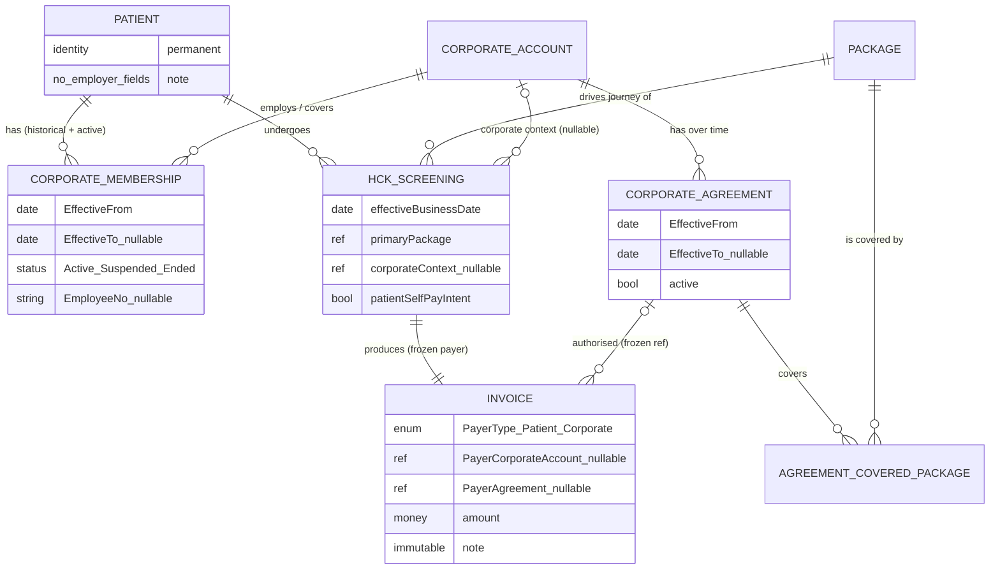

বুঝেছি — এটা purely domain/business validation phase। কোনো code, migration, entity, table, doc change করব না, G2a LOCK করব না। শুধু বিশ্লেষণ।

নিচে পুরো বিশ্লেষণ দিলাম।

---

# ভূমিকা — পাঁচটা আলাদা প্রশ্ন যা প্রায়ই একসাথে মিশে যায়

Corporate health-check ডোমেইনে নিচের পাঁচটা প্রশ্ন **সম্পূর্ণ আলাদা**, এবং বেশিরভাগ ভুল ডিজাইন হয় এগুলো এক করে ফেলার কারণে:

1. **এই ব্যক্তি কে?** → Patient (permanent clinical identity)
2. **এই ব্যক্তির কোনো কোম্পানির সাথে সম্পর্ক আছে কি, কবে থেকে কবে পর্যন্ত?** → CorporateMembership
3. **এই নির্দিষ্ট screening-টা কি কোনো corporate context-এ হচ্ছে?** → Screening-এর Corporate Context (booking-time decision)
4. **এই নির্দিষ্ট transaction-এর টাকা কে দেবে?** → Payer determination (confirm-time decision, agreement + coverage + effective date + রোগীর পছন্দের উপর নির্ভরশীল)
5. **শেষ পর্যন্ত কাকে কত bill করা হলো?** → Invoice (immutable financial record)

"Membership আছে" মানেই "কোম্পানি টাকা দেবে" — এই লাফটাই মূল বিপদ। Membership হলো #2, payer হলো #4; এদের মাঝে #3 আর eligibility validation দাঁড়িয়ে আছে।

তোমার dead-code sweep-এর ফলাফলও এখানে সঙ্গতিপূর্ণ: `HckCorporateBatch` / `HckCorporateEmployee` হলো একটা **campaign/roster-upload** ধারণা — এটা membership নয়, এবং একে membership-এর বিকল্প হিসেবে ব্যবহার করলে #2 আর #3 আবার মিশে যাবে।

---

# অংশ ১ — ছয়টি Hypothesis-এর সরাসরি যাচাই

## A. একজন Patient-এর একাধিক CorporateMembership

**Verdict: CONFIRMED** (domain capability হিসেবে অবশ্যই support করতে হবে; V1-এ শুধু active subset ব্যবহার করলেও model-এ 1:N লাগবেই)

বাস্তবতা:

|কেস|বাস্তবে ঘটে?|মন্তব্য|
|---|---|---|
|চাকরি পরিবর্তন (A → B)|খুব সাধারণ|পুরোনো membership মুছে ফেললে audit/reconciliation ভেঙে যায়|
|পূর্বতন employer|সাধারণ|historical row হিসেবে থাকতেই হবে|
|একই সময়ে দুই চাকরি / board membership / group-company|ঘটে, বিরল নয়|**overlapping active periods** representable হতে হবে|
|Consultant / part-time / retainer|ঘটে|"employment" শব্দটা সংকীর্ণ — নিচে F-এর নোট দেখো|
|Dependent/spouse coverage, retiree benefit|কিছু agreement-এ ঘটে|তখন "membership" = employment নয়, "eligibility relationship"|

**সংশোধন/সতর্কতা:** hypothesis A ঠিক, কিন্তু "simultaneous active membership কখনো allowed নয়" — এই ধারণা **রাখা যাবে না**। Model-কে overlapping active membership _store_ করতে দিতে হবে। V1 UI চাইলে booking-এর সময় শুধু একটা বেছে নিতে বাধ্য করতে পারে (নিচে D ও §3), কিন্তু সেটা storage constraint নয়, workflow constraint।

---

## B. Historical CorporateMembership সংরক্ষণ

**Verdict: CONFIRMED — এবং এটা "future enhancement" নয়, correct model-এর জন্য REQUIRED**

কেন history আজই দরকার (পরে নয়):

- **Eligibility as-of date:** screening-এর effective date-এ patient কোন কোম্পানির অধীনে ছিল — সেটা জানতে হলে period লাগবে। আজকের `IsActive` দিয়ে ৩ মাস আগের booking যাচাই করা যায় না।
- **Corporate reconciliation:** কোম্পানিকে মাস শেষে invoice পাঠানো হয়; কোম্পানি ৪৫ দিন পরে জিজ্ঞেস করে "এই লোকটা তো ওই তারিখে আমাদের কর্মী ছিল না" — তখন historical membership ছাড়া উত্তর নেই।
- **Dispute/audit:** "screening যখন হয়েছিল তখন কি এই ব্যক্তি covered ছিল?" — এটা immutable historical fact, পরে membership বদলালেও উত্তর একই থাকতে হবে।
- **Re-hire:** একই কোম্পানিতে দুইবার (Case 3) — দুটো আলাদা period, মাঝে একটা gap। এক row-তে date overwrite করলে gap-এর মধ্যে হওয়া কোনো booking ভুলভাবে "covered" দেখাবে।

Booking time-এ system-কে যা জানতে হবে:

1. এই patient-এর যে membership-গুলো **effective business date-এ active** ছিল তার তালিকা।
2. তার প্রতিটার corporate account ও (থাকলে) EmployeeNo।

চিরকাল available থাকতে হবে:

- প্রতিটা membership period (from/to), status transition-এর ইতিহাস, কোন account।
- একবার কোনো screening/invoice যে membership+agreement-এর ভিত্তিতে corporate-billed হয়েছে — সেই সম্পর্ক invoice-এ **frozen** (membership পরে বদলালেও invoice বদলাবে না)।

**নিয়ম:** CorporateMembership rows কখনো hard-delete বা date-overwrite হবে না; পরিবর্তন = নতুন period বা explicit status transition, audit সহ।

---

## C. Membership period / validity (`MembershipFrom`, `MembershipTo`, `IsActive`, `EmployeeNo`)

**Verdict: MODIFIED**

|ক্ষেত্র|এটা কী?|রায়|
|---|---|---|
|`MembershipFrom`|**genuine business concept**|REQUIRED, "future optional" নয় — eligibility-on-date এটা ছাড়া অসম্ভব|
|`MembershipTo`|**genuine business concept** (nullable = open-ended/current)|REQUIRED|
|`IsActive`|**বেশিরভাগ ক্ষেত্রে derived** (today ∈ [From,To)), কিন্তু একটা স্বাধীন business state-ও আছে|নিচে দেখো|
|`EmployeeNo`|**genuine business concept**, কিন্তু optional/nullable|corporate-এর নিজস্ব reconciliation identifier; সব কোম্পানি দেয় না; Patient-এ নয়, Membership-এ|
|membership status|**genuine, date থেকে আলাদা**|Suspended / Terminated-for-cause তারিখের অঙ্ক নয় — explicit event|
|eligibility period|derived (status + date period-এর যৌথ ফল)|আলাদা store করার দরকার নেই|

**কেন original hypothesis অপর্যাপ্ত:**

`IsActive`-কে একটা স্বাধীন, mutable boolean হিসেবে source-of-truth রাখলে সেটা date-এর সাথে **contradict** করতে পারে (period বলছে active, কেউ ভুলে `IsActive=false` করে দিল, বা উল্টো)। তখন "eligible কি না" প্রশ্নের দুটো পরস্পরবিরোধী উত্তর — payer determination-এ এটা বিপজ্জনক।

**সংশোধিত business rule:**

> Membership-এর দুটো স্বাধীন মাত্রা আছে: (a) **period** — `EffectiveFrom` (required), `EffectiveTo` (nullable); (b) **lifecycle status** — একটা explicit concept: `Active` / `Suspended` / `Ended` (তারিখ নয়, ঘটনা)।
> 
> "effective date D-তে eligible?" = `status` D-তে কার্যকরভাবে Active **এবং** D ∈ [EffectiveFrom, EffectiveTo)।
> 
> কোনো denormalized `IsActive` boolean-কে source of truth করা হবে না — দরকার হলে সেটা শুধু derived read-model / UI hint।

`EmployeeNo` — genuine business concept, Membership-owned, nullable।

---

## D. এক HCK booking-এ ঠিক এক Corporate context/payer

**Verdict: CONFIRMED — V1 simplification হিসেবে সঠিক ও নিরাপদ** (তবে "inferred" নয়, "explicit" হতে হবে)

তোমার আটটা কেস বিশ্লেষণ:

|#|পরিস্থিতি|V1 আচরণ|
|---|---|---|
|1|Self-paid|corporate context = none → PayerType = Patient (existing path, unchanged)|
|2|Corporate-sponsored|context = সেই এক account → agreement+coverage যাচাই → Corporate payer|
|3|এক patient, এক corporate|তুচ্ছ কেস — context স্পষ্ট|
|4|এক patient, একাধিক corporate|**system নিজে বাছবে না** — operator/referral explicit বেছে দেবে (§3)|
|5|একাধিক corporate একই package cover করে|একই — explicit selection; ambiguity মানুষ resolve করবে, deterministically record হবে|
|6|Membership আছে কিন্তু package covered নয়|eligibility fail → self-pay (বা booking আটকাবে — owner question)|
|7|Agreement expired/suspended|effective date-এ invalid → self-pay fallback|
|8|Eligible, কিন্তু রোগী self-pay চায়|রোগীর পছন্দ জেতে → PayerType = Patient|

**কেন এক-corporate-per-booking V1-এ ঠিক আছে:**

- Health-check-এ split billing / dual sponsor বাস্তবে আছে কিন্তু **বিরল**।
- Invoice হলো permanent record এবং পরে extend করা যায় — এখন এক payer রাখলে ভবিষ্যতে multi-payer যোগ করা corrupting নয়, additive।
- এক payer context = deterministic, unambiguous — যেটা INV-G2.7-এর দাবি।

**তবে "এক booking = এক Package" — এটা CHALLENGE করছি।**

**Verdict এই sub-assumption-এ: MODIFIED (V1 UI-limit হিসেবে ঠিক, locked domain invariant হিসেবে অনিরাপদ)**

কেন:

- বাস্তবে একটা screening event প্রায়ই = **base package + add-ons**: বয়স/লিঙ্গভিত্তিক extra test, ডাক্তার/রোগীর চাওয়া অতিরিক্ত test।
- **Split payer সমস্যাটা এখান থেকেই আসে:** corporate base package cover করে, রোগী extra test নিজে যোগ করে ও তার দাম দেয়। যদি structural ভাবে "এক screening = এক ServiceGroup, ব্যস" লক করি, তাহলে পরে add-on/co-pay যোগ করা মানে schema ভাঙা।
- **সুপারিশ:** conceptually একটা screening-এর **একটা primary package** থাকে যা journey/stations চালায়; কিন্তু data model যেন একই screening-এ **অতিরিক্ত billable item** নিষিদ্ধ না করে। V1 UI চাইলে শুধু একটা package-এ সীমাবদ্ধ থাকুক — কিন্তু "screening-এ ঠিক একটাই billable line" যেন **locked invariant না হয়**।

---

## E. Membership স্বয়ংক্রিয়ভাবে payer নির্ধারণ করে না

**Verdict: CONFIRMED (দৃঢ়ভাবে) — এটাই পুরো মডেলের মেরুদণ্ড**

"Patient, Corporate A-এর member" → **কখনোই আপনাআপনি** মানে "Corporate A এই screening-এর টাকা দেবে" নয়।

কেন নয়:

- Membership = **সম্ভাব্য eligibility**, payment authorization নয়।
- Corporate কেবল **নির্দিষ্ট package**, **নির্দিষ্ট agreement window-তে** cover করে — membership থাকা সত্ত্বেও এই screening covered না-ও হতে পারে (Scenario 3)।
- রোগীর **self-pay বেছে নেওয়ার অধিকার** আছে (Scenario 2) — corporate visit ট্র্যাক করতে চায় না এমন সংবেদনশীল test।
- Agreement **expired/suspended** থাকতে পারে (Scenario 5) — membership row তখনো "active" দেখাতে পারে, কিন্তু কোম্পানির দায় নেই।
- একাধিক corporate (Scenario 4) — auto-inference মানেই ভুল বা নির্বিচার বাছাই।

**Corporate context, eligibility, coverage, payer, financial responsibility — কোথায় প্রতিষ্ঠিত হয়:**

|ধাপ|কোথায়|কখন|পরিবর্তনযোগ্য?|
|---|---|---|---|
|**Corporate context** (কোন account, বা none)|HckScreening-এর উপর একটা nullable pointer + (থাকলে) referral artifact|**Booking time**, explicit human/referral decision|confirm-এর আগে হ্যাঁ|
|**Eligibility validation**|confirm atomic core-এর ভেতর একটা function (আলাদা entity নয় V1-এ)|**Confirm time**, effective business date-এ evaluated|না — মুহূর্তের সিদ্ধান্ত|
|**Package coverage**|agreement ↔ covered-package সম্পর্ক দেখে|Confirm time|না|
|**Payer determination**|confirm core, E-এর নিয়ম প্রয়োগ|Confirm time (INV-G2.7)|না|
|**Financial responsibility**|**Invoice**-এ frozen (payer type + account + agreement id)|Confirm time|**কখনো না** — immutable|

---

## F. এক Patient identity

**Verdict: CONFIRMED**

- Patient = **স্থায়ী ব্যক্তি/clinical identity**। Employer বদলানো, একাধিক corporate সম্পর্ক, historical membership — কোনোটাই নতুন Patient record তৈরি করবে না।
- Employment/membership তথ্য **Patient entity-তে ঢুকবে না** — সেটা CorporateMembership-এর।
- একমাত্র বৈধ ব্যতিক্রম healthcare-domain-এ: duplicate patient record merge (MRN dedup) — কিন্তু সেটা data-quality process, employer modelling-এর কারণ নয়।

এতে চ্যালেঞ্জ করার মতো কোনো domain কারণ নেই।

---

# অংশ ২ — ডোমেইন ধারণাগুলো স্পষ্টভাবে আলাদা

|ধারণা|কী ধারণ করে|কী ধারণ করে **না**|
|---|---|---|
|**Patient**|স্থায়ী ব্যক্তি পরিচয়, demographics, MRN, clinical history-র anchor|employer, EmployeeNo, membership, payer|
|**CorporateMembership**|Patient ↔ CorporateAccount সম্পর্ক; period (from/to); lifecycle status; EmployeeNo?; সম্পর্কের ধরন (employee/dependent/retiree — future)|কে টাকা দেবে; কোন package covered; screening data|
|**CorporateAccount** (বিদ্যমান `HckCorporateAccount`)|সংস্থা/কোম্পানি: নাম, যোগাযোগ, ঠিকানা|individual patient; কোন screening; payer সিদ্ধান্ত|
|**Corporate Agreement** (concept — REQUIRED, shape নয়)|account-এর সাথে একটা validity window (effective from/to, active?), renewal-এ একাধিক|billing terms/credit limit (V1-এ নয়)|
|**Agreement ↔ Covered Package** (concept)|কোন agreement কোন package cover করে (V1: binary)|দাম, শতাংশ, co-pay (V1-এ নয়)|
|**HCK Screening/Booking**|একটা নির্দিষ্ট health-check event: primary package, effective date, journey, status; + একটা **nullable Corporate Context pointer**|membership ইতিহাস; agreement master; permanent financial record|
|**Corporate Context (screening-এর)**|_এই_ event কোন account-এর অধীনে (বা none); + referral artifact থাকলে|eligibility-র চূড়ান্ত রায় (সেটা confirm-এ হয়)|
|**Payer / Financial Responsibility**|_এই_ transaction-এর দায়ী পক্ষ: PayerType (Patient/Corporate), account?, authorising agreement?|patient identity; membership; clinical data|
|**Invoice**|চূড়ান্ত bill-এর **immutable** record: কাকে, কত, কোন agreement-এর ভিত্তিতে|live membership state (শুধু frozen copy)|

**গুরুত্বপূর্ণ:** campaign/batch entity (`HckCorporateBatch`/`HckCorporateEmployee`) এদের কারো বিকল্প নয় — ওটা roster-upload workflow, membership নয়। তোমার নিজের নির্দেশনার সাথে এটা মিলে যায়।

---

# অংশ ২ (চলমান) — দশটি বাস্তব দৃশ্যকল্প

প্রতিটার জন্য: (১) বাস্তবে মানে · (২) system-এর যা জানা দরকার · (৩) owner concept · (৪) booking-এ কী ঘটবে।

### A. Corporate A → ছেড়ে B-তে যোগ

1. পুরোনো নিয়োগ শেষ, নতুন শুরু। 2. দুটো membership: A `[t0, t1)` Ended, B `[t1, ∞)` Active। 3. CorporateMembership (দুটো row)। 4. Booking effective date যদি `< t1` → A context প্রস্তাব; `≥ t1` → B। System **শুধু effective-date-এ active** membership-গুলো দেখায়।

### B. একই সময়ে A ও B

1. দুই চাকরি/পরিচালকপদ। 2. দুটো overlapping Active membership। 3. CorporateMembership (overlapping periods allowed)। 4. Booking-এ operator/referral **explicitly** কোনটা বেছে দেবে — system বাছবে না (§3)।

### C. আগে A-তে ছিল, এখন কর্মী নয়

1. নিয়োগ শেষ, নতুন নেই। 2. A membership `[t0, t1)` Ended; কোনো active membership নেই। 3. CorporateMembership (historical)। 4. Booking-এ কোনো corporate context প্রস্তাব হয় না → self-pay। পুরোনো screening/invoice-এর corporate সম্পর্ক অক্ষত থাকে।

### D. একই Corporate-এর সাথে একাধিক period

1. Resign করে আবার যোগ। 2. একই account-এর দুটো আলাদা period, মাঝে gap। 3. CorporateMembership (একই account, ভিন্ন period rows — কখনো merge/overwrite নয়)। 4. Booking effective date কোন period-এ পড়ে সেটা দেখে eligibility; gap-এর মধ্যে হলে not covered।

### E. Referral ছাড়া HCK

1. রোগী নিজে থেকে এসেছে। 2. corporate context = none। 3. Screening (context null)। 4. Self-pay path, existing, unchanged। (রোগীর membership থাকলেও — E hypothesis)।

### F. Corporate A-এর program-এর মাধ্যমে

1. কোম্পানির health-check drive/authorization। 2. context = A; referral artifact (letter/authorization no.) থাকলে capture। 3. Screening-এর Corporate Context + (owner-question) referral record। 4. Confirm-এ: A-এর agreement effective date-এ valid? package covered? রোগী self-pay চায় না? → Corporate payer।

### G. একাধিক membership, একাধিক corporate package cover করে

1. দুই sponsor-ই সম্ভাব্য। 2. patient-এর active membership তালিকা + প্রতিটার agreement coverage। 3. Screening Corporate Context (একটা বাছাই আবশ্যক)। 4. **Deterministic rule (§3):** referral context থাকলে সেটাই; না থাকলে operator বাধ্যতামূলকভাবে বেছে দেয়; system কখনো নিজে বাছে না; বাছাই ও তার কারণ record হয়।

### H. Membership আছে, package covered নয়

1. কোম্পানি এই screening-এর দায় নেয় না। 2. agreement-এ এই package নেই। 3. coverage সম্পর্ক (agreement ↔ package)। 4. Eligibility fail → self-pay (অথবা booking block — **owner question**: fail করলে থামবে না ফলব্যাক করবে?)।

### I. Membership আছে, agreement expired/suspended

1. চুক্তিগত সম্পর্ক এই তারিখে কার্যকর নয়। 2. agreement-এর effective window + status effective date-এ। 3. Corporate Agreement (period + status)। 4. Effective date-এ invalid → Corporate payer নয় → self-pay fallback। Membership row "active" থাকলেও এতে কিছু আসে যায় না।

### J. Eligible, কিন্তু self-pay বেছেছে

1. রোগী corporate benefit ব্যবহার করতে চায় না (গোপনীয়তা/ব্যক্তিগত)। 2. রোগীর explicit choice। 3. Screening-এর payer-intent flag (booking input)। 4. Confirm-এ eligibility pass করলেও রোগীর choice জেতে → PayerType = Patient। **এটাই প্রমাণ করে payer ≠ membership-এর যান্ত্রিক ফল।**

---

# অংশ ৩ — একাধিক Membership, দুই Corporate-ই Package X cover করে

Patient P1001 → Corporate A membership + Corporate B membership → Package X বেছেছে, A ও B দুজনেই X cover করে।

চারটি approach:

|#|Approach|রায়|
|---|---|---|
|1|System স্বয়ংক্রিয়ভাবে একটা বেছে নেয় (যেমন "সাম্প্রতিকতম membership")|**REJECTED** — নির্বিচার, ভুল কোম্পানিকে bill করার ঝুঁকি, রোগী/কোম্পানি বিতর্ক|
|2|Explicit corporate selection আবশ্যক|**RECOMMENDED (V1)**|
|3|Booking/referral context ব্যবহার|**RECOMMENDED (যখন উপলব্ধ)** — #2-এর সাথে মিলিয়ে|
|4|অন্য deterministic rule|শুধু tie-break হিসেবে, নিচে|

**নিরাপদ ও ব্যবহারিক সুপারিশ (V1):**

> **Corporate context booking-এ explicit ভাবে সেট হবে, কখনো inferred নয়:**
> 
> 1. যদি referral/authorization artifact থাকে যা একটা নির্দিষ্ট account নির্দেশ করে → সেটাই context (deterministic)।
> 2. না থাকলে → booking operator-কে patient-এর **effective-date-এ active** membership তালিকা থেকে **একটা বেছে দিতে বাধ্য** করা হয়।
> 3. রোগী চাইলে "self-pay" বেছে সব corporate context বাদ দিতে পারে।
> 4. System **কখনো** দুই সম্ভাবনার মধ্যে নিজে বাছে না। বাছাই না হলে confirm এগোয় না।
> 
> নির্বাচিত context + (confirm-এ) resolved payer + agreement id — Invoice-এ frozen।

**REAL-WORLD PRACTICE vs HCK V1 SIMPLIFICATION:**

- বাস্তবে: একটা booking-এ dual coverage coordination (primary/secondary payer, যেমন insurance COB) সম্ভব।
- V1: ঠিক একটা payer context; দ্বিতীয় সম্ভাব্য sponsor সম্পূর্ণ উপেক্ষিত; ambiguity মানুষ resolve করে। Invoice permanent record বলে পরে COB-স্টাইল যোগ করা additive।

---

# অংশ ৪ — Membership history আসলেই লাগে কি না

|ক্ষেত্র|genuine business concept|derived state|implementation convenience|অপ্রয়োজনীয় duplication|
|---|---|---|---|---|
|`MembershipFrom` / `EffectiveFrom`|✅||||
|`MembershipTo` / `EffectiveTo` (nullable)|✅||||
|`EmployeeNo`|✅ (corporate-এর reconciliation key)|||(Patient-এ রাখলে duplication হতো)|
|lifecycle status (Active/Suspended/Ended)|✅ (তারিখ থেকে স্বাধীন ঘটনা)||||
|`IsActive` (bool)||✅ (status + period থেকে)|⚠️ source-of-truth করলে বিপজ্জনক||
|"eligibility period" আলাদা করে||✅||✅ (status+period-এর যৌথ ফল)|

**validity period কি employment-switching-এর জন্য আবশ্যক?** — হ্যাঁ, দ্ব্যর্থহীনভাবে। A→B switch, একই কোম্পানিতে re-join, gap-এর মধ্যে booking — এসব **শুধু** from/to period দিয়েই historically সঠিক থাকে। Period ছাড়া model বাস্তবের সাথে সাংঘর্ষিক।

---

# অংশ ৫ — Screening Journey-তে Membership কোথায় অংশ নেয়, কোথায় থামে

```
Patient identification
   → Corporate context (if applicable)          ← Membership এখানে candidate তালিকা দেয়
   → Package selection                            ← Package journey নির্ধারণ করে
   → Eligibility validation                       ← Membership + Agreement + Coverage এখানে
   → Payer determination                          ← এখানে Membership-এর ভূমিকা শেষ
   ─────────────────────────────────────────────  ← এই রেখার পরে Membership সম্পূর্ণ অনুপস্থিত
   → Screening registration (composition snapshot)
   → Invoice { frozen payer context }
   → HCK journey / stations
   → Results / report
```

**নিশ্চিতকরণ — CorporateMembership কখনোই station/journey model-এর অংশ হবে না।** ✅

কারণ:

- Journey হলো **clinical/physical** — কোন station, কোন test, কোন ক্রম। এটা নির্ধারণ করে **package composition**, corporate সম্পর্ক নয়।
- Corporate A vs Corporate B vs self-pay — একই package হলে **হুবহু একই journey**। Payer শুধু bill-এ প্রভাব ফেলে, station-এ নয়।
- Membership-কে journey-তে টানলে: (a) repeat-patient cross-contamination আরও খারাপ হয়, (b) membership বদলালে ঐতিহাসিক journey পুনর্ব্যাখ্যা হয়ে যায়, (c) G1-এর immutable composition snapshot নীতি ভাঙে।

**Package selection কি journey/stations নির্ধারণ করে?** — হ্যাঁ, এবং **একমাত্র সেটাই** (+ registration-এ নেওয়া immutable composition snapshot — G1 ArchitectureVersion)। রোগীর corporate সম্পর্ক business/eligibility context দেয়, physical journey নয়।

`HckCorporateEmployee.ScreeningId` — এই dead FK-টা ঠিক এই ভুল সংযোগেরই অবশিষ্ট; membership model-এ এটা ফিরিয়ে আনা যাবে না।

---

# অংশ ৬ — Data Ownership (তোমার টেবিল + সংশোধন)

|তথ্য|Conceptual Owner|মন্তব্য / সংশোধন|
|---|---|---|
|ব্যক্তি পরিচয়|**Patient**|✅|
|Healthcare identity / MRN|**Patient**|✅|
|Employee relationship|**CorporateMembership**|✅ Patient-এ নয়|
|Membership history / periods|**CorporateMembership** (append-only, overwrite নয়)|✅|
|Employee number|**CorporateMembership** (nullable)|✅; confirm-এ Invoice-এ snapshot হতে পারে|
|Corporate সংস্থা|**CorporateAccount** (`HckCorporateAccount`)|✅|
|Agreement / validity window|**CorporateAgreement** (নতুন concept, REQUIRED)|account-এর `ContractStart/End` এটা নয়|
|কোন package covered|**Agreement ↔ CoveredPackage** সম্পর্ক|✅|
|এই HCK event-এর নির্বাচিত corporate|**HckScreening-এর Corporate Context** (nullable pointer) + confirm-এ **Invoice-এ frozen copy**|দুই জায়গা: live pointer + immutable copy|
|নির্বাচিত package|**HckScreening** (primary package)|+ সম্ভাব্য add-on items (§D challenge)|
|Eligibility decision|**Confirm transaction** — আলাদা mutable entity নয় (V1); ফলাফল Invoice-এ frozen|তোমার টেবিলে "eligibility context" — V1-এ এটা function, entity নয়|
|চূড়ান্ত payer|**Invoice** (PayerType + account? + agreement?)|confirm-এ নির্ধারিত, immutable|
|bill করা amount|**Invoice**|✅|
|Screening stations / journey|**HCK package/screening composition** (registration snapshot)|Membership এখানে নেই — নিশ্চিত|
|Results|**HCK screening/result domain**|✅|
|রোগীর self-pay intent|**HckScreening** (booking input flag)|নতুন — J scenario-র জন্য দরকার|
|Referral / authorization artifact|**HckScreening** (owner question — এটা কি আদৌ আছে?)||

---

# অংশ ৭ — Conceptual সম্পর্ক

```
                    Patient  (permanent healthcare identity — এক ব্যক্তি, এক record, চিরকাল)
                       │
                       │ 1 : N        (একাধিক, historical + overlapping active সহ)
                       ▼
              CorporateMembership   { EffectiveFrom, EffectiveTo?, status, EmployeeNo? }
                       │
                       │ N : 1
                       ▼
               CorporateAccount   (সংস্থা)
                       │
                       │ 1 : N        (renewal-এ একাধিক, সময়ের সাথে)
                       ▼
              CorporateAgreement   { EffectiveFrom, EffectiveTo?, active? }
                       │
                       │ 1 : N
                       ▼
        AgreementCoveredPackage ───▶ Package (ServiceGroup)   [V1: binary coverage]
```

Screening → payer কীভাবে যুক্ত হয় (membership-এর সরাসরি সংযোগ **নেই**):

```
HckScreening { effectiveDate, primaryPackage, corporateContext?, selfPayIntent? }
      │
      │  ── confirm atomic core (INV-G2.7): payer determination ──
      │      1. corporateContext == none  OR  selfPayIntent  → PayerType = Patient
      │      2. নাহলে: context.account-এর Agreement যা effectiveDate-এ valid?
      │      3. সেই agreement Package cover করে?
      │      4. তিনটাই হ্যাঁ → PayerType = Corporate; নাহলে → Patient (fallback/আটকানো — owner Q)
      ▼
Invoice { PayerType, PayerCorporateAccountId?, PayerAgreementId?, PayorName }   ← FROZEN, immutable
```

**তিনটি concrete উদাহরণ:**

**(ক) এক Corporate** — P1001 → Corporate A membership `[2024-01, ∞)` Active → 2026-09 booking, referral A থেকে। context = A → A-এর agreement 2026-09-এ valid ও package X cover করে → **PayerType = Corporate, account = A, agreement = A-2025**। Invoice-এ frozen।

**(খ) দুই historical Corporate** — P1001 → A `[2023-01, 2025-06)` Ended, B `[2025-07, ∞)` Active।

- 2025-03 booking → effective date A-period-এ → context candidate = A।
- 2026-09 booking → effective date B-period-এ → candidate = B; A দেখানো হয় না (তখন active নয়)।
- 2025-03-এর screening/invoice পরেও A-billed হিসেবেই থাকে, B যোগ হওয়ায় বদলায় না।

**(গ) দুই simultaneous Corporate** — P1001 → A `[2024-01, ∞)` Active + B `[2025-01, ∞)` Active। 2026-09 booking।

- referral A নির্দেশ করলে → context = A।
- referral না থাকলে → operator বাধ্যতামূলকভাবে A বা B বা self-pay বাছে; **system নিজে বাছে না; না বাছলে confirm আটকায়**।
- বাছাই + কারণ record; resolved payer Invoice-এ frozen।

**কেন booking শুধু "Patient-এর membership আছে" দেখে payer ঠিক করতে পারে না:** membership সম্ভাব্যতা, authorization নয়; কোন package, কোন window, রোগীর সম্মতি, এবং একাধিক হলে কোনটা — এসব membership row-তে লেখা নেই। এগুলো transaction-time সিদ্ধান্ত।

---

# অংশ ৮ — Assumption-গুলোর চ্যালেঞ্জ

|Assumption|রায়|কেন|
|---|---|---|
|এক Patient-এর একাধিক Corporate|**নিরাপদ — support করতেই হবে**|চাকরি বদল, dual employment বাস্তব; 1:N না হলে history ভাঙে|
|এক HCK booking = এক Corporate|**নিরাপদ V1 simplification** — তবে **explicit, inferred নয়**|split/dual sponsor বিরল; Invoice পরে extend করা যায়; ambiguity মানুষ resolve করবে|
|এক HCK booking = এক Package|**locked invariant হিসেবে অনিরাপদ**|base + add-on বাস্তব; split-payer সমস্যা এখান থেকেই; V1 UI-limit ঠিক আছে, structural lock নয়|
|Membership → স্বয়ংক্রিয় payer|**অনিরাপদ — REJECT**|membership = eligibility সম্ভাবনা; payer = agreement + coverage + effective date + রোগীর পছন্দ + context|
|Membership validity dates পরে যোগ করা যাবে|**অনিরাপদ — REJECT**|date ছাড়া "as-of eligibility" অসম্ভব; পরে যোগ করলে সব ঐতিহাসিক booking পুনর্মূল্যায়ন|
|Membership station/journey assignment-এ অংশ নেবে|**অনিরাপদ — REJECT**|journey = clinical, package-driven; membership টানলে contamination + immutability ভাঙে|

---

# অংশ ৯ — চূড়ান্ত রায় টেবিল

|Hypothesis|Verdict|Reason|
|---|---|---|
|**A — Multiple CorporateMembership**|**CONFIRMED**|চাকরি বদল, পূর্বতন employer, dual/consultant সম্পর্ক — সব বাস্তব। Domain model-এ Patient 1:N Membership আবশ্যক, overlapping active সহ। V1 workflow শুধু active subset ব্যবহার করলেও storage constraint দেওয়া যাবে না।|
|**B — Historical membership**|**CONFIRMED** (future নয়, এখনই REQUIRED)|Effective-date eligibility, corporate reconciliation, dispute/audit, re-hire — সব ঐতিহাসিক period ছাড়া ভুল হয়। Membership append-only; hard-delete/overwrite নিষিদ্ধ।|
|**C — Membership period**|**MODIFIED**|`EffectiveFrom/To` = genuine, REQUIRED (future-optional নয়)। `IsActive`-কে স্বাধীন stored boolean/source-of-truth করা অনিরাপদ — date-এর সাথে contradict করতে পারে। Lifecycle **status** (Active/Suspended/Ended) আলাদা concept হিসেবে দরকার; eligibility = status ∧ period, derived। `EmployeeNo` = genuine, nullable, Membership-owned।|
|**D — One Corporate per HCK booking**|**CONFIRMED** (payer context) / **MODIFIED** (one-package sub-assumption)|এক payer context V1-এ নিরাপদ ও deterministic — তবে explicit, কখনো inferred নয়। "এক booking = এক package" locked invariant হিসেবে অনিরাপদ (add-on/co-pay বাস্তব); V1 UI-limit হিসেবে গ্রহণযোগ্য।|
|**E — Membership ≠ automatic payer**|**CONFIRMED**|Membership = সম্ভাব্য eligibility। Payer = context + agreement (effective date-এ valid) + package coverage + রোগীর self-pay choice। Confirm core-এ নির্ধারিত, Invoice-এ frozen (INV-G2.7)। পাঁচটা scenario-ই এটা সমর্থন করে।|
|**F — One Patient identity**|**CONFIRMED**|Patient = স্থায়ী clinical identity; employer বদল/multiple/historical membership কখনো নতুন Patient তৈরি করবে না। Employment তথ্য Patient-এ নয়, Membership-এ।|

**MODIFIED গুলোর সংশোধিত business rule:**

**C — সংশোধিত নিয়ম:**

> CorporateMembership-এর দুটো স্বাধীন মাত্রা: (a) **period** — `EffectiveFrom` (required), `EffectiveTo` (nullable = current); (b) **lifecycle status** — explicit event-driven concept `Active / Suspended / Ended`, তারিখ থেকে স্বাধীন। কোনো effective date D-তে "eligible" = status D-তে কার্যকরভাবে Active **এবং** D ∈ [EffectiveFrom, EffectiveTo)। `IsActive` কোনো canonical stored field নয় — শুধু derived read-hint। `EmployeeNo` nullable, Membership-owned।

**D — সংশোধিত নিয়ম (one-package অংশ):**

> এক HCK screening-এর ঠিক একটা **primary package** থাকে যা journey/stations চালায়, এবং V1 UI এক package-এ সীমাবদ্ধ থাকতে পারে। কিন্তু domain model একই screening-এ অতিরিক্ত billable item (add-on) **structurally নিষিদ্ধ করবে না**। "screening-এ ঠিক একটাই billable line" — এটা locked invariant হবে না; পরে add-on/co-pay যোগ করা যেন additive পরিবর্তন হয়।

---

# অংশ ১০ — চূড়ান্ত আউটপুট

## ১. প্রস্তাবিত Real-World Conceptual Model (implementation-নিরপেক্ষ)

- **Patient** — একজন ব্যক্তির একটাই স্থায়ী healthcare identity। কোনো employer/membership/payer field নেই।
- **CorporateMembership** — Patient ↔ CorporateAccount-এর একটা সম্পর্ক-দৃষ্টান্ত, যার নিজস্ব **period** (from/to), **lifecycle status**, ঐচ্ছিক **EmployeeNo**, এবং সম্পর্কের ধরন (employee / dependent / retiree — ধারণাগতভাবে, V1-এ শুধু employee)। এক Patient-এর একাধিক (historical + overlapping active)।
- **CorporateAccount** — সংস্থা। এক account-এর সময়ের সাথে একাধিক **CorporateAgreement** (renewal), প্রতিটার নিজস্ব validity window ও active-state।
- **AgreementCoveredPackage** — কোন agreement কোন package cover করে (binary)।
- **HCK Screening** — একটা নির্দিষ্ট event: primary package (+ সম্ভাব্য add-on), effective date, journey, status, এবং একটা **nullable Corporate Context** (কোন account-এর অধীনে, বা none) + রোগীর self-pay intent।
- **Payer determination** — একটা transaction-time সিদ্ধান্ত (entity নয়): context + agreement-validity + coverage + রোগীর choice → PayerType।
- **Invoice** — চূড়ান্ত, immutable financial record: PayerType, account?, authorising agreement?, amount।

সম্পর্কের মেরুদণ্ড: **Membership eligibility-র সম্ভাবনা দেয়; Screening-এর Corporate Context কোন সম্পর্ক এই event-এ প্রযোজ্য তা ঠিক করে; Payer determination সেই context-কে agreement/coverage/choice-এর বিরুদ্ধে যাচাই করে টাকা কে দেবে ঠিক করে; Invoice সেটা চিরস্থায়ী করে।**

## ২. প্রস্তাবিত HCK V1 Model

**V1-এ support করা হবে:**

- Patient 1:N CorporateMembership, period + status সহ, historical rows সংরক্ষিত।
- CorporateAccount 1:N CorporateAgreement (validity window + active flag), Agreement N:M Package (binary coverage)।
- Screening-এ একটা nullable Corporate Context + self-pay intent।
- Confirm core-এ deterministic binary payer determination, effective business date-এ evaluated।
- Invoice-এ frozen payer (type + account + agreement)।

**V1-এ ইচ্ছাকৃতভাবে সরলীকৃত:**

- এক screening = এক payer context (split/dual sponsor নয়)।
- এক screening = এক primary package UI-তে (কিন্তু model add-on নিষিদ্ধ করে না)।
- Binary coverage (co-pay/শতাংশ/negotiated price নয়)।
- একাধিক সম্ভাব্য corporate → operator/referral explicit বাছে (system auto-select নয়)।
- Membership type = employee ধরে নেওয়া (dependent/retiree ধারণাগতভাবে স্বীকৃত, V1-এ ব্যবহৃত নয়)।
- Eligibility = confirm-এর ভেতরের function, আলাদা persisted "eligibility decision" entity নয়।

## ৩. এখন থেকেই যা represent করতে হবে

1. Patient-এর একাধিক membership (historical + overlapping)।
2. প্রতিটা membership-এর `EffectiveFrom` / `EffectiveTo?` / lifecycle status / `EmployeeNo?`।
3. CorporateAgreement-এর validity window + active-state।
4. Agreement ↔ covered package সম্পর্ক।
5. Screening-এর nullable Corporate Context (এই event কোন account-এর, বা none)।
6. রোগীর self-pay intent (eligible হয়েও self-pay বেছে নেওয়া)।
7. Invoice-এ frozen payer: type + account + authorising agreement id।
8. Effective business date — যার বিরুদ্ধে eligibility/payer যাচাই হয়।

## ৪. যা নিরাপদে scope-এর বাইরে রাখা যায়

- Split billing / co-pay / শতাংশভিত্তিক coverage / secondary payer (COB)।
- Agreement-এ billing terms, credit limit, negotiated price, price list।
- Persisted eligibility-decision entity / eligibility audit table।
- Dependent / spouse / retiree membership workflow (ধারণাটা রাখো, workflow পরে)।
- একাধিক package এক booking-এ (UI); add-on line items।
- Automatic corporate selection / referral-artifact parsing।
- Membership self-service portal, roster bulk-upload (এটাই dead Batch/Employee — পুনরুজ্জীবিত নয়)।
- Corporate receivable ledger / aging / statement generation (`EnumInvoiceStatus.CorporateReceivable` = optional)।

এগুলো পরে যোগ করা **additive** — কারণ Invoice immutable record, payer-determination একটা function, আর membership-এ history থাকছে।

## ৫. প্রস্তাবিত Conceptual ER ডায়াগ্রাম (শুধু ধারণাগত — কোনো table/entity design নয়)



সংযোগ-বাক্য: **Membership diagram-এর বাম দিকে (Patient ↔ Account eligibility); Screening ও Invoice ডান দিকে; দুইয়ের মাঝে সেতু হলো Screening-এর `corporateContext` pointer + confirm-এ চলা payer-determination function। Membership থেকে Screening/Invoice-এ কোনো সরাসরি রেখা নেই — ইচ্ছাকৃতভাবে।**

## ৬. Business Invariants যা শেষে LOCK করা উচিত (এখন নয়)

- **INV-G2a.A** — একজন ব্যক্তির আজীবন ঠিক একটা Patient identity; employer পরিবর্তন কখনো নতুন Patient তৈরি করে না।
- **INV-G2a.B** — Patient ↔ Corporate সম্পর্ক কেবল CorporateMembership-এর মাধ্যমে; Patient-এ কোনো employer/EmployeeNo/membership field নেই।
- **INV-G2a.C** — CorporateMembership rows কখনো hard-delete বা date-overwrite হয় না; পরিবর্তন = নতুন period বা explicit status transition, audit সহ।
- **INV-G2a.D** — eligibility ও payer সর্বদা screening-এর effective business date-এর বিরুদ্ধে evaluated, "now"-এর বিরুদ্ধে নয়।
- **INV-G2a.E** — membership-এর অস্তিত্ব কখনো payment দায়িত্ব বোঝায় না। Corporate payer হতে দরকার: screening-এ explicit corporate context **এবং** effective date-এ valid agreement **এবং** package covered **এবং** রোগী self-pay বাছেনি।
- **INV-G2a.F** — V1-এ প্রতি HCK screening-এ সর্বোচ্চ একটা corporate payer context; অনুপস্থিতি ⇒ self-pay।
- **INV-G2a.G** — payer determination confirm atomic core-এর ভেতরে চলে এবং Invoice-এ frozen হয় (type + account + agreement); Invoice-এর সেই copy পরে immutable (INV-G2.7 সম্প্রসারণ)।
- **INV-G2a.H** — CorporateMembership কখনো station/journey/result model-এ অংশ নেয় না; journey চালায় registration-এ নেওয়া package composition snapshot।
- **INV-G2a.I** — নির্বাচিত primary package journey চালায়; domain model একই screening-এ অতিরিক্ত billable add-on item structurally নিষিদ্ধ করবে না (V1 UI এক package-এ সীমাবদ্ধ থাকলেও)।
- **INV-G2a.J** — একাধিক সম্ভাব্য corporate context থাকলে system কখনো নিজে বাছে না; explicit referral বা operator selection ছাড়া confirm এগোয় না।

## ৭. Owner-এর জন্য অবশিষ্ট Business প্রশ্ন

1. **একাধিক active membership + কোনো referral context নেই** — V1-এ operator-কে explicitly একটা corporate বাছতে বাধ্য করা কি গ্রহণযোগ্য? (সুপারিশ: হ্যাঁ)
2. **Partial coverage:** agreement যদি package-এর অংশ / কিছু component test cover করে — V1-এ "all-or-nothing" (covered package পুরোটা corporate, নাহলে পুরোটা self-pay) কি চলবে? নাকি split/co-pay V1-এই লাগবে?
3. **Add-on:** V1-এ রোগীর কি corporate-covered package-এর উপর নিজের টাকায় extra test যোগ করার দরকার আছে? (এটা "one package" প্রশ্নটা নির্ধারণ করে)
4. **Referral artifact:** বাস্তবে কি কোম্পানির থেকে একটা authorization letter/number আসে যা screening-এ capture ও store করা উচিত, নাকি V1-এ corporate context শুধু operator-এর selection?
5. **Non-employee eligibility:** বর্তমান কোনো corporate agreement কি dependent / spouse / retiree-কে HCK eligibility দেয়? দিলে "membership" ≠ কেবল "employment" — concept-এর নাম ও আকার বড় হয়।
6. **Effective date:** eligibility কি booking/registration তারিখে বিচার হবে, নাকি প্রকৃত screening/service তারিখে (দুটো কয়েক দিন আলাদা হতে পারে)? (G2-এর `RegisteredAt` vs `BookingDate` প্রশ্নের সাথে যুক্ত)
7. **Confirm-এর পরে suspension:** confirm-এর পরে কিন্তু screening শেষ হওয়ার আগে membership/agreement suspended হলে কিছু কি বদলায়? (সুপারিশ: না — invoice frozen)
8. **EmployeeNo** কি কখনো **আবশ্যক** (nice-to-have নয়) — corporate invoice reconciliation-এর জন্য?
9. **Overlapping agreements:** এক account-এর কি overlapping agreement থাকতে পারে, এবং একই package দুটো overlapping agreement cover করলে Invoice-এ কোন agreement id frozen হবে?
10. **Coverage fail হলে:** package covered না হলে booking কি **থামবে** (block), নাকি নীরবে **self-pay-তে fallback** করবে?

---

**পরবর্তী ধাপ:** এই বিশ্লেষণে owner প্রতিটা hypothesis-এর রায় ও §১০.৭-এর প্রশ্নগুলোর উত্তর দিলে — তখন (এবং শুধু তখন) আমরা প্রকৃত schema design (G2a) করব। এখন পর্যন্ত কোনো কিছু LOCKED নয়, কোনো code/doc/entity পরিবর্তন করা হয়নি।