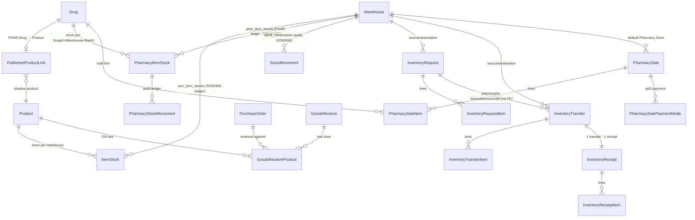
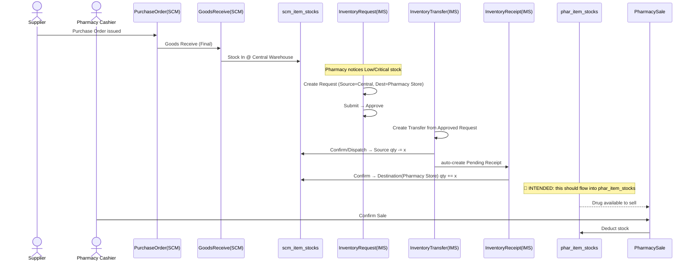
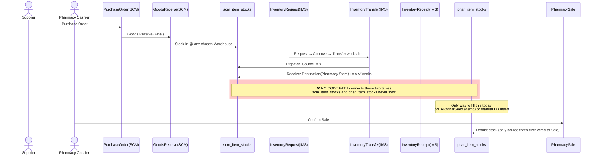

আমি ডকুমেন্টেশন (`docs/KnowledgeBase/Warehouse_Store_Analysis.md`, `docs/KnowledgeBase/IMS_Module_Analysis.md`, `docs/KnowledgeBase/Pharmacy_Module_Analysis.md`, `docs/PHAR-SCM-Integration-Design.md`, `docs/UserManual/IMS/en.md`) সম্পূর্ণ পড়েছি — এগুলো কোড-ভেরিফায়েড এবং আজকের তারিখেই (2026-08-03) আপডেট করা, তাই সোর্স কোড আলাদাভাবে ঘাঁটার দরকার হয়নি। নিচে আপনার ৯টি প্রশ্নের উত্তর।

---

## ১. Pharmacy Store

- Pharmacy-এর নিজস্ব "Store" আছে, কিন্তু এটা কোনো আলাদা টাইপের এনটিটি না — এটা সাধারণ **`Warehouse`** এনটিটির (টেবিল `scm_warehouses`) একটা সাধারণ row মাত্র, নাম **"Pharmacy Store"**। Central Store, ICU Store, OT Store, Café Store — সবই এই একই টেবিলের row, কোনো টাইপ-discriminator কলাম নেই।
- এই row-টা `PharmacyWarehouseService.GetDefaultWarehouseAsync()` লেজি-ভাবে তৈরি করে, নাম দিয়ে খুঁজে (`DefaultWarehouseName = "Pharmacy Store"` — hardcoded constant, কোনো config-ভিত্তিক না)।
- **এক Pharmacy = ঠিক একটা Warehouse।** মাল্টি-ওয়্যারহাউস সাপোর্ট **নেই** — কোনো selection UI নেই, `PharmacySale.WarehouseId` সবসময় এই একটা default-এই resolve হয়। এটা design-এ ইচ্ছাকৃতভাবে out-of-scope রাখা হয়েছে।
- `PharmacySale`/`PharmacyItemStock` উভয়েই `WarehouseId` FK রাখে, কিন্তু বাস্তবে সবসময় একই Guid।

---

## ২. Central Inventory / Main Store সম্পর্ক

এখানেই সবচেয়ে গুরুত্বপূর্ণ finding — **আপনার কল্পিত চেইন (Main Warehouse → Pharmacy Store → Sale) কোডে সরাসরি বাস্তবায়িত নেই।**

মূল কারণ: HMS-এ পণ্যের স্টক রাখার জন্য **দুটি সম্পূর্ণ আলাদা লেজার টেবিল** আছে —

|লেজার|টেবিল|ব্যবহারকারী|
|---|---|---|
|SCM/IMS-এর সাধারণ স্টক|`scm_item_stocks` (`ItemStock`)|Goods Receipt, IMS Inventory Request/Transfer/Receipt, Stock Out|
|Pharmacy-র নিজস্ব স্টক|`phar_item_stocks` (`PharmacyItemStock`)|শুধুমাত্র `PharmacySale`|

এই দুটো **একে অপরের সাথে কখনো sync হয় না।** IMS-এর পুরো Request→Transfer→Receipt চেইন কেবল `scm_item_stocks`-এ লেখে; সেটা `phar_item_stocks`-কে কখনো ছোঁয় না। `Pharmacy_Module_Analysis.md` §6 gap #2 এ স্পষ্ট লেখা আছে:

> **"No stock-in path."** IMS Request → Transfer → Receipt integration meant to populate `phar_item_stocks` is **deferred**. Stock must be seeded (`/PHAR/PharSeed`) or inserted by hand.

তাই "Main Warehouse ↓ Pharmacy Store ↓ Drug Sale" — এই সংযোগটা **আজকের কোডে বিচ্ছিন্ন**। `Product` মাস্টারেও কোনো "home store" ফিল্ড নেই (`Warehouse_Store_Analysis.md` §3), তাই এমনকি ধারণাগতভাবেও কোনো পণ্যের "নিজস্ব ওয়্যারহাউস" নেই।

---

## ৩. Pharmacy Replenishment Process (বর্তমানে যা আছে, যা নেই)

**বর্তমানে বাস্তবায়িত জেনেরিক IMS চেইন (Pharmacy-স্পেসিফিক নয়, যেকোনো Warehouse-এর জন্য কাজ করে):**

- **কে তৈরি করে:** যেকোনো ব্যবহারকারী যার IMS মডিউলে পারমিশন আছে (কোনো hardcoded "Pharmacy staff only" রুল নেই)।
- **কোন স্ক্রিন:** [`InventoryRequestController`](vscode-webview://0tri44ar51et483btke71i178mqksugck1rce8n1q6b1u371eioe/HMS.Web/Areas/IMS/Controllers/InventoryRequestController.cs) → `/IMS/InventoryRequest/Add`।
- **Source Store (Fulfilling):** ফর্মে ড্রপডাউন থেকে **ম্যানুয়ালি বেছে নিতে হয়** — সব active Warehouse দেখায়, শুধু Central Store না।
- **Destination Store (Requesting):** একইভাবে ম্যানুয়াল বাছাই — সাধারণত "Pharmacy Store"।
- **নিয়ম:** Source ≠ Destination (এটাই একমাত্র হার্ড-চেক); কোনো "Pharmacy শুধু Central থেকেই চাইতে পারবে" — এমন বিধিনিষেধ **কোডে নেই**।
- **Approve কে করে:** কোনো নির্দিষ্ট "Approver Role" আলাদা করে কোডে নেই — যার IMS পারমিশন আছে সেই Approve করতে পারে (role-ভিত্তিক নয়, generic permission-ভিত্তিক)।
- **Approve মানে কী:** শুধু "গ্রহণ" — এটা স্বয়ংক্রিয়ভাবে কোনো স্টক সরায় না বা রিজার্ভও করে না।

**তারপর কী হয় — Transfer:**

- Store Keeper approved Request-এর উপর ভিত্তি করে `InventoryTransfer` তৈরি করে (FEFO batch সাজেশনসহ)।
- **Confirm (Dispatch)** করলে **Source Warehouse-এর `scm_item_stocks` কমে যায়**, এবং **স্বয়ংক্রিয়ভাবে একটা Pending `InventoryReceipt` তৈরি হয়**।

**তারপর — Receipt:**

- Destination-এর ব্যবহারকারী Receipt Confirm করলে **Destination Warehouse-এর `scm_item_stocks` বাড়ে**।

**⚠️ কিন্তু এই "Destination Warehouse" = "Pharmacy Store" হলেও, এটা `scm_item_stocks`-এ বাড়ে, `phar_item_stocks`-এ নয়।** অর্থাৎ পুরো চেইনটা টেকনিক্যালি চালানো _যায়_ (Pharmacy Store-কে Destination বানিয়ে), কিন্তু তার ফলে `PharmacySale` যেটা থেকে বিক্রি করে (`phar_item_stocks`) সেই সংখ্যা **এক বিন্দুও বাড়ে না।**

---

## ৪. Internal Store Transfer — টেবিল ও টাইমিং

|ধাপ|কী হয়|কোন টেবিলে লেখে|
|---|---|---|
|Request Create (Draft)|নতুন request|`ims_inventory_requests`, `ims_inventory_request_items`, `ims_inventory_request_status_logs`|
|Submit → Approve|status পরিবর্তন|একই টেবিল + status log|
|Transfer Create (Draft)|নতুন transfer draft|`ims_inventory_transfers`, `ims_inventory_transfer_items`|
|**Transfer Confirm (Dispatch)** — এক transaction-এ|Source stock **কমে**|`scm_item_stocks` (atomic `ExecuteUpdateAsync`) + `stock_movements` (TransferOut) + transfer status=Dispatched + **স্বয়ংক্রিয় Pending Receipt তৈরি**|
|**Receipt Confirm** — এক transaction-এ|Destination stock **বাড়ে**|`scm_item_stocks` + `stock_movements` (ReceiptIn) + receipt status=Received|

- Pharmacy stock **কখনো বাড়ে না** এই চেইনে — কারণ উপরে বলা হয়েছে, এটা ভুল টেবিলে (`scm_item_stocks`) লেখে।
- Main Warehouse stock কমে **Transfer Confirm/Dispatch**-এর মুহূর্তে, Receipt-এর সময় না (transit loss আলাদাভাবে discrepancy হিসেবে ধরা পড়ে)।

---

## ৫. Drug Sale সম্পর্ক — আপনার কল্পিত চেইন vs বাস্তব

আপনার প্রস্তাবিত চেইন (Sale → Stock কমে → Reorder → Request → Approval → Transfer → Stock বাড়ে) **intended design হিসেবে সঠিক ছিল** (মূল design doc, [ims-inventory-request-transfer-design](vscode-webview://0tri44ar51et483btke71i178mqksugck1rce8n1q6b1u371eioe/memory) অনুযায়ী), কিন্তু **বাস্তবে বাস্তবায়িত হয়নি**। প্রকৃত অবস্থা:

1. Drug Sale → `phar_item_stocks` কমে (ঠিক আছে, কাজ করে, live-verified)।
2. **Reorder Level-এ পৌঁছালে কোনো স্বয়ংক্রিয় Inventory Request তৈরি হয় না** — Stock Levels ড্যাশবোর্ড শুধু Low/Critical status _দেখায়_, কোনো auto-trigger নেই। সম্পূর্ণ ম্যানুয়াল প্রক্রিয়া (কেউ IMS-এ গিয়ে নিজে থেকে Request বানাতে হবে)।
3. Request → Approval → Transfer → Receipt চেইন কাজ করে, কিন্তু — যেমন §২-৩-এ বলা হলো — এটা `scm_item_stocks`-এ লেখে, `phar_item_stocks`-এ না।
4. তাই আজ **`phar_item_stocks`-এ স্টক ঢোকার একমাত্র উপায় হলো ম্যানুয়াল সিডিং (`/PHAR/PharSeed`) অথবা সরাসরি DB insert।** কোনো production-grade "stock receive into Pharmacy" স্ক্রিনই নেই (`PharStock` কন্ট্রোলার একটা খালি prototype)।

---

## ৬. ডাটাবেস সম্পর্ক (সব টেবিল)

|টেবিল|ভূমিকা|
|---|---|
|`scm_warehouses` (`Warehouse`)|একমাত্র "Store" concept — Central/Pharmacy/ICU সব এখানেই row|
|`scm_item_stocks` (`ItemStock`)|SCM/IMS-এর স্টক ব্যালেন্স (Product+Warehouse+Batch কী)|
|`stock_movements`|SCM/IMS-এর immutable audit ledger|
|`phar_item_stocks` (`PharmacyItemStock`)|Pharmacy-র **নিজস্ব, আলাদা** স্টক ব্যালেন্স (Drug+Warehouse+Batch কী)|
|`phar_stock_movements`|Pharmacy-র নিজস্ব audit ledger, IMS-এরটার sibling কিন্তু আলাদা|
|`ims_inventory_requests/_items/_status_logs`|Request document|
|`ims_inventory_transfers/_items/_status_logs`|Transfer/Dispatch document|
|`ims_inventory_receipts/_items/_status_logs`|Receipt document|
|`phar_sales`, `phar_sale_items`, `phar_sale_payment_modes`|Pharmacy বিক্রয়|
|`phar_drugs`|ক্লিনিক্যাল মাস্টার (Drug)|
|`Products`|SCM-এর procurement মাস্টার|
|`PublishedProductLink`|`Drug ↔ Product` এর one-directional shadow-mapping (§৯ দ্রষ্টব্য)|

---

## ৭. Business Rules (যেমন আছে, ধরে নেওয়া না)

|প্রশ্ন|উত্তর|
|---|---|
|Pharmacy কি যেকোনো Warehouse থেকে Request করতে পারে?|**হ্যাঁ** — কোড-লেভেলে কোনো বিধিনিষেধ নেই। Source/Destination দুটোই একই unfiltered ড্রপডাউন থেকে বাছা হয়, সব active warehouse দেখায়।|
|শুধু Central Store থেকেই কি নেওয়া বাধ্যতামূলক?|**না, বাধ্যতামূলক নয়** — এটা শুধু প্রচলিত ব্যবহার-প্রথা (convention), কোড এটা enforce করে না।|
|Source/Destination কীভাবে নির্ধারিত হয়?|সম্পূর্ণ ম্যানুয়াল ইউজার-নির্বাচন, দুই পক্ষেই কোনো ফিল্টারিং নেই।|
|পারমিশন/কন্ট্রোল কেমন?|শুধু generic RBAC module-permission (`ims.*`)। **কোনো user-to-warehouse access control নেই** (`UserWarehouse`/`StoreAccess` জাতীয় কোনো মেকানিজম কোডে খুঁজে পাওয়া যায়নি) — যেকোনো অনুমোদিত ব্যবহারকারী যেকোনো store-কে source/destination বানাতে পারে। Company/Branch দিয়েও কোনো scoping নেই যদিও `Warehouse.CompanyId` ফিল্ড আছে।|

---

## ৮. End-to-End Sequence Diagram

নিচে দুইটা ডায়াগ্রাম দিলাম — একটা আপনার কল্পিত **Intended** ফ্লো, আরেকটা **বর্তমানে যা প্রকৃতপক্ষে ঘটে** (এবং কোথায় চেইনটা ভেঙে যায়)।

### (ক) Intended (design অনুযায়ী, কিন্তু আজ পুরোটা wired নয়)

### (খ) বর্তমান বাস্তবতা — চেইন কোথায় বিচ্ছিন্ন

---

## ৯. Final Report

### ১. Current Implementation

- **SCM** (Purchase Requisition → RFQ → Purchase Order → Goods Receipt) সম্পূর্ণ কার্যকর, `scm_item_stocks`-এ লেখে।
- **IMS Inventory Request → Transfer → Receipt** সম্পূর্ণ কার্যকর ও পরীক্ষিত, কিন্তু কেবল `scm_item_stocks` ও `stock_movements` টেবিলের সাথে কাজ করে — যেকোনো দুই Warehouse-এর মধ্যে (Pharmacy Store-কেও destination বানানো _যায়_, কিন্তু ফলাফল কার্যকর হয় না)।
- **Pharmacy Sale** সম্পূর্ণ কার্যকর ও ভালোভাবে পরীক্ষিত (transaction-atomic, idempotent, split-payment সহ), কিন্তু এটা সম্পূর্ণ **আলাদা** `phar_item_stocks`/`phar_stock_movements` লেজার থেকে কাজ করে।
- **এই দুইয়ের মধ্যে কোনো সংযোগকারী কোড নেই।**

### ২. Intended Business Workflow

Design doc অনুযায়ী ইচ্ছাকৃত পরিকল্পনা ছিল — IMS-এর Transfer/Receipt ইঞ্জিন **generic** রাখা হয়েছিল ঠিক এই কারণে যাতে ভবিষ্যতে Ward Issue, Pharmacy Replenishment, Emergency Replenishment ইত্যাদি এই **একই ইঞ্জিন** পুনঃব্যবহার করতে পারে, শুধু Warehouse পরিবর্তন করে — নতুন document type না বানিয়ে। কিন্তু Pharmacy-র জন্য এই "reuse" ধাপটা **কখনো implement হয়নি**।

### ৩. Database Relationships

§৬-এ বিস্তারিত দেওয়া হয়েছে। মূল কথা: `Warehouse` একটাই shared anchor entity, কিন্তু stock **balance** দুটো সমান্তরাল, সম্পূর্ণ আলাদা টেবিলে (`scm_item_stocks` vs `phar_item_stocks`) রাখা হয়েছে।

### ৪. Module Relationships (SCM ↔ IMS ↔ PHAR)

- **SCM → IMS:** Goods Receipt-ই একমাত্র জায়গা যেখানে স্টক প্রথম `scm_item_stocks`-এ ঢোকে।
- **IMS ↔ PHAR (Product master):** `Drug`(PHAR) → `Product`(SCM) একমুখী **"Published Product Pattern"** দিয়ে সংযুক্ত (`PublishedProductLink`) — এটা শুধু **item master**-এর সংযোগ, procurement (PR/PO) করতে দেয়। এটা সম্পূর্ণ কার্যকর।
- **IMS ↔ PHAR (Stock ledger):** এখানেই ফাঁক — কোনো সংযোগ নেই।

### ৫. Missing Implementation / Design Gaps

1. **সবচেয়ে বড় ফাঁক:** IMS `InventoryReceipt.ConfirmAsync` শুধু `IStockLedgerService`-এর মাধ্যমে `scm_item_stocks` বাড়ায়; `IPharmacyStockLedgerService`-এর মাধ্যমে `phar_item_stocks` বাড়ানোর কোনো option/branch নেই।
2. Reorder Level অতিক্রম করলে **কোনো স্বয়ংক্রিয় Request তৈরি হয় না** — সম্পূর্ণ ম্যানুয়াল মনিটরিং প্রয়োজন।
3. Pharmacy-তে কোনো Stock-view/Opening-balance/Adjustment UI নেই (`PharStock` prototype মাত্র)।
4. Pharmacy Sale-এর COGS হিসাব `GoodsReceiveProduct.UnitPrice` (SCM GR) থেকে পড়ে — কিন্তু IMS transfer দিয়ে stock এলে সেই batch-এর কোনো GR row-ই থাকবে না, ফলে ভবিষ্যতে ঠিকমতো wire করলেও COGS পোস্ট হবে না, যতক্ষণ না "pharmacy batch cost কোথা থেকে আসবে" — এই design প্রশ্নের সমাধান হয়।
5. এই একই সমস্যা structurally SCM-এর `PurchaseRequisitionItem` স্তরেও প্রযোজ্য — Pharmacy যদি IMS Request-এর বদলে নতুন Purchase Requisition রেইজ করতে চায় (Published `Product` ব্যবহার করে), সেটা কাজ করবে, কিন্তু received stock তখনো `scm_item_stocks`-এই যাবে, `phar_item_stocks`-এ না — একই মূল সমস্যা।

### ৬. সুপারিশ (Recommendation)

এই ফাঁক বন্ধ করার জন্য মূলত দুইটা approach সম্ভব, দুটোরই ট্রেড-অফ আছে:

- **(A) `InventoryReceiptService.ConfirmAsync`-এ একটা polymorphic destination-ledger resolver যোগ করা** (Warehouse যদি "Pharmacy Store" হয়, তাহলে `IPharmacyStockLedgerService.IncreaseStockAsync` কল করা, নাহলে `IStockLedgerService`)। এটা কম কোড পরিবর্তন লাগে কিন্তু IMS-এর মধ্যে PHAR-এর জ্ঞান ঢুকিয়ে দেয় — module-boundary নরম হয়ে যায়।
- **(B) দুটো ledger-কে একটা জেনেরিক interface-এর পেছনে সরিয়ে আনা** (`IStockLedgerService<T>` জাতীয়) — cleaner architecture, কিন্তু বড় refactor, রিগ্রেশন-ঝুঁকি বেশি (মেমোরিতে এটা আগেও বিবেচিত হয়ে "না এখন না" সিদ্ধান্ত হয়েছিল)।

এই সিদ্ধান্তটা **implementation-এর প্রশ্ন, শুধু বিশ্লেষণের নয়** — আপনি বলেছেন কোনো কোড পরিবর্তন করতে না, তাই এখানেই থামছি। এটা একটা পরবর্তী আলোচনার/planning সেশনের বিষয় হতে পারে যদি আপনি চান।